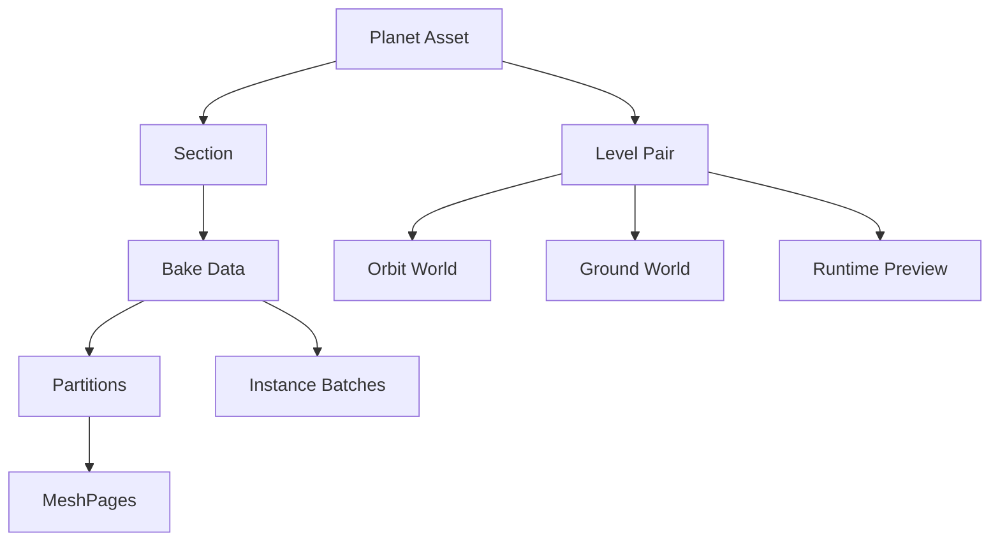

# Core Concepts

Concept Meaning Ground World Flat Level containing gameplay and original sources Planet Proxy Curved representation shown from Orbit Planet Asset Stores Planet ID, Radius, Secti...

| Concept | Meaning |
|---|---|
| Ground World | Flat Level containing gameplay and original sources |
| Planet Proxy | Curved representation shown from Orbit |
| Planet Asset | Stores Planet ID, Radius, Sections, Level Pairs, and settings |
| Section | One Ground region and its placement on the planet |
| Level Pair | Connects Ground/Orbit Worlds and entry mode |
| Bake Data | Manifest for partitions, MeshPages, instances, and transition data |



Identity:

- Planet ID: stable planet identity
- Section ID: `{SourceMap}_{FullSourceWorldPath CRC32}`
- Display Name: renameable UI label
- Planet Binding ID: identifies a World instance of the same Planet ID

The current projection is AEQD. Planet Radius controls curvature and Surface Datum defines altitude zero.

Partitions divide source regions; MeshPages are independent revision Static Mesh artifacts. Smaller partitions improve loading granularity but increase asset and seam cost.

Generated assets:

```text
/Game/PlanetX/ProxyBake/{PlanetAsset}/{GroundLevel}/
├─ DA_PXBake_{BakeId}
└─ Revisions/{RevisionId}/
   ├─ Meshes/
   └─ Payloads/
```

Avoid arbitrary moves or renames of generated assets.
