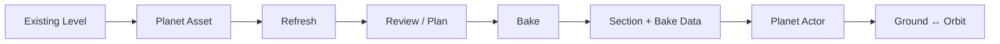
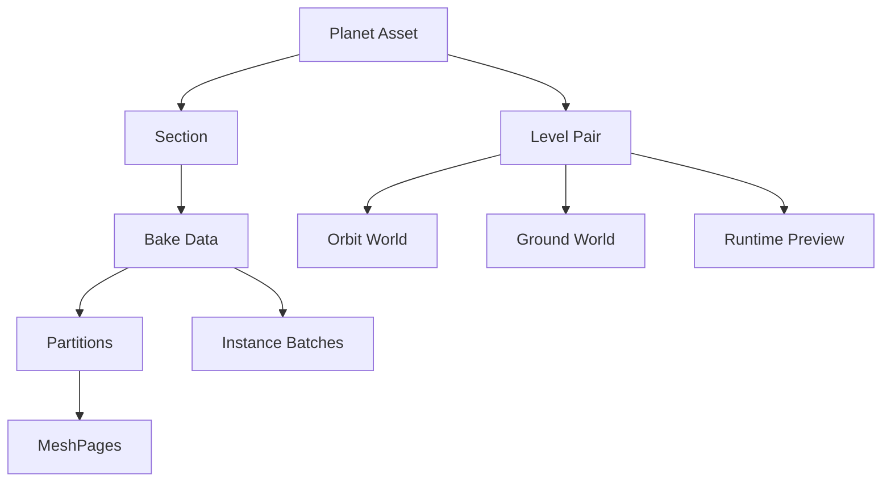

# PlanetX Official Documentation

Version 1.0 · Last reviewed 2026-08-01

## PlanetX Overview

PlanetX converts an existing Unreal Engine Level into a curved planetary representation and supports transitions between Ground and Orbit presentation.

PlanetX converts an existing Unreal Engine Level into a curved planetary representation and supports transitions between Ground and Orbit presentation.

### What it solves

- Reuses existing Landscapes and Static Meshes on a planet
- Generates orbit-scale proxies
- Connects Ground/Orbit coordinates and presentation
- Supports Same World and cross-Level travel
- Bakes large World Partition sources



### Requirements summary

| Item | Current status |
|---|---|
| Dependency | GeometryProcessing |
| Bake | Editor-only |
| Main sources | Static Mesh, Landscape, ISM/HISM, Foliage |
| World Partition | Supported |
| Multiplayer | The game owns travel and replication |
| Engine/Platform | Use combinations built and validated by the current project |
| Demo Map | No bundled user demo |

Continue with [Create Your First Planet Proxy](/docs/en/getting-started).

## Quick Start: Create Your First Planet Proxy

Step Action Expected Result Common Failure Screenshot/Landmark : 1 Enable PlanetX in Edit Plugins, then restart Tools PlanetX appears Old or duplicate plugin binary Plugins wind...

| Step | Action | Expected Result | Common Failure | Screenshot/Landmark |
|---:|---|---|---|---|
| 1 | Enable PlanetX in `Edit > Plugins`, then restart | `Tools > PlanetX` appears | Old or duplicate plugin binary | Plugins window |
| 2 | Open the Ground Map to bake | Current World matches the source | Untitled or Orbit Map opened | Level viewport |
| 3 | Create `Add > Miscellaneous > PlanetX Planet Asset` | Dedicated Asset Editor opens | Duplicate Planet ID or bad Radius | Create Planet Asset |
| 4 | Open `Tools > PlanetX > Proxy Bake Editor` | Bake window appears | Latest Editor module not loaded | Proxy Bake header |
| 5 | Select Planet Asset, Runtime Role, and Source Scope | Target World and source range resolve | Empty Selected Actors | Setup area |
| 6 | Run `Refresh` | Source Review and Output Plan appear | Hidden, NoBake, or unsupported source | [Current screen](/images/proxy-bake-refresh-review.png) |
| 7 | Review `ManualReview`, `Unsupported`, and Reason | Sources have valid roles | WPO/displacement or missing source LOD | Source Review |
| 8 | Confirm Target Section Name and `NEW OUTPUT` | Output path and partitions resolve | TARGET CONFLICT or SCAN OUT OF DATE | Output Plan |
| 9 | Select `BAKE IN EDITOR` | Bake Data and Section are linked automatically | Unsaved asset, memory, or save failure | ACTIVE BAKE |
| 10 | Place a `PlanetX Planet Actor` and assign the Asset | Runtime planet instance registers | Planet Binding collision | Actor Details |
| 11 | Check Sections/Diagnostics and run PIE | Proxy and Level Pair are valid | Missing Bake/Preview link | Planet Asset Editor |

> The old `Scan Sources` action is now `Refresh`. A successful Bake links its result to the Planet Asset automatically.

### Completion check

- The Planet Asset contains a Section.
- Bake Data is linked.
- An External Level has a Runtime Preview World link.
- The Planet Actor references the same Asset.
- Diagnostics has no blocking Error.

For C++, add `"PlanetX"` to the game module's `Build.cs`. Do not add `PlanetXEditor` to a runtime module.

## Editor Workflow

Basic flow

### Basic flow

```text
Refresh → Source Review → Output Plan → Bake → Sections/Diagnostics
```

### Source Scope

| Scope | Use |
|---|---|
| Selected Actors | Test a small set |
| Current Level | Bake the current Level |
| Loaded Levels | Bake loaded Levels |
| Reviewed Set | Reuse confirmed source membership |

Use `Refresh` after changing selection, tags, Levels, or settings.

`PlanetX.NoBake` and `PlanetX.ProxyBakePreview` exclude an Actor or Component.

### Source roles

| Role | Processing |
|---|---|
| ProxyGeometry | Curved proxy geometry |
| LandscapeProxy | Landscape-specific path |
| InstanceBatch | ISM/HISM, Foliage, repeated or small rigid meshes |
| Discard | User exclusion, tiny detail, or world-scale helper |
| ManualReview | User decision required, such as WPO/displacement |
| Unsupported | Unsupported Component or invalid payload/LOD |

Non-instanced Static Meshes at or below 80 cm maximum size are discarded as Tiny. ISM/HISM and Foliage remain InstanceBatch candidates.

### Main settings

| Setting | Purpose | Recommended start |
|---|---|---|
| Planet Radius | AEQD curvature, edited on Planet Asset | Real planet radius |
| Surface Datum World Z | Altitude zero | Auto |
| Source Grid | Original Landscape vertex grid | Off for preview |
| Partition X/Y | Output region size | Automatic plan |
| Memory Budget | Bake RAM limit | Auto + Safe |
| Workers | Geometry worker count | 0 (automatic) |

Smaller partitions reduce loading granularity but create more assets, seams, and finalization work.

### Bake modes

- `BAKE IN EDITOR`: rapid iteration and small-to-medium sources
- `BAKE IN EXTERNAL PROCESS`: large World Partition and high-memory work

Save Maps and assets before External Bake. Use `ACTIVE BAKE`, `Saved/Logs`, and `Saved/PlanetXProxyBake` for status.

### Output states

| State | Action |
|---|---|
| NEW OUTPUT | Bake a new result |
| UP TO DATE | Use it or confirm Force Rebuild |
| REBAKE REQUIRED | SourceHash changed; bake again |
| LEGACY HASH | Refresh to the current contract |
| TARGET CONFLICT | Resolve the path/identity conflict |
| SCAN OUT OF DATE | Refresh |

### Section management

- A new In Editor Bake applies `Target Section Name` when the Section is created.
- `Rename` changes only an existing Section's Display Name.
- Internal Section ID includes a source World path hash and remains stable.
- `Delete Selected Section` removes the Section and Level Pair, not generated asset files.
- A Planet Asset can have at most one enabled Same World Level Pair.

Supporting tools:

- `PlanetX Mode`: Planet/Compare/Level views and authoring palettes
- `Visual Editor`: Section Placement, Surface Correction, and visual preview

## Runtime Integration

Planet Actor

### Planet Actor

1. Place `APlanetXPlanetActor`.
2. Assign the Planet Asset to its Planet Component.
3. Normally keep Auto Register Runtime enabled.
4. Set a stable Planet Binding ID when several instances use the same Planet Asset.

### Runtime Role

| Role | Behavior |
|---|---|
| Same World | Switches Ground/Orbit presentation in one World |
| External Level | The game travels between Worlds; PlanetX hands off pose/state |

PlanetX does not own `OpenLevel`, spawning, possession, or GameMode.

### Same World

Blueprint:

- `Enter Ground Same World(World Context, Request Actor, Surface Query)`
- `Return To Orbit Same World(World Context, Request Actor)`

Coordinate Component can also opt into automatic Same World entry/return.

### External Level

```text
Prepare Travel
→ game stores Ticket/Route
→ game performs World travel
→ Target Actor is spawned and possessed
→ Resume Pending Travel
```

`UPlanetXTravelReceiverComponent` can attempt automatic resume on arrival.

### Main Components

| Component | Purpose |
|---|---|
| Coordinate Component | Planet/Section identity and PlanetX pose |
| Movement Component | Optional native surface movement |
| Viewpoint Component | Camera/player observer and transition driver |
| Travel Receiver | Applies arrival pose/state |

Attaching Coordinate Component does not force-move the Actor every frame.

### Runtime Preview

- Load Runtime Preview
- Set Runtime Preview Visible
- Unload Runtime Preview
- Get Runtime Preview Status

### C++ entry point

```cpp
#include "PlanetX/Runtime/PlanetXSubsystem.h"

UPlanetXSubsystem* PlanetX =
    GetGameInstance()->GetSubsystem<UPlanetXSubsystem>();
```

Use `PrepareTravel`, let the game perform travel, then call `ResumePendingTravel`. Game code should depend on the public `UPlanetXSubsystem` facade, not internal runtime services.

Transition and environment:

- `APlanetXTransitionEndpoint`: Orbit/Ground boundary for a Planet/Section/Level Pair
- `APlanetXEnvironmentManager`: Cloud/Atmosphere binding and Ground/Orbit environment transition

## Core Concepts

Concept Meaning Ground World Flat Level containing gameplay and original sources Planet Proxy Curved representation shown from Orbit Planet Asset Stores Planet ID, Radius, Secti...

| Concept | Meaning |
|---|---|
| Ground World | Flat Level containing gameplay and original sources |
| Planet Proxy | Curved representation shown from Orbit |
| Planet Asset | Stores Planet ID, Radius, Sections, Level Pairs, and settings |
| Section | One Ground region and its placement on the planet |
| Level Pair | Connects Ground/Orbit Worlds and entry mode |
| Bake Data | Manifest for partitions, MeshPages, instances, and transition data |



Identity:

- Planet ID: stable planet identity
- Section ID: `{SourceMap}_{FullSourceWorldPath CRC32}`
- Display Name: renameable UI label
- Planet Binding ID: identifies a World instance of the same Planet ID

The current projection is AEQD. Planet Radius controls curvature and Surface Datum defines altitude zero.

Partitions divide source regions; MeshPages are independent revision Static Mesh artifacts. Smaller partitions improve loading granularity but increase asset and seam cost.

Generated assets:

```text
/Game/PlanetX/ProxyBake/{PlanetAsset}/{GroundLevel}/
├─ DA_PXBake_{BakeId}
└─ Revisions/{RevisionId}/
   ├─ Meshes/
   └─ Payloads/
```

Avoid arbitrary moves or renames of generated assets.

## Supported Content

Source Status Processing Static Mesh Component Supported ProxyGeometry or InstanceBatch Landscape / Streaming Proxy Supported LandscapeProxy ISM/HISM Supported InstanceBatch Fol...

| Source | Status | Processing |
|---|---|---|
| Static Mesh Component | Supported | ProxyGeometry or InstanceBatch |
| Landscape / Streaming Proxy | Supported | LandscapeProxy |
| ISM/HISM | Supported | InstanceBatch |
| Foliage | Supported | Foliage InstanceBatch |
| PCG output | Conditional | Actual Static Mesh/ISM/HISM Components must exist |
| Level Instance / Packed Level | Supported | Discovers contained supported Components |
| World Partition HLOD | Conditional | Valid HLOD preferred, raw-source fallback |
| Skeletal Mesh / Cloth | Unsupported | Excluded during discovery |
| Spline deformation | Unsupported | Convert to Static Mesh |
| Dynamic runtime mesh | Unsupported | Convert to persistent Static Mesh |

Important conditions:

- Static Mesh requires a valid source LOD.
- Negative scale winding and normal sign are corrected.
- Source Nanite clusters are not copied; new MeshPages are built from source LOD data.
- Foliage and ISM/HISM remain InstanceBatch candidates even when tiny.
- A regular Static Mesh at or below 80 cm maximum size is discarded automatically.
- Live WPO/displacement becomes `ManualReview` for projected Orbit/Morph output.
- `PlanetX.NoBake`, `PlanetX.ProxyBakePreview`, hidden-in-game, transient, and editor-only sources are excluded.

Diagnose one source with `Selected Actors → Refresh → inspect Role/Reason`.

## Large World and World Partition

Source discovery

### Source discovery

World Partition actors do not all have to be loaded manually.

```text
Enumerate descriptors
→ select eligible actors/HLODs
→ temporarily load chunks of 64
→ capture Component payloads
→ release references
→ classify and build the Plan
```

- Valid current top-level HLODs are preferred.
- Stale or invalid HLODs fall back to original sources.
- Data Layer membership is recorded but does not limit the Bake to currently active Data Layers.
- Use `PlanetX.NoBake` for deterministic exclusion.
- Level Instance/Packed Level cycles and load failures are diagnosed.

### Large Bake recommendation

1. Save Maps and assets.
2. Refresh with `Current Level` or a confirmed `Reviewed Set`.
3. Keep automatic partitions.
4. Use `Auto Memory Budget + Safe`.
5. Use `BAKE IN EXTERNAL PROCESS`.
6. Inspect `ACTIVE BAKE` and `Saved/Logs`.

### Checkpoints

- Static geometry spool can be reused for an identical contract.
- Landscape currently disables geometry checkpoint reuse.
- This is exact-contract geometry reuse, not arbitrary full-pipeline resume.
- A successful publish removes the checkpoint.

Main temporary paths:

```text
Saved/PlanetX/ProxyBake/PartitionSpool
Saved/PlanetX/ProxyBakeRollback
Saved/PlanetXProxyBake
Saved/Logs
```

Smaller partitions can reduce packet RAM but increase MeshPages, seams, packages, and finalization work.

## Performance and Optimization

Recommended starting points

### Recommended starting points

| Use | Settings |
|---|---|
| Preview | Auto Partition, Source Grid Off, In Editor, Auto + Safe |
| General production | Auto Partition, Auto + Safe |
| High-quality Landscape | Compare Source Grid On, prefer External |
| Large World Partition | Auto Partition, External, Workers 0 |
| Dedicated bake machine | Select High Utilization only after measurement |

`High Utilization` is not a quality setting. It reduces the reserved RAM from 4 GiB to 1 GiB.

### High-impact changes

| Change | Impact |
|---|---|
| Source Grid On | More triangles, RAM, and disk |
| Smaller partitions | Smaller packets; more assets, seams, and finalization |
| Larger partitions | Fewer assets; higher peak RAM and loading unit |
| More Workers/Queue | Potential throughput and peak-RAM increase |
| Unnecessary instances | Larger payload and Runtime Preview cost |

Optimization order:

1. Remove unnecessary and ManualReview sources.
2. Create a baseline with Auto Partition + Safe.
3. Check largest packet, peak RAM, and output bytes.
4. Change one setting at a time.
5. Profile Runtime Preview, MeshPages, InstanceBatches, and transition.

The current Basic UI has no general user-facing Simplify ratio slider. Do not hard-code undocumented internal values.

## Reference

Proxy Bake UI

### Proxy Bake UI

| Area | Main items |
|---|---|
| Target | Planet Asset, Target Section Name, Rename/Use on Bake |
| Runtime Role | Same World, External Level, Ground/Orbit World |
| Source Scope | Selected Actors, Current Level, Loaded Levels, Reviewed Set |
| Output Plan | Sources, partitions, geometry mix, Bake ID, output path |
| Review | Use, Owner, Component, Role, Assignment, Reason, Partitions |
| Advanced | Partition X/Y, Planet Radius, Source Grid, Surface Datum |
| Budget | Auto Memory, Safe/High Utilization, Workers, Queue, GT Finalize |
| Actions | Refresh, Plan, Clear, Logs, In Editor/External Bake |

### Planet Asset Editor

| Tab | Purpose |
|---|---|
| Overview | Identity and readiness |
| Sections | Rename, Delete, Runtime Role, Bake/Level Pair |
| Configuration | Authoring and visual settings |
| Preview | Saved-result preview |
| Diagnostics | Topology and link validation |

### Main runtime types

- `APlanetXPlanetActor`
- `APlanetXTransitionEndpoint`
- `APlanetXEnvironmentManager`
- `UPlanetXCoordinateComponent`
- `UPlanetXMovementComponent`
- `UPlanetXViewpointComponent`
- `UPlanetXTravelReceiverComponent`

### Public API

Game code uses `UPlanetXSubsystem`.

Entry/Travel:

- EnterGroundSameWorld / ReturnToOrbitSameWorld
- PrepareTravel / ResumePendingTravel
- Begin/Resolve/Complete/Cancel LevelHandoff

Runtime Preview:

- LoadRuntimePreview
- SetRuntimePreviewVisible
- UnloadRuntimePreview
- GetRuntimePreviewStatus

Coordinate/Surface:

- CaptureActorPlanetXTransform
- ResolvePlanetXTransform
- ApplyPlanetXTransformToActor
- QuerySurfaceAtWorldRay/Geo/PlanetXTransform
- BuildLandingTransform

Query/Diagnostics:

- GetActorRuntimeContext
- GetMovementRuntimeState
- GetTransitionRuntimeResult
- GetSectionDesc/GetSectionTransform
- GetLevelPair/GetLevelPairForSection
- ValidatePlanetAsset
- DiagnoseProxySync
- ResolvePlanetAlignmentForSection

### Console Variables

| CVar | Purpose |
|---|---|
| `PlanetX.MemoryBudgetMB` | PlanetX memory-stat budget |
| `px.Material.DebugMode` | Development material-debug override |
| `px.Material.UseLegacyPath` | Development legacy-path comparison |

### Generated layout

```text
/Game/PlanetX/ProxyBake/{PlanetAsset}/{GroundLevel}/
├─ DA_PXBake_{BakeId}
├─ {BakeDataName}_RuntimePreview
└─ Revisions/{RevisionId}/
   ├─ Meshes/
   └─ Payloads/
```

Logs and jobs:

```text
Saved/Logs
Saved/PlanetXProxyBake
Saved/PlanetX/ProxyBake/PartitionSpool
Saved/PlanetX/ProxyBakeRollback
```

## Troubleshooting

Symptom Likely Cause / Check Solution No Scan Sources button The action was renamed Use Refresh Refresh finds 0 sources Empty selection, hidden/NoBake, unsupported Component Try...

| Symptom | Likely Cause / Check | Solution |
|---|---|---|
| No `Scan Sources` button | The action was renamed | Use `Refresh` |
| Refresh finds 0 sources | Empty selection, hidden/NoBake, unsupported Component | Try Current Level, then isolate with Selected Actors |
| Landscape missing | Hidden/tag/WP load/LandscapeInfo issue | Inspect `LandscapeDiscovery` and failed WP loads |
| Target Section Name disabled | Target identity unresolved | Select Planet Asset and Refresh |
| Name missing after External Bake | Staged naming is In Editor-only | Refresh after completion and Rename |
| `TARGET CONFLICT` | Another identity occupies the output path | Resolve existing asset/path conflict |
| Excessive memory | Source Grid, large packet, too many workers/queue | Auto + Safe, Workers 0, External |
| Appears stuck at `RootManifestBuild` | Large manifest or real hang | Check logs, CPU/RAM/disk, and timestamps together |
| Visible seam or hole | Clipping/topology invariant failure | Stop using output; preserve source/partition/full log |
| Mirrored mesh inside-out | Old Bake or material tangent issue | Rebake with current code and isolate the mesh |
| WPO material blocked | Live deformation cannot project safely | Flatten, replace, or Discard |
| WP actor missing | Descriptor/HLOD/Level Instance/load failure | Inspect WP/HLOD metrics and external actor package |
| Save/Publish failure | Read-only, disk, unsaved data, rollback failure | Check out, save, free disk, retry |
| Empty Preview | Bake Data/Runtime Preview/Level Pair link missing | Inspect Sections and Diagnostics |
| Cannot change to Same World | Another Same World Pair is enabled | Keep only one |
| Wrong location after travel | Binding/Ticket/Target timing mismatch | Inspect resume result and identities |

Important errors:

```text
Align Section failed: ... target placement is unchanged or violates placement constraints.
```

The target is unchanged or violates placement constraints. Check Ground Sync Mapping, Section Placement, and Planet Actor transform.

```text
Canonical seam coverage mismatch ... owners=1
```

Canonical seam ownership failed after clipping. Do not use the output. Preserve triangle, axis, boundary, partition, and the full log for a pipeline report.

Use `Logs` and `ACTIVE BAKE` first. Attach the full run from `Saved/Logs` to support requests.
