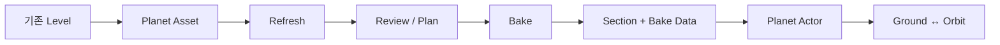
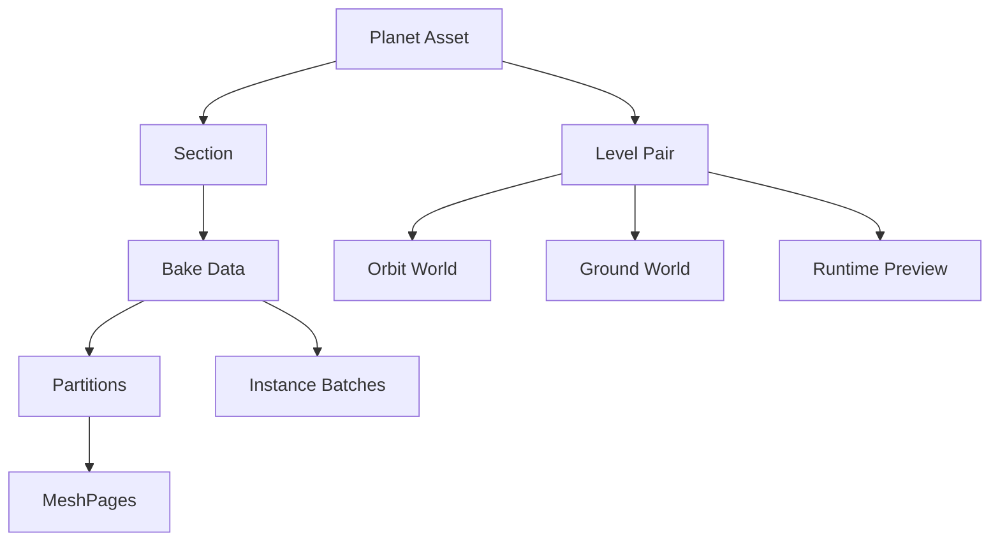
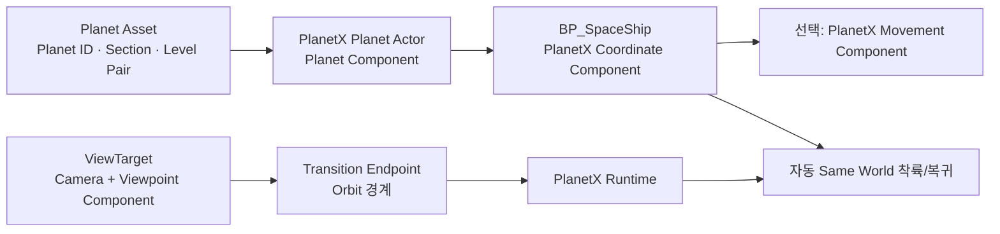
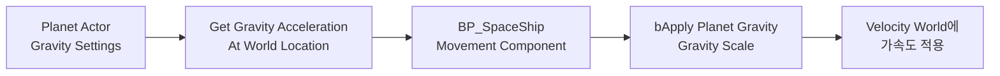

# PlanetX 공식 문서

Version 1.0 · Last reviewed 2026-08-01

## PlanetX 개요

PlanetX는 기존 Unreal Engine Level을 곡면 행성 표현으로 변환하고 Ground와 Orbit 표현 사이의 전환을 제공하는 플러그인입니다.

PlanetX는 기존 Unreal Engine Level을 곡면 행성 표현으로 변환하고 Ground와 Orbit 표현 사이의 전환을 제공하는 플러그인입니다.

### 해결하는 문제

- 기존 Landscape와 Static Mesh를 행성 표면으로 재사용
- 우주용 Proxy 생성
- Ground/Orbit 좌표와 표시 전환
- Same World 및 서로 다른 Level 간 이동
- World Partition 대형 Bake



### 요구사항 요약

| 항목 | 현재 상태 |
|---|---|
| 의존 플러그인 | GeometryProcessing |
| Bake | Editor 전용 |
| 주요 Source | Static Mesh, Landscape, ISM/HISM, Foliage |
| World Partition | 지원 |
| Multiplayer | Travel과 replication은 게임에서 구현 |
| Engine/Platform | 현재 프로젝트에서 빌드·검증한 조합 사용 |
| Demo Map | 사용자용 번들 Demo 없음 |

바로 시작하려면 [첫 Planet Proxy 만들기](/docs/ko/getting-started)로 이동하십시오.

## Quick Start: 첫 Planet Proxy 만들기

이 문서는 PlanetX 플러그인을 활성화한 뒤, 기존 Level을 Ground Section으로 Bake하고 PlanetX Planet Actor를 통해 PIE에서 확인하는 가장 기본적인 과정을 설명합니다.

이 문서는 PlanetX 플러그인을 활성화한 뒤, 기존 Level을 Ground Section으로 Bake하고 `PlanetX Planet Actor`를 통해 PIE에서 확인하는 가장 기본적인 과정을 설명합니다.

처음에는 다음 구성으로 진행합니다.

```
Runtime Role = Same World
Source Scope = Current Level
Bake Mode    = Bake In Editor
Section Name = Main
```

### 1. PlanetX 플러그인 활성화하기


Unreal Editor 상단 메뉴에서 **Edit > Plugins**를 엽니다.

검색창에 `PlanetX`를 입력하고 PlanetX 플러그인의 **Enabled**를 켭니다. 의존 플러그인 활성화 안내가 표시되면 함께 활성화합니다.

변경 후 **Restart Now**를 눌러 Unreal Editor를 다시 시작합니다.

> **Edit > Plugins**에서 수행하는 작업은 플러그인 파일 설치가 아니라 **활성화**입니다. PlanetX 플러그인 파일은 먼저 프로젝트의 `Plugins` 폴더 또는 Engine의 `Plugins` 폴더에 설치되어 있어야 합니다.

Editor를 다시 시작한 뒤 **Tools > PlanetX** 메뉴가 표시되면 활성화가 완료된 것입니다.

### 2. PlanetX Asset 생성하기

### PlanetX Planet Asset 생성하기

Content Drawer에서 **Add > Miscellaneous > PlanetX Planet Asset**을 선택합니다.

Asset 이름은 프로젝트 규칙에 맞게 지정합니다. 이 문서에서는 다음 이름을 사용합니다.

```
PA_FirstPlanet
```


이 단계에서는 Asset을 생성한 뒤 한 번 저장하면 됩니다. Section과 Level Pair 같은 세부 설정은 Bake가 끝난 뒤 Planet Asset Editor에서 확인합니다.

> `Planet Radius`처럼 Proxy의 곡률에 영향을 주는 값이 기본값과 다르다면 Bake 전에 올바른 값으로 지정해야 합니다. 이러한 Bake 입력값을 나중에 변경하면 다시 Bake해야 합니다.

### 3. Ground로 사용할 Level 열기

Planet Proxy의 원본으로 사용할 Ground Level을 엽니다.

Level에는 Bake할 Landscape, Static Mesh, ISM/HISM 또는 Foliage 등의 Ground 콘텐츠가 배치되어 있어야 합니다. Untitled Level이나 Orbit 전용 Level이 아니라 실제 Ground Gameplay에 사용할 Level인지 확인합니다.

Level을 연 뒤 먼저 저장합니다.

> Quick Start에서는 현재 열려 있는 Level을 `Current Level` Source로 사용합니다. 다른 Level을 연 상태에서 Bake하면 의도하지 않은 Source가 선택될 수 있습니다.

### 4. BakeEditor에서 Bake 실행

상단 메뉴에서 **Tools > PlanetX > Proxy Bake Editor**를 엽니다.

다음 값을 지정합니다.

|설정|값|
|---|---|
|**Planet Asset**|`PA_FirstPlanet`|
|**Runtime Role**|`Same World`|
|**Source Scope**|`Current Level`|
|**Bake Quality**|`High`|


Partition, Memory Budget와 Workers는 기본값을 사용합니다.

설정이 끝나면 **BAKE IN EDITOR**를 누릅니다. 현재 Source Scan이 없거나 오래된 경우 Bake 시작 과정에서 Source Refresh가 자동으로 수행됩니다.

- Bake 전에 대상을 직접 검토하고 싶다면 **Refresh**를 먼저 눌러 `Source Review`와 `Output Plan`을 확인해도 됩니다.
- Bake가 진행되는 동안 Editor를 종료하거나 대상 Level과 Planet Asset을 변경하지 마십시오.

[성공 이미지 필요]

Bake가 성공하면 다음 결과가 생성되거나 갱신됩니다.

- `Main` Section
- Section에 연결된 Bake Data
- 생성된 Proxy Mesh와 Payload
- Runtime Preview 연결 정보
- Planet Asset의 Bake Revision 정보

> Bake가 실패하면 오류 창의 요약과 Proxy Bake 로그를 먼저 확인합니다. `ManualReview`, `Unsupported`, Level Pair 충돌 또는 저장 실패가 있으면 해당 원인을 해결한 뒤 다시 실행합니다.

### 5. PlanetAssetEditor에서 설정하기

이후 자동으로 열리는 Planet Asset Editor에서 다음 항목을 순서대로 확인합니다.

상단에서 **Basic > Planet**을 선택합니다.


먼저 **Completion Material**에 행성의 기본 표면으로 사용할  
Material 또는 Material Instance를 지정합니다.

Completion Material은 Bake된 Ground Section을 제외한 나머지  
행성 표면을 표시하는 데 사용됩니다.

처음에는 나머지 설정을 기본값으로 유지합니다.

`Terrain Height`, `Terrain Frequency`, `Padding Width`는 처음에는  
기본값을 유지합니다.

|항목|구현 기준 설명|
|---|---|
|Completion Material|Bake된 Ground Section 밖의 **Completion Surface** 머티리얼입니다. Padding에서는 Ground 머티리얼과 이 머티리얼을 연결·블렌딩하는 기준으로도 사용됩니다.|
|Terrain Height|Completion Surface에만 적용되는 노이즈 최대 변위입니다. 행성 반지름 대비 %이며, `0`이면 자동 지형 노이즈가 꺼집니다.|
|Terrain Frequency|Completion 노이즈의 주파수입니다. 값이 클수록 더 작고 촘촘한 지형이 생성됩니다.|
|Randomize Terrain|새 **결정적 Seed**를 골라 다른 지형 패턴을 만듭니다. 같은 Seed면 항상 같은 결과가 나옵니다.|
|Padding Width (km)|Bake된 Ground Section 둘레에 생성되는 **Geometry Padding**의 폭입니다. 기본값은 정확히 `1.0 km`입니다.|
|Apply & Build|Padding 머티리얼을 먼저 Bake하고, 설정을 Asset에 반영한 뒤 Runtime Visual을 생성/재사용합니다. Padding Bake가 실패하면 설정은 반영될 수 있지만 최종 Visual Build는 건너뜁니다.|

설정이 끝나면 **Apply & Build**를 누르고 Planet Asset을 저장합니다.

### 6. PlanetXActor 배치 후 Planet Asset 지정

Place Actors 패널에서 **PlanetX Planet Actor**를 검색해 현재 Level에 배치합니다.

Actor를 선택하고 Details 패널에서 다음 값을 지정합니다.

```
Planet Component
└─ Planet Asset = PA_FirstPlanet
```

`Auto Register Runtime`은 활성화된 상태로 유지합니다.


같은 Planet Asset을 사용하는 Planet Actor가 현재 World에 하나뿐이라면 `Planet Binding ID`는 비워 두어도 됩니다. 여러 Planet Actor가 같은 Planet Asset을 사용한다면 각각 고유한 Binding ID를 지정합니다.

설정을 마친 뒤 Level을 저장합니다.

### 7. Diagnostics 확인 후 PIE

Planet Asset Editor의 **Diagnostics** 탭에서 Validation 결과를 확인합니다.

다음 조건을 만족해야 합니다.

- `Main` Section과 Bake Data 연결이 유효합니다.
- 진행을 차단하는 Error가 없습니다.
- Generated Visual Build가 최신 상태입니다.
- 필요한 Transition Resource가 준비되어 있습니다.
- Level과 Planet Asset이 모두 저장되어 있습니다.

문제가 없다면 PIE를 실행합니다.

PIE가 `Transition resources are not ready` 메시지와 함께 취소되면 Level과 Planet Asset을 다시 저장하고 자동 Build가 완료될 때까지 상태를 확인합니다. 정확한 실패 원인은 Diagnostics의 Validation 결과에서 확인합니다.

PIE가 정상적으로 시작되고 `PlanetX Planet Actor`가 Planet Asset을 등록하면 첫 Planet Proxy 구성이 완료된 것입니다.

## Editor Workflow

기본 흐름

### 기본 흐름

```text
Refresh → Source Review → Output Plan → Bake → Sections/Diagnostics
```

### Source Scope

| 범위 | 용도 |
|---|---|
| Selected Actors | 소수 Actor 테스트 |
| Current Level | 현재 Level 전체 |
| Loaded Levels | 로드된 Level 전체 |
| Reviewed Set | Review에서 확정한 Source 집합 |

선택, Tag, Level 또는 설정을 바꾸면 다시 `Refresh`하십시오.

`PlanetX.NoBake`와 `PlanetX.ProxyBakePreview` 태그는 Actor/Component를 제외합니다.

### Source 분류

| Role | 처리 |
|---|---|
| ProxyGeometry | 곡면 Proxy geometry |
| LandscapeProxy | Landscape 전용 처리 |
| InstanceBatch | ISM/HISM, Foliage, 반복·소형 rigid mesh |
| Discard | 사용자 제외, tiny 또는 world-scale helper |
| ManualReview | WPO/displacement 등 사용자 판단 필요 |
| Unsupported | 미지원 Component 또는 유효 payload/LOD 없음 |

일반 Static Mesh 중 최대 크기 80cm 이하는 자동 Tiny Discard입니다. ISM/HISM과 Foliage는 크기와 관계없이 InstanceBatch 후보입니다.

### 주요 설정

| 설정 | 설명 | 권장 시작 |
|---|---|---|
| Planet Radius | AEQD 곡률 기준, Planet Asset에서 변경 | 실제 행성 반지름 |
| Surface Datum World Z | altitude 0 기준 | Auto |
| Source Grid | Landscape 원본 vertex grid | 빠른 검토 Off |
| Partition X/Y | 출력 분할 크기 | Auto plan |
| Memory Budget | Bake RAM 한도 | Auto + Safe |
| Workers | geometry worker 수 | 0(자동) |

작은 partition은 loading 단위를 줄이지만 Asset, seam과 finalize 비용을 늘립니다.

### Bake 방식

- `BAKE IN EDITOR`: 빠른 반복과 중소 규모
- `BAKE IN EXTERNAL PROCESS`: 대형 WP와 높은 메모리 작업

External Bake 전에는 Map과 Asset을 저장해야 합니다. 작업 상태는 `ACTIVE BAKE`, 로그는 `Saved/Logs`와 `Saved/PlanetXProxyBake`에서 확인합니다.

### Output 상태

| 상태 | 대응 |
|---|---|
| NEW OUTPUT | 새 Bake |
| UP TO DATE | 그대로 사용 또는 Force Rebuild |
| REBAKE REQUIRED | SourceHash 변경, 다시 Bake |
| LEGACY HASH | 현재 contract로 갱신 |
| TARGET CONFLICT | 경로/identity 충돌 해결 |
| SCAN OUT OF DATE | Refresh |

### Section 관리

- 새 In Editor Bake의 `Target Section Name`은 생성 시 적용됩니다.
- 기존 Section은 `Rename`으로 Display Name만 변경합니다.
- 내부 Section ID는 Source World 경로 hash를 포함하며 변경되지 않습니다.
- `Delete Selected Section`은 Section과 Level Pair만 제거하고 생성 Asset 파일은 남깁니다.
- 한 Planet Asset에는 활성 Same World Level Pair를 최대 하나만 둘 수 있습니다.

### 보조 Editor

- `PlanetX Mode`: Planet/Compare/Level 보기, Placement, Runtime, Transition, Environment, Validate
- `Visual Editor`: Section Placement, Surface Correction, completion/padding Preview

Visual Editor 변경은 `Apply to Asset` 전까지 edit buffer에만 있습니다.

## Runtime Integration

Planet Actor

### Planet Actor

1. World에 `APlanetXPlanetActor`를 배치합니다.
2. Planet Component에 Planet Asset을 지정합니다.
3. 일반적으로 Auto Register Runtime을 유지합니다.
4. 같은 Planet Asset의 여러 인스턴스가 있으면 안정적인 Planet Binding ID를 지정합니다.

### Runtime Role

| Role | 사용 방식 |
|---|---|
| Same World | 같은 World에서 Ground/Orbit 표현 전환 |
| External Level | 게임이 World Travel하고 PlanetX가 pose/state를 Handoff |

PlanetX는 `OpenLevel`, spawn, possession과 GameMode를 소유하지 않습니다.

### Same World

Blueprint:

- `Enter Ground Same World(World Context, Request Actor, Surface Query)`
- `Return To Orbit Same World(World Context, Request Actor)`

Coordinate Component의 Automatic Same World Entry/Return을 사용할 수도 있습니다.

### External Level

```text
Prepare Travel
→ 게임이 Ticket/Route 보관
→ 게임이 World Travel
→ Target Actor 생성·Possess
→ Resume Pending Travel
```

도착 Actor의 `UPlanetXTravelReceiverComponent`는 자동 resume를 시도할 수 있습니다.

### 주요 Component

| Component | 용도 |
|---|---|
| Coordinate Component | Planet/Section identity와 PlanetX pose |
| Movement Component | 선택적 행성 표면 native movement |
| Viewpoint Component | 카메라/플레이어 관찰자와 transition driver |
| Travel Receiver | External Travel 도착 pose/state 적용 |

Coordinate Component만 붙여도 Actor가 매 프레임 자동 이동하지는 않습니다.

### Runtime Preview

External Level의 Bake Preview를 실제 Travel 없이 표시할 때 사용합니다.

- Load Runtime Preview
- Set Runtime Preview Visible
- Unload Runtime Preview
- Get Runtime Preview Status

### C++ 시작점

```cpp
#include "PlanetX/Runtime/PlanetXSubsystem.h"

UPlanetXSubsystem* PlanetX =
    GetGameInstance()->GetSubsystem<UPlanetXSubsystem>();
```

```cpp
PlanetX->EnterGroundSameWorld(this, RequestActor, SurfaceQuery);
PlanetX->ReturnToOrbitSameWorld(this, RequestActor);
```

External Travel은 `PrepareTravel` 후 게임 Travel을 수행하고, 도착 후 `ResumePendingTravel`을 호출합니다.

내부 Runtime Service가 아니라 `UPlanetXSubsystem` 공개 facade를 사용하십시오.

### Transition과 Environment

- `APlanetXTransitionEndpoint`: Planet/Section/Level Pair의 Orbit/Ground 경계 등록
- `APlanetXEnvironmentManager`: Cloud/Atmosphere binding과 Ground/Orbit 환경 전환

PIE에서는 PlanetX Mode의 Runtime 팔레트로 Actor context, Movement state와 Transition result를 확인합니다.

전체 Blueprint/C++ 함수, 반환 타입과 실패 처리 방법은 [사용자 제공 API](/docs/ko/user-api)를 참고하십시오.

## Core Concepts

개념 의미 Ground World 실제 gameplay와 원본 Source가 있는 평면 Level Planet Proxy Orbit에서 표시하는 곡면 표현 Planet Asset Planet ID, Radius, Sections, Level Pairs와 설정을 보관 Section 하나의 Ground 영역과 행성 표면...

| 개념 | 의미 |
|---|---|
| Ground World | 실제 gameplay와 원본 Source가 있는 평면 Level |
| Planet Proxy | Orbit에서 표시하는 곡면 표현 |
| Planet Asset | Planet ID, Radius, Sections, Level Pairs와 설정을 보관 |
| Section | 하나의 Ground 영역과 행성 표면 배치 |
| Level Pair | Ground/Orbit World와 진입 모드 연결 |
| Bake Data | partition, MeshPage, instance와 transition manifest |



### ID와 이름

- Planet ID: 행성의 안정 identity
- Section ID: `{SourceMap}_{FullSourceWorldPath CRC32}`
- Display Name: UI용 이름, Rename 가능
- Planet Binding ID: 같은 Planet ID의 World instance 구분

### Projection과 좌표

현재 projection은 AEQD입니다. Planet Radius가 곡률, Surface Datum이 altitude 0을 결정합니다.

주요 좌표:

- Unreal World
- Planet Local
- Geographic(latitude/longitude/altitude)
- Section tangent frame
- World-independent PlanetX Transform

### Partition과 MeshPage

Partition은 Source 영역을 나누는 계획 단위이고 MeshPage는 revision 아래 생성되는 독립 Static Mesh 결과입니다. 작은 partition은 세밀한 로딩에 유리하지만 Asset과 seam 비용이 늘어납니다.

### Generated Asset

```text
/Game/PlanetX/ProxyBake/{PlanetAsset}/{GroundLevel}/
├─ DA_PXBake_{BakeId}
└─ Revisions/{RevisionId}/
   ├─ Meshes/
   └─ Payloads/
```

경로와 이름은 identity/revision에 사용되므로 임의 이동·Rename을 피하십시오.

## Supported Content

Source 상태 처리 Static Mesh Component 지원 ProxyGeometry 또는 InstanceBatch Landscape / Streaming Proxy 지원 LandscapeProxy ISM/HISM 지원 InstanceBatch Foliage 지원 Foliage InstanceBatch PCG...

| Source | 상태 | 처리 |
|---|---|---|
| Static Mesh Component | 지원 | ProxyGeometry 또는 InstanceBatch |
| Landscape / Streaming Proxy | 지원 | LandscapeProxy |
| ISM/HISM | 지원 | InstanceBatch |
| Foliage | 지원 | Foliage InstanceBatch |
| PCG 결과 | 조건부 | 실제 Static Mesh/ISM/HISM Component가 존재해야 함 |
| Level Instance / Packed Level | 지원 | 내부 지원 Component 검색 |
| World Partition HLOD | 조건부 | 유효 HLOD 우선, raw source fallback |
| Skeletal Mesh / Cloth | 미지원 | 검색에서 제외 |
| Spline deformation | 미지원 | Static Mesh로 변환 권장 |
| Dynamic runtime mesh | 미지원 | 영속 Static Mesh로 변환 필요 |

### 중요 조건

- Static Mesh는 유효 source LOD가 필요합니다.
- Negative Scale은 winding과 normal sign을 보정합니다.
- Source Nanite cluster를 복사하는 것이 아니라 source LOD에서 새 MeshPage를 만듭니다.
- Foliage와 ISM/HISM은 tiny여도 InstanceBatch 후보입니다.
- 일반 Static Mesh의 최대 크기가 80cm 이하면 자동 Discard됩니다.
- live WPO/displacement는 projected Orbit/Morph에서 `ManualReview`가 됩니다.
- `PlanetX.NoBake`, `PlanetX.ProxyBakePreview`, hidden-in-game, transient, editor-only Source는 제외됩니다.

문제 Source는 `Selected Actors → Refresh → Role/Reason 확인`으로 가장 빠르게 진단할 수 있습니다.

## Large World와 World Partition

Source 검색

### Source 검색

World Partition은 unloaded actor를 미리 전부 열 필요가 없습니다.

```text
Descriptor 열거
→ 유효 Actor/HLOD 선택
→ 64개 단위 임시 로드
→ Component payload 캡처
→ 참조 해제
→ 분류와 Plan 생성
```

- 유효하고 최신인 top-level HLOD를 우선 사용합니다.
- stale/invalid HLOD는 original source로 fallback합니다.
- Data Layer membership은 통계에 기록되지만 활성 Data Layer만으로 자동 제한하지 않습니다.
- 확실한 제외에는 visibility보다 `PlanetX.NoBake`를 사용합니다.
- Level Instance/Packed Level의 순환과 로드 실패는 진단에 기록됩니다.

### 대형 Bake 권장

1. Map과 Asset을 저장합니다.
2. `Current Level` 또는 확정한 `Reviewed Set`으로 Refresh합니다.
3. Auto Partition을 유지합니다.
4. `Auto Memory Budget + Safe`를 사용합니다.
5. `BAKE IN EXTERNAL PROCESS`를 사용합니다.
6. `ACTIVE BAKE`와 `Saved/Logs`를 확인합니다.

### Checkpoint

- 동일 contract의 static geometry spool은 재사용될 수 있습니다.
- Landscape가 포함되면 현재 geometry checkpoint는 비활성화됩니다.
- 전체 pipeline 임의 지점 resume가 아니라 exact-contract geometry 재사용입니다.
- 성공 publish 후 checkpoint는 정리됩니다.

주요 임시 경로:

```text
Saved/PlanetX/ProxyBake/PartitionSpool
Saved/PlanetX/ProxyBakeRollback
Saved/PlanetXProxyBake
Saved/Logs
```

작은 partition은 packet RAM을 줄일 수 있지만 MeshPage, seam, package와 finalize 수를 늘립니다.

## Performance와 Optimization

권장 시작점

### 권장 시작점

| 용도 | 설정 |
|---|---|
| Preview | Auto Partition, Source Grid Off, In Editor, Auto + Safe |
| 일반 제작 | Auto Partition, Auto + Safe |
| 고품질 Landscape | Source Grid On 비교, External 권장 |
| 대형 WP | Auto Partition, External, Workers 0 |
| 전용 Bake 머신 | 측정 후 High Utilization 선택 |

`High Utilization`은 품질 설정이 아니라 RAM reserve를 4 GiB에서 1 GiB로 줄이는 실행 설정입니다.

### 영향이 큰 옵션

| 변경 | 영향 |
|---|---|
| Source Grid On | triangle, RAM, disk 증가 |
| 작은 Partition | packet은 작아지고 Asset/seam/finalize 증가 |
| 큰 Partition | Asset은 줄고 peak RAM/loading 단위 증가 |
| Workers/Queue 증가 | 처리량과 동시 peak RAM 증가 가능 |
| 불필요한 Instance 포함 | payload와 Runtime Preview 비용 증가 |

### 최적화 순서

1. 불필요 Source와 ManualReview를 정리합니다.
2. Auto Partition + Safe로 기준 Bake를 만듭니다.
3. largest packet, peak RAM, output bytes를 확인합니다.
4. 설정을 한 번에 하나만 바꿉니다.
5. Runtime Preview, MeshPage, InstanceBatch와 transition을 profile합니다.

현재 Basic UI에는 임의 비율의 단일 Simplify slider가 없습니다. 내부 값을 추측해 고정하지 말고 노출된 Plan과 설정만 사용하십시오.

## Reference

Proxy Bake UI

### Proxy Bake UI

| 영역 | 주요 항목 |
|---|---|
| Target | Planet Asset, Target Section Name, Rename/Use on Bake |
| Runtime Role | Same World, External Level, Ground/Orbit World |
| Source Scope | Selected Actors, Current Level, Loaded Levels, Reviewed Set |
| Output Plan | Source/partition/geometry mix/Bake ID/output path |
| Review | Use, Owner, Component, Role, Assignment, Reason, Partitions |
| Advanced | Partition X/Y, Planet Radius, Source Grid, Surface Datum |
| Budget | Auto Memory, Safe/High Utilization, Workers, Queue, GT Finalize |
| Actions | Refresh, Plan, Clear, Logs, Bake In Editor/External Process |

### Planet Asset Editor

| 탭 | 기능 |
|---|---|
| Overview | identity와 readiness |
| Sections | Rename, Delete, Runtime Role, Bake/Level Pair |
| Configuration | authoring/visual 설정 |
| Preview | 저장 결과 Preview |
| Diagnostics | topology와 link 검증 |

### 주요 Runtime Actor/Component

- `APlanetXPlanetActor`: Planet Asset runtime 인스턴스
- `APlanetXTransitionEndpoint`: transition 경계
- `APlanetXEnvironmentManager`: Cloud/Atmosphere 환경
- `UPlanetXCoordinateComponent`: 좌표 identity와 pose
- `UPlanetXMovementComponent`: 선택적 native movement
- `UPlanetXViewpointComponent`: 관찰자
- `UPlanetXTravelReceiverComponent`: Travel 도착 적용

### Public API

게임 코드는 `UPlanetXSubsystem`을 사용합니다.

함수별 용도, C++ 예제, Component API와 실패 처리 계약은 [사용자 제공 API](/docs/ko/user-api)에 정리되어 있습니다.

#### Entry/Travel

- EnterGroundSameWorld
- ReturnToOrbitSameWorld
- PrepareTravel
- ResumePendingTravel
- Begin/Resolve/Complete/Cancel LevelHandoff

#### Runtime Preview

- LoadRuntimePreview
- SetRuntimePreviewVisible
- UnloadRuntimePreview
- GetRuntimePreviewStatus

#### Coordinate/Surface

- CaptureActorPlanetXTransform
- ResolvePlanetXTransform
- ApplyPlanetXTransformToActor
- QuerySurfaceAtWorldRay/Geo/PlanetXTransform
- BuildLandingTransform

#### Query/Diagnostics

- GetActorRuntimeContext
- GetMovementRuntimeState
- GetTransitionRuntimeResult
- GetSectionDesc/GetSectionTransform
- GetLevelPair/GetLevelPairForSection
- ValidatePlanetAsset
- DiagnoseProxySync
- ResolvePlanetAlignmentForSection

### Console Variables

| CVar | 용도 |
|---|---|
| `PlanetX.MemoryBudgetMB` | PlanetX memory stat budget |
| `px.Material.DebugMode` | 개발용 material debug override |
| `px.Material.UseLegacyPath` | 개발 비교용 legacy path |

### 생성 경로

```text
/Game/PlanetX/ProxyBake/{PlanetAsset}/{GroundLevel}/
├─ DA_PXBake_{BakeId}
├─ {BakeDataName}_RuntimePreview
└─ Revisions/{RevisionId}/
   ├─ Meshes/
   └─ Payloads/
```

### 로그 경로

```text
Saved/Logs
Saved/PlanetXProxyBake
Saved/PlanetX/ProxyBake/PartitionSpool
Saved/PlanetX/ProxyBakeRollback
```

## Troubleshooting

Symptom Likely Cause / 확인 Solution Scan Sources 버튼이 없음 현재 이름이 변경됨 왼쪽 Refresh 사용 Refresh 결과 0 sources 빈 선택, hidden/NoBake, 미지원 Component Current Level로 확인 후 Selected Actors로 격리 L...

| Symptom | Likely Cause / 확인 | Solution |
|---|---|---|
| `Scan Sources` 버튼이 없음 | 현재 이름이 변경됨 | 왼쪽 `Refresh` 사용 |
| Refresh 결과 0 sources | 빈 선택, hidden/NoBake, 미지원 Component | Current Level로 확인 후 Selected Actors로 격리 |
| Landscape 누락 | hidden/tag/WP actor load/LandscapeInfo 문제 | `LandscapeDiscovery` 로그와 failed WP load 확인 |
| Target Section Name 비활성 | target identity 미확정 | Planet Asset 선택 후 Refresh |
| External Bake 후 이름 미적용 | staged 이름은 In Editor 경로 전용 | 완료 후 Refresh하고 Rename |
| `TARGET CONFLICT` | 다른 identity가 output path 점유 | 기존 Asset/경로 확인 후 충돌 해결 |
| 메모리 과다 | Source Grid, 큰 packet, worker/queue 과다 | Auto + Safe, Workers 0, External 사용 |
| `RootManifestBuild` 정지처럼 보임 | 큰 manifest 또는 실제 hang | Logs, CPU/RAM/disk와 timestamp를 함께 확인 |
| seam/구멍 | clipping/topology 불변식 실패 | 출력 사용 중단, Source/partition/전체 log 보존 |
| mirrored mesh inside-out | 구 Bake 또는 material tangent 문제 | 최신 코드로 재Bake, 문제 Mesh 격리 |
| WPO material 차단 | projected morph에 live deformation 불가 | flatten/교체/Discard |
| WP Actor 누락 | descriptor/HLOD/Level Instance/load 실패 | WP/HLOD metrics와 external actor package 확인 |
| Save/Publish 실패 | read-only, disk, unsaved, rollback 실패 | checkout, 저장, 공간 확보 후 재시도 |
| Preview 비어 있음 | Bake Data/Runtime Preview/Level Pair link 누락 | Sections와 Diagnostics 확인 |
| Same World 변경 실패 | 이미 활성 Same World Pair 존재 | topology를 하나로 정리 |
| Travel 후 위치 오류 | Binding/Ticket/Target Actor timing 불일치 | Resume 결과와 identity 확인 |

### 주요 오류

```text
Align Section failed: ... target placement is unchanged or violates placement constraints.
```

현재 위치와 계산 위치가 같거나 placement constraint 위반입니다. Ground Sync Mapping, Section Placement와 Planet Actor transform을 확인합니다.

```text
Canonical seam coverage mismatch ... owners=1
```

partition clipping 후 canonical seam ownership이 깨진 결과입니다. 해당 output을 사용하지 말고 triangle, axis, boundary, partition과 전체 로그를 보존해 pipeline 문제로 보고합니다.

### 로그

우선 `Logs`와 `ACTIVE BAKE`를 사용하고, 지원 요청에는 `Saved/Logs`의 전체 실행 로그를 첨부하십시오.

## PlanetX 사용자 제공 API

이 문서는 게임 Blueprint, 게임 C++ 코드와 다른 Runtime 모듈에서 사용하는 PlanetX 공개 API를 정리합니다.

이 문서는 게임 Blueprint, 게임 C++ 코드와 다른 Runtime 모듈에서 사용하는 PlanetX 공개 API를 정리합니다.

- 기준 소스: `Plugins/PlanetX/Source/PlanetX/Public`
- 기준일: 2026-07-30
- 기본 공개 진입점: `UPlanetXSubsystem`
- Actor 단위 좌표 API: `UPlanetXCoordinateComponent`
- 선택적 Native 이동 API: `UPlanetXMovementComponent`
- 기존 UE 이동 구현 연결 API: `UPlanetXMovementInteropLibrary`

`UPlanetXWorldRuntimeSubsystem`과 그 내부 Runtime Service는 외부 사용자 API가 아닙니다.

### 1. API 선택 가이드

| 필요한 기능 | 사용할 API |
|---|---|
| Ground 진입, Orbit 복귀 | `UPlanetXSubsystem` |
| Level 이동 전후 pose/state 보존 | `UPlanetXSubsystem` |
| 행성 표면 또는 Section 조회 | `UPlanetXSubsystem` |
| World Transform과 PlanetX pose 변환 | `UPlanetXSubsystem` |
| 특정 Actor의 좌표 저장과 벡터 변환 | `UPlanetXCoordinateComponent` |
| PlanetX Native 이동, 중력, 표면 정렬 | `UPlanetXMovementComponent` |
| CharacterMovement, Physics, Custom Movement 전환 | `UPlanetXMovementInteropLibrary` |
| Planet/Section/LevelPair 상태 조회 | `UPlanetXSubsystem` |
| Planet Asset 유효성 검사 | `UPlanetXSubsystem::ValidatePlanetAsset` |
| Bake/Visual Revision 조회 | `UPlanetXPlanetAsset` |

일반 게임 코드는 내부 서비스나 Proxy 컴포넌트를 직접 찾지 말고 `UPlanetXSubsystem`을 사용합니다.

### 2. 시작하기

#### Blueprint

1. `Get Game Instance Subsystem` 노드를 추가합니다.
2. Class를 `PlanetXSubsystem`으로 지정합니다.
3. 반환값에서 `PlanetX` 카테고리의 노드를 호출합니다.

Blueprint에서는 `WorldContextObject` 핀이 일반적으로 숨겨지며 현재 Blueprint가 자동으로 전달됩니다.

#### C++

게임 모듈의 `Build.cs`에 `PlanetX` 모듈 의존성을 추가합니다.

```csharp
PublicDependencyModuleNames.AddRange(new[]
{
    "Core",
    "CoreUObject",
    "Engine",
    "PlanetX"
});
```

```cpp
#include "PlanetX/Runtime/PlanetXSubsystem.h"

UPlanetXSubsystem* PlanetX =
    GetGameInstance()->GetSubsystem<UPlanetXSubsystem>();
```

호출 전 다음 상태를 확인합니다.

- 현재 World에 `APlanetXPlanetActor`가 존재합니다.
- `PlanetComponent`에 `UPlanetXPlanetAsset`이 지정되어 있습니다.
- `bAutoRegisterRuntime`이 활성화되어 있거나 등록 API를 직접 호출했습니다.
- 사용하는 Section과 LevelPair가 Planet Asset에 존재하고 활성화되어 있습니다.
- 동일한 Planet Asset을 여러 Actor가 사용하면 안정적인 `PlanetBindingId`를 지정합니다.

### 3. 공통 반환 규칙

대부분의 명령과 조회 함수는 `bool`을 반환합니다.

- `true`: 요청 또는 조회가 정상적으로 완료됨
- `false`: 입력, Runtime 등록, 좌표 해석 또는 대상 상태가 유효하지 않음

결과 구조체가 함께 제공되면 `bool`만 확인하지 말고 오류 필드도 기록합니다.

| 결과 타입 | 확인할 필드 |
|---|---|
| `FPlanetXTransformResolveResult` | `bSuccess`, `Error`, `ValidationError`, `ConversionError` |
| `FPlanetXLevelHandoffResult` | `bSuccess`, `Error`, `CaptureId`, `JourneyId`, `TransformResult` |
| `FPlanetXMovementHandoffResult` | `bSucceeded`, `Error`, `Handle`, `DiagnosticContext` |
| `FPlanetXRuntimePreviewStatus` | `State`, `bRenderableContentReady`, `bActuallyVisible`, `RetryCount` |

`PlanetBindingId`가 비어 있으면 Runtime이 일치하는 행성을 찾습니다. 같은 `PlanetId`를 가진 PlanetActor가 여러 개라면 명시적인 Binding을 사용해야 합니다.

### 4. Same World 진입 API

Ground와 Orbit 표현이 같은 `UWorld`에 있을 때 사용합니다.

```text
Surface Query
→ EnterGroundSameWorld
→ Ground Gameplay
→ ReturnToOrbitSameWorld
```

| 함수 | 용도 |
|---|---|
| `EnterGroundSameWorld` | Surface Query 결과를 기준으로 Actor를 Ground pose에 원자적으로 적용 |
| `ReturnToOrbitSameWorld` | 저장된 Capture를 사용해 Actor를 Orbit pose로 복귀 |
| `BuildLandingTransform` | Surface Query에서 실제 Ground spawn transform 계산 |

#### C++ 예시

```cpp
FPlanetXSurfaceQueryResult Surface;
const bool bSurfaceFound = PlanetX->QuerySurfaceAtGeo(
    this,
    PlanetId,
    TargetGeo,
    PlanetBindingId,
    Surface);

if (bSurfaceFound && Surface.bCanEnterGround)
{
    PlanetX->EnterGroundSameWorld(this, RequestActor, Surface);
}
```

```cpp
PlanetX->ReturnToOrbitSameWorld(this, RequestActor);
```

수동 진입 대신 `UPlanetXCoordinateComponent`에서 다음 정책을 활성화할 수 있습니다.

- `SetAutomaticSameWorldEntryEnabled`
- `SetAutomaticSameWorldReturnEnabled`
- `SpatialEntryPolicy.MovementContinuityPolicy`

자동 참여 Actor의 경계 감지, Capture와 실제 이동은 World Runtime이 처리합니다.

### 5. Level Travel API

PlanetX는 좌표, 전환 상태와 Ticket을 보존합니다. 다음 작업은 게임 코드의 책임입니다.

- `OpenLevel` 또는 다른 Travel 호출
- 로딩 화면
- Pawn 생성
- PlayerController와 Possession
- GameMode
- Replication과 멀티플레이 이동 정책

#### 권장 간편 흐름

```text
PrepareTravel
→ 게임이 TargetRoute.World로 이동
→ Target PlanetActor 등록
→ Target Actor 생성·Possess
→ ResumePendingTravel
```

| 함수 | 용도 |
|---|---|
| `PrepareTravel` | Source pose/state를 캡처하고 Target Route가 포함된 Ticket 생성 |
| `ResumePendingTravel` | 가장 최근에 준비한 Ticket을 Target Actor에 적용하고 성공 시 소비 |
| `BeginReturnLevelHandoff` | Ground Journey를 Ground→Orbit 복귀 Ticket으로 전환 |
| `GetTransitionJourney` | `JourneyId`로 Journey 상태 조회 |
| `GetActiveTransitionJourneys` | 현재 활성 Journey 전체 조회 |

#### Source World 예시

```cpp
FPlanetXTravelRoute Route;
Route.World = TargetWorld;
Route.PlanetId = PlanetId;
Route.SectionId = SectionId;
Route.PlanetBindingId = TargetPlanetBindingId;

FPlanetXLevelHandoffTicket Ticket;
FPlanetXLevelHandoffResult Result;

if (PlanetX->PrepareTravel(
        this,
        SourceActor,
        Surface,
        Route,
        Ticket,
        Result))
{
    // PlanetX는 Travel을 호출하지 않는다.
    // 게임이 Ticket.TargetWorld 또는 Route.World을 사용해 이동한다.
}
```

#### Target World 예시

```cpp
FPlanetXLevelHandoffResult Result;
const bool bApplied = PlanetX->ResumePendingTravel(
    this,
    TargetActor,
    Result,
    true);
```

도착 Actor에 `UPlanetXTravelReceiverComponent`를 추가하면 `ResumePendingTravel`을 자동으로 재시도할 수 있습니다.

| 설정 | 의미 |
|---|---|
| `bAutoResumePendingTravel` | BeginPlay 이후 자동 Resume 사용 |
| `bApplyControlRotation` | 저장된 Control Rotation 적용 |
| `ArrivalRetryTimeoutSeconds` | PlanetActor 등록 지연을 기다리는 최대 시간 |
| `bLastResumeSucceeded` | 마지막 자동 Resume 성공 여부 |
| `LastResumeError` | 마지막 실패 코드 |

완전 수동으로 처리하려면 `bAutoResumePendingTravel`을 끕니다.

#### 명시적 Ticket 흐름

여러 Ticket을 직접 관리하거나 적용 전 Transform을 검사할 때 사용합니다.

| 함수 | 용도 |
|---|---|
| `BeginLevelHandoff` | LevelPair를 기준으로 Capture와 Ticket 생성 |
| `ResolveLevelHandoffTicket` | Ticket을 소비하지 않고 Target World Transform만 계산 |
| `CompleteLevelHandoff` | Target Actor에 적용하고 성공한 경우에만 Capture 소비 |
| `CancelLevelHandoff` | 미완료 Ticket 취소 |
| `ResolveLevelHandoffEntryTransform` | 기존 Capture의 Ground pose를 현재 World에서 해석 |
| `GetStoredLevelHandoffCapture` | `CaptureId`로 저장 Capture 조회 |

`FPlanetXLevelHandoffTicket`의 `CaptureId`, `JourneyId`, `Generation`, `TargetWorld`, `TargetRoute`는 한 묶음으로 보관해야 합니다. 일부 필드만 복사해 새로운 Ticket을 조립하면 검증에 실패합니다.

### 6. Runtime Preview API

LevelHandoff 전에 Ground의 Bake 결과를 렌더링 전용으로 보여줄 때 사용합니다.

| 함수 | 용도 |
|---|---|
| `LoadRuntimePreview` | LevelPair의 Runtime Preview 로드 요청 |
| `SetRuntimePreviewVisible` | 로드된 Preview의 표시 요청 |
| `GetRuntimePreviewStatus` | 로딩, 렌더 준비와 실제 표시 상태 조회 |
| `UnloadRuntimePreview` | Preview와 임시 렌더 컴포넌트 해제 |

권장 순서:

```text
LoadRuntimePreview
→ GetRuntimePreviewStatus 반복 조회
→ State == Ready
→ bRenderableContentReady == true
→ SetRuntimePreviewVisible(true)
```

`bVisibleRequested`와 `bActuallyVisible`은 다릅니다. 리소스 준비 전에는 표시를 요청했어도 실제 화면에 보이지 않을 수 있습니다.

Runtime Preview는 다음 기능을 제공하지 않습니다.

- Gameplay Actor 복제
- Collision
- Navigation
- Tick 기반 Gameplay
- GameMode 또는 Ground World 대체

### 7. 좌표와 Transform API

#### `FPlanetXTransform`

World에 종속되지 않는 행성 고정 pose입니다.

| 필드 | 의미 |
|---|---|
| `PlanetId` | 행성 식별자 |
| `PlanetBindingId` | 현재 World의 PlanetActor Binding |
| `PlanetFixedPositionCm` | 행성 중심 기준 Cartesian 위치 |
| `PlanetFixedRotation` | 행성 좌표 규약 기준 회전 |
| `Scale3D` | Actor Scale |

`SectionId`와 `LevelPairId`는 pose에 저장되지 않으며 현재 World에서 resolve할 때 계산됩니다.

#### Subsystem 좌표 API

| 함수 | 용도 |
|---|---|
| `CapturePlanetXTransform` | World Transform을 `FPlanetXTransform`으로 캡처 |
| `CaptureActorPlanetXTransform` | Actor의 현재 Transform을 캡처 |
| `ResolvePlanetXTransform` | PlanetX pose를 현재 World Transform으로 해석 |
| `ApplyPlanetXTransformToActor` | 해석한 Transform을 Actor에 적용 |
| `ResolveCoordinateFrame` | Planet 또는 Section frame을 World Transform으로 해석 |
| `CaptureTransitionActorSyncPose` | 전환용 Actor pose와 Control Rotation 캡처 |
| `ApplyTransitionActorSyncPose` | 캡처한 전환 pose를 다른 표현 또는 World의 Actor에 적용 |

#### C++ 예시

```cpp
FPlanetXTransform SavedPose;
FPlanetXTransformResolveResult CaptureResult;

if (PlanetX->CaptureActorPlanetXTransform(
        this,
        PlanetId,
        PlanetBindingId,
        Actor,
        SavedPose,
        CaptureResult))
{
    // SavedPose를 SaveGame, Journey 또는 사용자 상태에 보관할 수 있다.
}
```

```cpp
FPlanetXTransformResolveResult ApplyResult;
PlanetX->ApplyPlanetXTransformToActor(
    this,
    TargetActor,
    SavedPose,
    ApplyResult);
```

### 8. Surface, Section과 LevelPair 조회

#### Surface Query

| 함수 | 입력 기준 | 주요 결과 |
|---|---|---|
| `QuerySurfaceAtWorldRay` | World Ray | 교차 표면, Section, Geo, Ground 진입 가능 여부 |
| `QuerySurfaceAtGeo` | PlanetId와 정규화 Geo | 표면 위치, Normal, Section |
| `QuerySurfaceAtPlanetXTransform` | PlanetX pose | 해당 위치의 Surface/Section |
| `BuildLandingTransform` | Surface Query 결과 | Ground Spawn Transform과 Surface Frame |

`FPlanetXSurfaceQueryResult`의 핵심 필드:

- `bHitPlanetSurface`
- `PlanetId`, `PlanetBindingId`
- `SectionId`, `LevelPairId`
- `Geo`, `SectionLocal`
- `SurfacePositionWorld`, `SurfaceNormalWorld`
- `bInsideSection`
- `bCanEnterGround`
- `bHasGroundWorld`

표면에 맞았다는 사실과 Ground 진입 가능 여부는 별도입니다. 진입 전 `bCanEnterGround`를 확인합니다.

#### Section과 LevelPair

| 함수 | 용도 |
|---|---|
| `GetSectionTransform` | SectionLocal→World Transform 조회 |
| `GetSectionDesc` | Section 배치, Bounds, Region, Bake Link 조회 |
| `GetSectionRuntimeState` | Proxy, Ground 로딩, 표시, Transition 상태 조회 |
| `GetLevelPair` | LevelPairId로 전환 정책 조회 |
| `GetLevelPairForSection` | SectionId에 연결된 LevelPair 조회 |
| `DiagnoseSectionPlanetOverlapFromBounds` | Bounds와 Planet Sphere의 겹침 진단 |

### 9. Runtime 상태와 Transition 조회

| 함수 | 용도 |
|---|---|
| `GetActorRuntimeContext` | Actor의 Planet, Section, Geo와 공간 상태 Snapshot |
| `GetMovementRuntimeState` | 특정 Actor의 속도, 중력, Movement 상태 조회 |
| `GetMovementRuntimeStates` | 현재 World의 모든 PlanetX Movement 상태 조회 |
| `GetTransitionRuntimeResult` | 특정 SourceObject의 현재 Transition 결과 조회 |
| `GetTransitionRuntimeResults` | 현재 Tick의 모든 Transition 결과 조회 |
| `GetTransitionManagedActorState` | Runtime이 관리하는 Actor의 현재·복구 예정 상태 조회 |
| `EvaluateTransitionCylinderState` | 거리와 고도로 Orbit/Transition/Ground 및 Alpha 사전 계산 |

`FPlanetXActorRuntimeContext`의 주요 필드:

- `PlanetId`, `SectionId`, `LevelPairId`
- `Geo`, `SectionLocal`
- `SpaceState`
- `TransitionDirection`
- `TransitionAlpha`
- `bInsidePlanet`, `bInsideSection`, `bCanEnterGround`

이 값들은 Runtime이 계산한 Snapshot입니다. 사용자가 값을 수정해 Runtime 상태를 변경하는 구조가 아닙니다.

### 10. `UPlanetXCoordinateComponent`

Actor가 어떤 Planet 기준 pose를 가지는지 저장하고 좌표 벡터를 변환합니다. 이 컴포넌트 자체는 Actor를 매 프레임 이동시키지 않습니다.

#### 좌표 동기화

| 함수 | 용도 |
|---|---|
| `RefreshRuntimeContext` | 현재 Actor의 Runtime Context 갱신 |
| `CaptureOwnerTransformToPlanetX` | Owner World Transform을 PlanetX pose로 저장 |
| `ApplyPlanetXTransformToOwner` | 저장된 PlanetX pose를 Owner에 적용 |
| `SetPlanetXTransform` | pose 저장 및 선택적 즉시 적용 |
| `GetPlanetXTransform` | 현재 저장 pose 조회 |
| `SetCoordinateFrameReference` | 값은 유지하고 해석할 Planet/Section frame 변경 |
| `PullFromWorld` | World 값을 Coordinate 데이터로 가져오기 |
| `PushToWorld` | Coordinate 데이터를 World에 적용 |

`ApplyPlanetXTransformToOwner`는 PlanetX Coordinate Mode에서만 허용됩니다. 두 Coordinate Mode 모두 숨은 Tick으로 Owner Transform을 덮어쓰지 않습니다.

#### 방향과 벡터

| 함수 | 용도 |
|---|---|
| `GetCurrentSurfaceFrame` | 현재 위치의 East/North/Up frame 조회 |
| `GetPlanetUpVectorWorld` / `GetPlanetDownVectorWorld` | 방사형 Up/Down 조회 |
| `GetSurfaceEastVectorWorld` / `GetSurfaceNorthVectorWorld` | 표면 방향축 조회 |
| `ProjectVectorToSurfaceTangent` | World vector를 표면 접평면에 투영 |
| `ConvertSurfaceVectorToWorld` | East/North/Up vector를 World로 변환 |
| `ConvertPlanetLocalVectorToWorld` | PlanetLocal vector를 World로 변환 |
| `ConvertSectionLocalVectorToWorld` | SectionLocal vector를 World로 변환 |
| `ConvertCoordinateVectorToWorld` | 선택한 VectorSpace에서 World로 통합 변환 |
| `ConvertWorldVectorToCoordinate` | World vector를 선택한 VectorSpace로 역변환 |
| `BuildPlanetSurfaceWorldLocation` | 현재 위치 기준 목표 고도의 World 위치 계산 |
| `BuildSurfaceAlignedRotation` | Actor Up을 행성 표면 Up에 맞춘 회전 계산 |

### 11. `UPlanetXMovementComponent`

PlanetX Native Movement를 선택한 Actor에만 사용합니다. 같은 Owner에 유효한 `UPlanetXCoordinateComponent`가 필요합니다.

| 함수 | 용도 |
|---|---|
| `AddPlanetXInputVector` | 다음 Tick의 이동 입력 누적 |
| `SetPlanetXVelocity` | Native Movement 속도 설정 |
| `GetPlanetXVelocity` | 선택 좌표 기준 속도 조회 |
| `AddPlanetXForce` | 다음 Tick Force 누적 |
| `AddPlanetXImpulse` | 속도에 Impulse 즉시 반영 |
| `SnapToPlanetSurface` | 목표 고도로 위치 보정 |
| `AlignUpToPlanetSurface` | Actor Up을 표면 Up에 정렬 |
| `ValidateMovementConfiguration` | Owner, UpdatedComponent와 좌표 참조 검증 |
| `GetMovementRuntimeState` | 현재 Movement Snapshot 조회 |
| `GetCommittedRuntimeContext` | Orchestrator가 확정한 공간 상태 조회 |

```cpp
Movement->AddPlanetXInputVector(
    FVector(1.0, 0.0, 0.0),
    EPlanetXMovementVectorSpace::SurfaceFrame,
    true);
```

지원 Vector Space:

- `World`
- `PlanetLocal`
- `SurfaceFrame`
- `SectionLocal`

이 컴포넌트는 CharacterMovement, Vehicle, Physics Body 또는 Custom Movement를 자동으로 탐색하거나 비활성화하지 않습니다.

### 12. Movement Handoff API

기존 UE Movement 또는 Physics Body 사이에서 속도 연속성을 보존할 때 `UPlanetXMovementInteropLibrary`를 사용합니다.

#### 표준 MovementComponent

| 함수 | 용도 |
|---|---|
| `CaptureMovementComponentHandoff` | Source Movement 속도 Snapshot 생성 |
| `ApplyMovementComponentHandoff` | Snapshot을 Target Movement에 적용 |
| `SwitchMovementComponentsWithHandoff` | Capture, Target 적용, 활성 상태 전환과 소비를 원자적으로 수행 |

#### Physics Body

| 함수 | 용도 |
|---|---|
| `CapturePhysicsBodyHandoff` | PrimitiveComponent의 선속도·각속도 캡처 |
| `ApplyPhysicsBodyHandoff` | Target Physics Body에 속도 적용 |

#### Custom Movement

| 함수 | 용도 |
|---|---|
| `CaptureMovementHandoffVelocity` | 사용자 이동 구현의 원시 속도 캡처 |
| `ResolveMovementHandoffVelocity` | 목표 frame과 연속성 정책으로 속도 해석 |
| `GetMovementHandoffSnapshot` | Handle의 현재 Snapshot 조회 |
| `ConsumeMovementHandoff` | 사용자 적용 성공 후 Snapshot 소비 |
| `CancelMovementHandoff` | 실패하거나 취소된 Snapshot 종료 |

연속성 정책:

| 정책 | 동작 |
|---|---|
| `Reset` | 목표 속도를 0으로 초기화 |
| `PreserveWorld` | World 속도를 그대로 유지 |
| `RebaseBetweenFrames` | Source frame의 의미를 Target frame으로 재해석 |
| `DoNotApply` | Target 속도를 변경하지 않음 |

`SwitchMovementComponentsWithHandoff`는 성공한 경우에만 Target 활성화, Source 비활성화와 Snapshot 소비를 수행합니다. CharacterMovement의 Movement Mode, Root Motion, Floor State 같은 구현별 상태는 게임 코드가 별도로 처리합니다.

### 13. Planet Asset API

`UPlanetXPlanetAsset`은 행성, Section과 LevelPair의 canonical 설정 자산입니다.

#### 일반 조회

| 함수 | 용도 |
|---|---|
| `GetPlanetId` | 행성 ID 조회 |
| `GetRadiusCm` | 행성 반지름 조회 |
| `GetBakeContractRevision` | 현재 Bake 계약 Revision |
| `GetLastSuccessfulBakeRevision` | 마지막 성공 Bake Revision |
| `IsProxyBakeStale` | 현재 설정과 Bake 결과 불일치 여부 |
| `HasSuccessfulVisualBuild` | 저장형 Visual Build 성공 이력 |
| `IsVisualBuildStale` | 저장형 Visual 결과가 현재 설정보다 오래됐는지 조회 |
| `IsVisualPreviewStale` | 세션 Preview가 현재 설정보다 오래됐는지 조회 |

#### Authoring API

다음 함수는 Editor Tool 또는 명시적인 Authoring 코드에서 사용합니다.

- `SetSurfaceCompletionSettings`
- `SetProxyPaddingSettings`
- `SetVisualGenerationSettings`
- `SetActiveSurfacePreset`
- `SetSectionPlacement`
- `ValidateSectionPlacement`
- `ValidateLevelTopology`
- `SetSectionSurfaceCorrectionSettings`
- `RefreshSectionProxyBakeLink`

Cooked Runtime에서 값을 바꿔도 원본 Asset 패키지에 영속 저장되지 않습니다. 게임 플레이 상태 저장 용도로 사용하지 마십시오.

### 14. 검증과 진단 API

| 함수 | 용도 |
|---|---|
| `ValidatePlanetAsset` | 구조화된 `FPlanetXValidationIssue` 목록 생성 |
| `DiagnoseProxySync` | Planet, Proxy, Morph와 Ground anchor 정렬 진단 |
| `ResolvePlanetAlignmentForSection` | Bake Ground mapping 기준 필요 Planet 배치와 현재 오차 계산 |
| `DiagnoseSectionPlanetOverlapFromBounds` | Section bounds의 Planet surface 침범 깊이 계산 |
| `DrawPlanetDebug` | 등록 행성 디버그 표시 |
| `DrawSectionDebug` | Section 디버그 표시 |
| `DrawActorContextDebug` | Actor Runtime Context 표시 |
| `DrawCaptureStackDebug` | Transition Capture Stack 표시 |

`ValidatePlanetAsset`의 반환값과 Issue 목록을 함께 확인합니다. Warning만 존재하는 경우와 Runtime을 막는 Error를 구분해야 합니다.

### 15. 고급 직접 제어 API

다음 API도 Blueprint에 노출되지만 일반 게임 흐름에서는 Runtime Orchestrator가 관리합니다.

| 타입 | 주요 기능 | 권장 사용 |
|---|---|---|
| `UPlanetXPlanetComponent` | Runtime 등록, 행성 중력 조회, Morph 상태 | 등록·조회는 사용 가능, Transition setter는 특수 제어용 |
| `UPlanetXPlanetProxyComponent` | Sphere/Section Proxy 재구성, Layer/Partition 표시 | 디버그, 커스텀 표시 또는 툴링 |
| `UPlanetXTransitionMorphComponent` | BakeData/Resource 지정, Morph mesh와 Alpha 제어 | 커스텀 Transition Presentation |
| `APlanetXRuntimePreviewActor` | BakeData를 직접 로드하고 표시 | Subsystem Preview 경로를 사용할 수 없을 때 |
| `APlanetXEnvironmentManager` | 환경 binding 검증과 Transition Alpha 적용 | 커스텀 환경 제어 |

자동 Transition이 활성화된 상태에서 같은 Alpha, Visibility 또는 Environment 값을 매 Tick 직접 설정하면 Orchestrator 결과와 충돌할 수 있습니다.

#### 구성 전용 Actor/Component

- `APlanetXTransitionEndpoint`: Planet, Section, LevelPair와 Transition Cylinder를 Details에서 설정합니다. 상태 판정은 Runtime Service가 수행합니다.
- `UPlanetXViewpointComponent`: Actor를 관찰자 후보로 등록합니다. 공개 명령 함수 없이 설정 프로퍼티로 동작합니다.
- `UPlanetXTravelReceiverComponent`: 도착 Actor에서 Pending Travel을 자동 복원합니다. 공개 명령 함수 없이 BeginPlay와 설정 프로퍼티로 동작합니다.

### 16. 사용 책임 경계

PlanetX가 담당하는 기능:

- 행성 고정 pose Capture/Resolve
- Ground/Orbit 전환 상태
- SameWorld 진입과 복귀
- LevelHandoff Ticket과 Journey
- Runtime Preview
- Section, Surface와 Runtime Context 조회
- 선택적 Native Movement와 이동 속도 Handoff

게임이 담당하는 기능:

- `OpenLevel`, Seamless Travel 또는 다른 World 이동 실행
- Pawn Spawn과 Possession
- GameMode와 PlayerController 정책
- 저장 게임과 네트워크 복제
- 로딩 화면과 실패 복구 UI
- CharacterMovement, Vehicle과 Custom Movement의 고유 상태
- Data Layer와 Streaming Source 정책

### 17. 구현 체크리스트

- [ ] PlanetActor와 PlanetAsset이 현재 World에 등록되어 있다.
- [ ] 중복 PlanetId 사용 시 `PlanetBindingId`를 지정했다.
- [ ] Surface Query 성공 후 `bCanEnterGround`를 확인했다.
- [ ] 모든 `bool` 실패 경로에서 Result 오류를 기록한다.
- [ ] Level Travel은 게임 코드가 직접 수행한다.
- [ ] Target World에서 PlanetActor 등록 후 Ticket을 Resume/Complete한다.
- [ ] Runtime Preview의 `bRenderableContentReady`를 확인한 뒤 표시한다.
- [ ] CoordinateComponent를 MovementComponent로 오해하지 않는다.
- [ ] 기존 UE Movement 전환 시 Movement Handoff API를 명시적으로 호출한다.
- [ ] 자동 Transition 사용 중 Proxy/Morph/Environment를 중복 제어하지 않는다.

## Runtime Actor 통합 가이드: Blueprint로 우주선과 캐릭터 연결하기

이 문서는 PlanetX를 처음 사용하는 게임 플레이 프로그래머 또는 레벨 디자이너가 Blueprint Actor를 PlanetX Runtime에 연결하는 방법을 설명합니다. 예시는 BP SpaceShip이 Orbit에서 Ground로 착륙하고 복귀하는 흐름을 사용하지만 Pawn과 Character에도 같은 원칙을...

이 문서는 PlanetX를 처음 사용하는 게임 플레이 프로그래머 또는 레벨 디자이너가 Blueprint Actor를 PlanetX Runtime에 연결하는 방법을 설명합니다. 예시는 `BP_SpaceShip`이 Orbit에서 Ground로 착륙하고 복귀하는 흐름을 사용하지만 Pawn과 Character에도 같은 원칙을 적용할 수 있습니다.

이 문서를 끝까지 따르면 다음을 할 수 있습니다.

- `BP_SpaceShip`이 어느 Planet을 기준으로 움직이는지 지정한다.
- PlanetX Native Movement로 행성 기준 입력을 처리한다.
- 버튼으로 Same World 착륙/복귀를 실행한다.
- 전환 영역에 진입하면 자동으로 착륙/복귀하도록 설정한다.
- `Add PlanetX Input Vector`가 `false`를 반환하는 이유를 찾는다.

> 이 문서는 이미 Planet Asset과 Section을 만들고 Bake를 완료했다는 전제입니다. 아직 Planet을 만들지 않았다면 먼저 [Quick Start](/docs/ko/getting-started)를 완료하십시오.

### 1. 먼저 선택할 Runtime 방식

PlanetX Runtime에는 서로 목적이 다른 세 가지 진입 방식이 있습니다. 처음 검증할 때는 **Same World 수동 착륙**을 권장합니다.

| 목표 | 사용할 방식 | 핵심 API/설정 |
|---|---|---|
| 버튼을 눌러 같은 월드에서 착륙 | Same World 수동 | `Query Surface At Planet X Transform` → `Enter Ground Same World` |
| 전환 영역에 들어가면 자동 착륙 | Same World 자동 | Coordinate 정책 + Viewpoint + Transition Endpoint |
| Ground Map으로 실제 Level 이동 | Level Handoff | `Prepare Travel` → 게임의 Travel → `Resume Pending Travel` |
| 행성 기준 이동/중력/표면 정렬 | PlanetX Native Movement | `PlanetXMovementComponent` |
| 기존 Character/Vehicle/Physics 유지 | 기존 이동 구현 + Handoff | `PlanetXMovementInteropLibrary` |

PlanetX는 `Open Level`, Pawn Spawn, Possess, GameMode, 네트워크 복제를 대신하지 않습니다. Level을 바꾸는 경우에는 게임 Blueprint 또는 게임 코드가 그 흐름을 소유해야 합니다.

### 2. Runtime의 핵심 연결 구조



각 요소의 책임을 구분하면 문제를 훨씬 쉽게 해결할 수 있습니다.

| 요소 | 책임 | 하지 않는 일 |
|---|---|---|
| `PlanetX Planet Actor` | Planet Asset 제공, Runtime 등록, 행성 좌표 기준 제공 | 플레이어를 이동시키지 않음 |
| `PlanetXCoordinateComponent` | Actor와 Planet의 참조 연결, 좌표/방향 변환, 자동 진입 참여 | 매 Tick 이동을 만들지 않음 |
| `PlanetXMovementComponent` | 선택적 Native 이동, 중력, 표면 정렬 | CharacterMovement/Physics를 자동 제어하지 않음 |
| `PlanetXViewpointComponent` | 현재 카메라가 전환 상태를 판정할 수 있게 표시 | 우주선을 자동으로 이동시키지 않음 |
| `PlanetXTransitionEndpoint` | Section의 전환 경계를 Runtime에 등록 | 전환 상태 기계를 직접 소유하지 않음 |
| `PlanetXSubsystem` | Surface Query, 착륙/복귀, Travel Ticket의 공개 진입점 | 내부 Runtime Service를 노출하지 않음 |
Coordinate Component만 추가해도 Actor가 자동으로 움직이는 것은 아닙니다. 이동은 `PlanetXMovementComponent` 또는 게임의 기존 Character/Vehicle/Physics 구현이 담당합니다.
#### 2.1 Blueprint 핀 표시 규칙

PlanetX는 Query, Route, Ticket, Result 구조체를 그대로 유지하되 새 Make/Break Struct 노드에는 자주 사용하는 핀만 기본 표시합니다. 특정 Planet을 고르는 Preferred Planet/Binding, Ticket의 Capture/Generation, Result의 Transform 진단값이 필요하면 노드의 핀 옵션에서 해당 핀을 다시 표시하십시오.

Actor Blueprint에서는 `Request Actor`, `Source Actor`, `Target Actor`의 기본값이 `Self`입니다. 예시의 `Self` 연결은 흐름을 설명하기 위한 것이며 같은 Actor를 처리한다면 선을 생략할 수 있습니다. `Resume Alpha`와 `Apply Control Rotation`은 노드의 고급 핀을 펼쳐야 나타납니다. 전체 기본/숨김 핀 표는 [Blueprint 공개 API](/docs/ko/user-api#21-blueprint-기본-핀-정책)를 참고하십시오.

### 3. 착륙 전에 Planet 쪽을 준비한다

현재 플레이하는 World에 다음 상태가 갖춰져 있어야 합니다.

#### 3.1 Planet Actor

1. 레벨에 **PlanetX Planet Actor**를 배치합니다.
2. Actor의 **Planet Component → Planet Asset**에 만든 `Planet Asset`을 지정합니다.
3. `Auto Register Runtime`은 켜 둡니다.
4. 같은 Planet Asset을 여러 Planet Actor가 사용한다면 각 Actor에 고유한 `Planet Binding ID`를 지정합니다.

Planet Actor를 런타임에 Spawn하거나 `Auto Register Runtime`을 끈 경우에는 Planet Component 또는 Planet Actor에서 **Register To PlanetX Runtime**을 호출해야 합니다. 다만 이것은 Runtime Surface Query와 전환을 위한 등록입니다. 아래의 `Missing Planet Reference` 오류는 우선 Actor와 Asset 참조가 유효한지부터 확인해야 합니다.

#### 3.2 Section과 Level Pair

Same World 착륙이 가능하려면 목표 Section의 Level Pair가 다음 조건을 충족해야 합니다.

- `Entry Mode = Same World`
- `Can Enter Ground = true`
- `Visual Only = false`
- Ground Sync Mapping과 Ground 표현이 유효함

착륙 전에는 항상 Surface Query 결과의 `bCanEnterGround`를 확인하십시오. 표면에 맞았다고 해서 반드시 해당 위치가 착륙 가능한 Section이라는 뜻은 아닙니다.

**External Section만 있는 Planet도 지원됩니다. Same World Section을 정렬용 anchor로 추가할 필요가 없습니다.** Orbit → Ground 위치와 회전은 선택된 Section의 Ground Sync Mapping을 기준으로 계산합니다.

#### 3.3 시작 전 확인할 점

Planet Asset Editor의 Diagnostics에서 Error가 없는지 확인하고, PIE에서 Planet Actor가 실제로 로드된 상태인지 확인합니다. 문제를 분리할 때는 `PlanetXSubsystem → Validate Planet Asset`과 `Draw Planet Debug`가 유용합니다.

### 4. BP_SpaceShip에 Component를 추가한다

`BP_SpaceShip`을 열고 아래 Component를 추가합니다.

| Component                      |     필요 여부 | 언제 쓰는가                                      |
| ------------------------------ | --------: | ------------------------------------------- |
| `PlanetX Coordinate Component` |        필수 | Planet 참조, 좌표 변환, 착륙/복귀                     |
| `PlanetX Movement Component`   |        선택 | PlanetX가 우주선 이동을 직접 처리할 때                   |
| `PlanetX Viewpoint Component`  | 자동 전환에 필수 | 우주선 또는 카메라가 PlayerController의 ViewTarget일 때 |
| `Camera Component`             | 자동 전환에 필수 | 현재 ViewTarget의 활성 카메라                       |

#### 4.1 Coordinate Component 기본 설정

`PlanetXCoordinateComponent`를 선택하고 다음을 설정합니다.

| Details 항목                                        | 권장 값              | 이유                                      |
| ------------------------------------------------- | ----------------- | --------------------------------------- |
| `Auto Register Runtime`                           | `true`            | Actor Runtime Context와 자동 진입 참여에 필요     |
| `Representation Domain`                           | `Orbit`           | 우주선의 기본 표현 영역                           |
| `Runtime Load Policy`                             | `PlanetX Default` | Orbit Actor를 always-loaded 정책으로 다룰 때 사용 |
| `Reference Planet Actor` 또는 `Reference Planet Id` | 아래 5장 참고          | 우주선이 기준으로 삼을 Planet 지정                  |

World Partition을 사용하는 Orbit Actor에는 `PlanetX Default` 정책을 유지하고, 필요한 경우 Details의 **Apply Default Runtime Load Policy To Owner**를 실행합니다. Data Layer와 Streaming Source 정책은 게임 프로젝트가 별도로 관리합니다.

#### 4.2 Native Movement를 사용할 때의 Actor 조건

`PlanetXMovementComponent`는 `UpdatedComponent`를 이동시키는 kinematic Movement Component입니다. 기본적으로 Owner의 Root Component를 사용합니다.

- Root Component의 Mobility는 `Movable`이어야 합니다.
- Native Movement 테스트 중 Root Mesh의 `Simulate Physics`는 꺼 둡니다.
- 기존 `CharacterMovement`, Vehicle Movement 또는 자체 Physics 이동을 동시에 켜 두지 않습니다.
- Root가 아닌 Component를 움직여야 한다면 `Updated Component`를 명시적으로 지정합니다.

Physics 기반 우주선을 만들고 싶다면 PlanetX Native Movement를 대신 사용할 것이 아니라 Physics Body Handoff API 또는 프로젝트의 물리 제어 코드를 사용하십시오. PlanetX는 Physics 상태를 자동으로 바꾸지 않습니다.

### 5. Reference Planet을 지정한다

이 단계가 빠지면 `Add PlanetX Input Vector`가 `false`를 반환하면서 `Missing Planet Reference`가 발생합니다.

Coordinate Component는 아래 순서로 기준 Planet을 찾습니다.

```text
Reference Planet Actor
→ 없으면 Reference Planet Id가 같은 Planet Actor를 현재 World에서 탐색
→ 둘 다 없거나 Planet Asset이 없으면 Missing Planet Reference
```

PlanetX가 거리만 보고 가장 가까운 Planet을 자동으로 선택하지는 않습니다. 여러 Planet이 있는 게임에서 잘못된 Planet을 선택하지 않기 위한 의도적인 규칙입니다.

#### 5.1 레벨에 미리 배치한 우주선

1. 레벨에서 `BP_SpaceShip` 인스턴스를 선택합니다.
2. Components 패널에서 `PlanetXCoordinateComponent`를 선택합니다.
3. Details의 **Reference Planet Actor** 스포이드로 월드의 PlanetX Planet Actor를 지정합니다.
4. `Current Planet Actor`와 `Current Planet Asset`이 올바르게 표시되는지 확인합니다.

#### 5.2 런타임에 Spawn하는 우주선

Blueprint 클래스 기본값에서는 월드에 배치된 Actor를 안전하게 참조할 수 없습니다. `BP_SpaceShip`의 `Event BeginPlay`에서 Actor를 찾아 할당하십시오.

```text
Event BeginPlay
→ Get Actor Of Class (Class = PlanetXPlanetActor)
→ Get PlanetXCoordinateComponent
→ Set Reference Planet Actor
→ Refresh Coordinate Snapshot
```

`Set Reference Planet Actor`는 별도 Subsystem API가 아니라 Coordinate Component의 Blueprint writable 속성입니다. Component 참조 핀에서 드래그하여 노드를 검색할 수 있습니다. 런타임에 참조를 바꾼 직후에는 **Refresh Coordinate Snapshot**을 호출해야 새 Planet Actor와 Asset을 즉시 해석합니다. `Refresh Runtime Context`는 Runtime이 계산한 Context를 읽어 갱신하는 용도이며, 새 Reference를 초기화하는 대체 수단이 아닙니다.

World에 Planet이 여러 개면 `Get Actor Of Class`를 그대로 쓰지 마십시오. Actor Tag, 고유한 Planet Actor Blueprint, Spawn 시 전달한 Actor 참조 등으로 목표 Planet을 명시적으로 선택합니다.

#### 5.3 Actor 참조 대신 Planet ID로 찾기

`Reference Planet Actor`를 비워 둔 상태에서 **Reference Planet Id**에 Planet Asset의 `PlanetId`를 넣어도 됩니다. Planet Actor가 하나인 단순한 맵에서는 이 방식이 편합니다.

같은 `PlanetId`를 가진 Planet Actor가 여러 개라면 어떤 World 인스턴스를 뜻하는지 모호해질 수 있습니다. 이 경우에는 `Reference Planet Actor`와 필요 시 `Planet Binding ID`를 명시하십시오.

#### 5.4 가장 빠른 참조 검증

BeginPlay 직후 다음처럼 확인합니다.

```text
Get PlanetXCoordinateComponent
→ Get Resolved Planet Component
→ Is Valid?
```

`false`라면 입력, 표면 프레임, 중력, 착륙 모두 실패할 수 있습니다. Planet Actor에 `Planet Asset`이 비어 있지 않은지부터 다시 확인하십시오.

### 6. PlanetX Native Movement로 움직이기

Native Movement는 `Add PlanetX Input Vector`에 들어온 입력을 **다음 Movement Tick에만** 사용합니다. 따라서 Enhanced Input의 `Started` 한 번에서 호출하면 지속 이동하지 않습니다.

#### 6.1 처음에는 World Vector로 테스트

참조와 입력 자체를 먼저 검증할 때는 `Vector Space = World`를 사용합니다.

```text
IA_Move (Triggered)
→ Action Value (Vector2D)
→ Make Vector (X, Y, 0)
→ Add PlanetX Input Vector
    Target = PlanetXMovementComponent
    Vector Space = World
```

`Triggered` 또는 기존 Axis 이벤트처럼 매 프레임 실행되는 이벤트에서 호출해야 합니다. `Add PlanetX Input Vector`는 매 Tick 후 입력 누적값을 지우므로, `Started`만 연결하면 키를 누르고 있어도 다음 프레임에는 입력이 없습니다.

#### 6.2 표면 기준 이동으로 바꾸기

World Vector 이동이 정상이라면 `Vector Space = Surface Frame`으로 바꿉니다.

```text
IA_Move (Triggered)
→ Make Vector (Forward/Right 입력, 0)
→ Add PlanetX Input Vector
    Vector Space = Surface Frame
    Project To Surface Tangent = true
```

Surface Frame의 축은 다음과 같습니다.

| 값 | 방향 |
|---|---|
| X | Surface East |
| Y | Surface North |
| Z | Surface Up |

표면을 따라 이동하려면 `Project To Surface Tangent = true`를 권장합니다. 자유로운 우주 비행처럼 위/아래 성분도 사용하려면 `World` 또는 `Planet Local` Vector Space를 사용하고 Tangent 투영을 끕니다.

#### 6.3 Native Movement 설정 예시

처음에는 다음처럼 단순하게 설정하면 원인을 분리하기 쉽습니다.

| 설정 | 테스트 권장값 |
|---|---|
| `Maximum Speed Cm Per Second` | `1200` 이상 |
| `Acceleration Cm Per Second Squared` | `4096` 이상 |
| `Deceleration Cm Per Second Squared` | `4096` 이상 |
| `Apply Planet Gravity` | 이동 확인 전에는 `false` |
| `Align Up To Surface` | 지상/표면 이동이면 `true` |
| `Sweep In Orbit` | 충돌이 필요할 때만 `true` |

입력 후 `Get PlanetX Velocity` 또는 `Get Movement Runtime State`로 `Velocity World`가 변하는지 확인합니다.

#### 6.4 행성 중력 설정

PlanetX의 방사형 중력은 **Planet Actor의 Planet Component**가 계산하고, 이를 실제로 적용할지는 각 Actor의 `PlanetXMovementComponent`가 결정합니다. 따라서 Planet Asset만 설정했다고 우주선에 자동으로 중력이 적용되지는 않습니다.



##### Planet Actor: Gravity Settings

Planet Actor의 **Planet Component → Gravity Settings**에서 다음을 설정합니다.

| 항목 | 의미 | 시작 권장값 |
|---|---|---|
| `Enabled` | 행성 중력 계산 활성화 | `true` |
| `Model = Constant Surface` | 고도와 관계없이 일정한 방사형 중력 | 지상/아케이드 게임 |
| `Model = Inverse Square` | `표면 중력 × (행성 반지름 / 중심까지 거리)²` | 우주 비행 시뮬레이션 |
| `Surface Acceleration` | 표면에서의 가속도, 단위 `cm/s²` | 지구와 비슷하게는 `980` |
| `Maximum Acceleration` | 중심 근처의 과도한 가속도 상한 | 기본값 유지 후 필요 시 조절 |

중력 방향은 언제나 Planet Actor의 중심을 향합니다. Planet Actor를 다른 위치에 배치하면 중력 중심도 함께 바뀝니다.

##### 우주선: 실제 중력 적용 여부

`BP_SpaceShip → PlanetXMovementComponent → Gravity`에서 설정합니다.

| 항목 | 의미 |
|---|---|
| `Apply Planet Gravity` | Orbit/Transition에서 Planet Actor가 계산한 방사형 중력을 Native Movement에 적용 |
| `Apply Planet Gravity In Ground` | Ground에서도 PlanetX 방사형 중력을 적용. 기본값은 `false` |
| `Gravity Scale` | 이 Actor에만 적용하는 중력 배수. `0`은 사실상 무중력 |

자유 비행 우주선의 첫 테스트에서는 `Apply Planet Gravity = false`를 권장합니다. 조종과 착륙 흐름이 확인된 뒤 중력을 켜면, 중력 때문에 입력 실패처럼 보이는 문제를 피할 수 있습니다.

Ground에서 `Apply Planet Gravity In Ground = false`는 **PlanetX Native Movement가** 방사형 중력을 더하지 않는다는 뜻입니다. UE CharacterMovement의 기본 중력, Physics Body의 중력, 또는 프로젝트의 Custom Gravity를 자동으로 켜거나 끄지는 않습니다. 같은 Actor에 두 종류의 중력을 중복 적용하지 않도록 정책을 하나만 선택하십시오.

##### External Level에서의 중력

`Entry Mode = Level Handoff`인 경우 Orbit World와 Ground World의 Planet Actor는 서로 다른 월드 인스턴스입니다. `Gravity Settings`는 Planet Asset이 아니라 **각 World의 Planet Component가 소유하는 설정**이므로, 두 World의 Planet Actor에 원하는 값을 각각 설정해야 합니다.

Travel Ticket은 pose와 전환 상태를 전달하지만 중력 설정을 동기화하는 수단이 아닙니다. Target World에서 `Resume Pending Travel`이 끝난 뒤 우주선 Coordinate Component가 Target Planet Actor를 올바르게 참조하고 있는지 확인하십시오.

##### 중력 디버그

다음 중 하나로 현재 적용값을 확인합니다.

```text
Planet Component → Get Gravity Acceleration At World Location
    World Location = BP_SpaceShip의 현재 위치

또는

PlanetXMovementComponent → Get Movement Runtime State
    → Gravity Acceleration World 출력
```

첫 API는 계산 가능한 방사형 중력 벡터를 반환하고, 두 번째 API는 Native Movement가 이번 Tick에 실제로 적용한 중력 가속도를 보여 줍니다.

#### 6.5 입력 노드가 false일 때

`Add PlanetX Input Vector`의 Return Value를 반드시 Branch와 `Print String`에 연결하십시오. `false`이면 바로 이어서 `Get Movement Runtime State`를 호출하고 `Failure Reason`을 출력합니다.

| Failure Reason                 | 원인                                                        | 해결                                                  |
| ------------------------------ | --------------------------------------------------------- | --------------------------------------------------- |
| `Inactive Component`           | Movement Component가 비활성                                   | Component의 Active를 켜고 Activate                      |
| `Missing Owner`                | 정상 Blueprint 사용에서는 드묾                                     | Component를 유효한 Actor에 추가                            |
| `Missing Updated Component`    | Root/Updated Component가 없음                                | Movable Root를 만들거나 Updated Component 지정             |
| `Missing Coordinate Component` | 같은 Actor에 Coordinate Component가 없음                        | Coordinate Component 추가 또는 올바른 Component 참조 지정      |
| `Missing Planet Reference`     | Coordinate Component가 Planet Actor와 Planet Asset을 해석하지 못함 | 5장의 Reference Planet 설정 확인                          |
| `Invalid Coordinate Vector`    | `Surface Frame`/`Section Local` 변환 실패                     | 먼저 `World` Vector Space로 테스트하고 Planet 참조/Section 확인 |

추가로 **Validate Movement Configuration**을 BeginPlay에 한 번 호출해 Error Message를 출력해 두면, PIE에서 설정 실수를 즉시 확인할 수 있습니다.

### 7. 버튼으로 Same World 착륙시키기

이 방법은 전환 영역, Viewpoint, Transition Endpoint 없이도 착륙 명령 자체를 확인할 수 있는 가장 단순한 흐름입니다. Same World는 Ground 콘텐츠가 이미 같은 World에 존재하는 구조이며, PlanetX가 Ground Map을 열거나 스트리밍하는 방식이 아닙니다. Planet Asset의 Section/Level Pair와 Ground Mapping은 유효해야 합니다.

#### 7.1 착륙 Blueprint 흐름

예를 들어 `IA_Land`의 `Started`에서 다음 순서를 만듭니다.

```text
Get PlanetXCoordinateComponent
→ Capture Owner Transform To PlanetX
→ Get PlanetX Transform
→ Get Game Instance Subsystem (PlanetXSubsystem)
→ Query Surface At Planet X Transform
→ Break PlanetXSurfaceQueryResult
→ Branch (bCanEnterGround)
→ Enter Ground Same World
    Request Actor = Self
    Surface Query = 위 Query 결과
```

각 `bool` 반환값은 다음 노드로 넘어가기 전에 Branch로 검사하십시오. 특히 `Query Surface At Planet X Transform`이 성공해도 `bCanEnterGround`가 `false`이면 진입하면 안 됩니다.

`Enter Ground Same World`는 현재 Actor의 PlanetX pose를 Capture하고, Surface Query가 가리키는 Ground pose에 적용합니다. 같은 Actor가 유지되므로 Spawn이나 Possess를 추가로 할 필요는 없습니다.

#### 7.2 Orbit으로 복귀하기

복귀 입력에는 다음만 호출합니다.

```text
Get Game Instance Subsystem (PlanetXSubsystem)
→ Return To Orbit Same World
    Request Actor = Self
```

수동으로 여러 Actor를 착륙시켰다면 복귀는 진입의 역순으로 처리하십시오. 수동 Same World 복귀는 저장된 Capture 순서를 사용합니다.

#### 7.3 착륙 위치만 미리 보고 싶을 때

`Enter Ground Same World` 전에 **Build Landing Transform**을 호출하면 적용될 Ground Transform과 Surface Frame을 확인할 수 있습니다. 디버그 표시, 착륙 UI, 카메라 연출을 만들 때 유용하지만 Transform을 직접 적용한 뒤 Enter API를 또 호출하지는 마십시오.

### 8. 전환 영역에서 자동 착륙시키기

자동 착륙은 플레이어의 현재 관찰 위치가 Transition Cylinder에 들어갔을 때 동작합니다. 각 기능을 하나씩 수동으로 호출하는 대신, Runtime이 전환 상태와 Capture를 처리합니다.

#### 8.1 필요한 구성

| 위치 | 필요한 것 | 주요 설정 |
|---|---|---|
| Planet/Orbit World | `PlanetXTransitionEndpoint` | `Endpoint Role = Orbit`, Planet Actor, Section Id, Level Pair Id |
| Player의 ViewTarget | 활성 `Camera Component` | PlayerController가 이 Actor를 ViewTarget으로 사용 |
| Player의 ViewTarget | `PlanetXViewpointComponent` | `Auto Register Runtime = true`, `Can Drive Transition State = true` |
| 자동 이동할 우주선 | `PlanetXCoordinateComponent` | 올바른 Planet 참조, 자동 Entry/Return 활성화 |

전환은 우주선 Actor 자체의 위치만 보는 것이 아니라 **PlayerController의 실제 ViewTarget과 활성 Camera**를 우선 사용합니다. 우주선이 ViewTarget이 아니라면 Camera가 붙은 실제 ViewTarget Actor에 `PlanetXViewpointComponent`를 추가하십시오.

#### 8.2 Transition Endpoint 설정

Orbit World에 `PlanetXTransitionEndpoint`를 배치하고 다음을 지정합니다.

1. `Endpoint Role = Orbit`
2. `Planet Actor`에 현재 World의 PlanetX Planet Actor 지정
3. `Section Id`와 `Level Pair Id`에 목표 착륙 Section의 값을 지정
4. `Auto Size Transition Cylinder To Section Bounds`는 처음에는 켜 둠
5. 필요하면 `Outer Radius`, `Inner Radius`, 높이 제한을 조정

Endpoint는 전환 상태를 직접 실행하는 Actor가 아니라, 전환 중심과 Cylinder 규칙을 Runtime에 등록하는 authoring Actor입니다. PlanetX Runtime이 매 프레임 Orbit/Transition/Ground 상태와 Alpha를 계산합니다.

#### 8.3 우주선의 자동 진입 정책 설정

`BP_SpaceShip`의 Coordinate Component에서 다음 노드를 BeginPlay에 연결하거나 Details에서 값을 설정합니다.

```text
Set Automatic Same World Entry Enabled(true)
Set Automatic Same World Return Enabled(true)
```

`Spatial Entry Policy → Movement Continuity Policy`는 일반적으로 `Rebase Between Frames`를 사용합니다.

| 정책 | 사용 시점 |
|---|---|
| `Rebase Between Frames` | 일반적인 행성 좌표 전환. Source 속도의 의미를 목표 frame으로 변환 |
| `Preserve World` | World 공간 속도를 그대로 유지하고 싶을 때 |
| `Reset` | 착륙/복귀 순간 속도를 0으로 만들 때 |
| `Do Not Apply` | 이동 구현이 속도를 자체적으로 관리할 때 |

> 자동 진입에 참여한 Actor는 같은 Planet의 활성 전환 결과를 사용합니다. 여러 우주선이 같은 Planet에서 자동 Entry를 켜면 플레이어 카메라의 전환에 함께 반응할 수 있습니다. 플레이어가 조종하는 Actor만 자동 Entry를 켜고, AI/배경 Actor는 수동 API 또는 별도 정책으로 제어하는 편이 안전합니다.

#### 8.4 자동 전환이 일어나지 않을 때

아래 순서로 확인합니다.

1. ViewTarget에 활성 Camera와 `PlanetXViewpointComponent`가 모두 있는가?
2. `Can Drive Transition State`가 켜져 있는가?
3. Orbit Endpoint가 PIE에서 Runtime에 등록되었는가?
4. Endpoint의 Planet Actor/Section Id/Level Pair Id가 올바른가?
5. Level Pair가 `Same World`, `Can Enter Ground`, `Visual Only = false` 조건을 만족하는가?
6. 우주선 Coordinate Component에 `Reference Planet Actor` 또는 `Reference Planet Id`가 있는가?
7. 우주선의 `Automatic Same World Entry Enabled`가 켜져 있는가?

PIE에서 `Get Transition Runtime Result`를 호출하거나 PlanetX Mode의 Runtime 팔레트를 사용해 `State`, `Alpha`, `bGroundHandoffReady`를 확인하십시오. 이 API의 `Source Object`는 보통 `BP_SpaceShip`이 아니라 전환 규칙을 등록한 `PlanetXTransitionEndpoint`입니다.

### 9. Ground World가 별도 Level일 때

Ground로 들어갈 때 실제로 다른 World를 열어야 한다면 Same World API가 아니라 Level Handoff를 사용합니다.

```text
Source World
  Surface Query
  → Prepare Travel
  → 게임이 Ticket을 GameInstance 등에 보관
  → 게임이 Open Level / Seamless Travel 실행

Target World
  Planet Actor 등록 완료
  → Target Pawn Spawn / Possess
  → Resume Pending Travel
```

Target Actor에 `PlanetXTravelReceiverComponent`를 추가하면 BeginPlay 후 Pending Travel 복원을 자동 재시도할 수 있습니다. 그래도 Travel, 로딩 화면, Pawn 생성, Possess, 복제 정책은 게임이 직접 구현해야 합니다.

`FPlanetXLevelHandoffTicket`은 일부 필드만 복사하지 말고 구조체 전체를 한 묶음으로 보관하십시오. 성공한 Resume/Complete만 해당 Capture를 소비합니다.

#### 9.1 External LAND: Orbit World에서 Travel 시작하기

External 모드에서 `LAND` 입력은 Same World의 `Enter Ground Same World`가 아니라 **Travel Ticket을 준비하는 입력**입니다. Level Pair의 `Entry Mode`가 `Level Handoff`이고 `Ground World`가 지정돼 있어야 합니다.

아래는 `BP_SpaceShip`의 `IA_Land`에 연결할 권장 흐름입니다.

```text
IA_Land (Started)
→ Coordinate: Capture Owner Transform To PlanetX
→ Coordinate: Get PlanetX Transform
→ PlanetXSubsystem: Query Surface At Planet X Transform
→ Branch (Query 성공 AND Surface.bCanEnterGround)
→ PlanetXSubsystem: Get Level Pair For Section
→ Make PlanetXTravelRoute
    World            = LevelPair.GroundWorld
    PlanetId         = Surface.PlanetId
    SectionId        = Surface.SectionId
    PlanetActorIndex = 0
    PlanetBindingId  = Surface.PlanetBindingId
→ PlanetXSubsystem: Prepare Travel
    Source Actor = Self
    Surface Query = Surface
    Target Route = 위 Route
→ Branch (성공)
→ Ticket 전체와 JourneyId를 GameInstance 등의 Travel 후에도 남는 위치에 보관
→ 게임의 Open Level / Seamless Travel
    Target = Ticket.TargetWorld
```

`Prepare Travel`의 `Target Route`는 Surface Query와 같은 `PlanetId`, `SectionId`를 가져야 합니다. `World`, `PlanetId`, `SectionId`, `PlanetActorIndex` 중 하나라도 비어 있으면 Ticket 생성이 실패합니다. Target World에 같은 PlanetId의 Planet Actor가 여러 개면 `PlanetBindingId`를 명시해 대상 인스턴스를 고정하십시오.

`Prepare Travel`이 성공해도 아직 Actor를 이동시키지 않습니다. 반환된 `Ticket.TargetWorld`를 사용해 게임이 Level 이동을 실행해야 합니다. 실패했을 때는 `FPlanetXLevelHandoffResult`의 Error를 출력하고 Travel을 시작하지 마십시오.

#### 9.2 External LAND: Ground World에서 도착 Pawn 복원하기

Ground World가 열리면 다음 순서가 중요합니다.

```text
Target World BeginPlay
→ Ground World의 PlanetX Planet Actor가 Runtime 등록 완료
→ Target Pawn Spawn 및 Possess
→ 아래 둘 중 하나 선택
   A. PlanetXSubsystem: Resume Pending Travel (Target Actor = 새 Pawn)
   B. Target Pawn의 PlanetXTravelReceiverComponent가 자동 Resume
```

`PlanetXTravelReceiverComponent`를 쓴다면 `Auto Resume Pending Travel = true`로 두고 `Arrival Retry Timeout Seconds`를 설정합니다. Planet Actor 등록이 약간 늦어져도 설정된 시간 동안 재시도합니다. 이 경우에는 같은 Pawn에서 수동 `Resume Pending Travel`을 동시에 호출하지 마십시오.

도착 Pawn도 이후 이동/복귀에 사용할 `PlanetXCoordinateComponent`를 가져야 합니다. 런타임 Spawn Pawn이라면 Target World의 Planet Actor를 다시 `Reference Planet Actor`에 할당하고 **Refresh Coordinate Snapshot**을 호출하십시오.

#### 9.3 Ground에서 Orbit World로 돌아가기

복귀에는 출발 Ticket의 `JourneyId`를 사용합니다.

```text
IA_ReturnOrbit (Started)
→ PlanetXSubsystem: Begin Return Level Handoff
    Journey Id    = 저장한 JourneyId
    Source Actor  = 현재 Ground Pawn
    Resume Alpha  = 0
→ Branch (성공)
→ 게임의 Open Level / Seamless Travel
    Target = Return Ticket.TargetWorld
→ Orbit World의 Target Pawn에서 Resume Pending Travel
   또는 TravelReceiver의 자동 Resume
```

External Level에는 `Return To Orbit Same World`를 사용하지 않습니다. `Automatic Same World Entry/Return`도 이 Travel을 대신 실행하지 않습니다.

#### 9.4 External LAND 실패를 진단하는 순서

| 증상 | 먼저 확인할 것 |
|---|---|
| `Prepare Travel`이 false | Surface Query 성공, `bCanEnterGround`, Route의 World/PlanetId/SectionId |
| Target World에서 복원 실패 | Target Planet Actor의 Runtime 등록, PlanetId/BindingId, Target Pawn 생성 시점 |
| Spawn Pawn이 엉뚱한 Planet을 참조 | Target World에서 `Reference Planet Actor` 재할당 후 `Refresh Coordinate Snapshot` |
| Resume가 두 번 실행됨 | TravelReceiver 자동 Resume와 수동 Resume 중 하나만 사용 |
| Return Ticket 생성 실패 | 원본 LAND Ticket의 `JourneyId` 보관 여부와 Ground World 일치 여부 |

### 10. Runtime 상태를 보는 방법

문제가 생겼을 때 Transform을 추측해 수정하기보다 Runtime Snapshot을 읽으십시오.

| 확인하려는 것 | Blueprint API | 핵심 출력 |
|---|---|---|
| 우주선이 어느 Planet/Section에 있는가 | `Get Actor Runtime Context` | PlanetId, SectionId, SpaceState, TransitionAlpha |
| Native Movement가 왜 실패했는가 | `Get Movement Runtime State` | FailureReason, VelocityWorld, GravityAccelerationWorld |
| 표면 착륙이 가능한가 | `Query Surface At Planet X Transform` | bHitPlanetSurface, bCanEnterGround, SectionId |
| 전환이 어떤 상태인가 | `Get Transition Runtime Result` | State, Alpha, bGroundHandoffReady |
| Planet과 Section 위치를 보고 싶다 | `Draw Planet Debug`, `Draw Section Debug` | 월드 디버그 표시 |
| 현재 Actor 상태를 보고 싶다 | `Draw Actor Context Debug` | 월드 디버그 표시 |

특히 다음 두 값을 처음에 출력해 두면 대부분의 구성 문제를 빠르게 찾습니다.

```text
CoordinateComponent → Get Resolved Planet Component → Is Valid
MovementComponent  → Validate Movement Configuration → Error Message
```

### 11. 자주 묻는 문제

#### `Add PlanetX Input Vector`가 false다

Return Value만 보지 말고 `Get Movement Runtime State → Failure Reason`을 출력합니다. 가장 흔한 `Missing Planet Reference`는 Coordinate Component가 유효한 Planet Actor와 Planet Asset을 찾지 못했다는 뜻입니다. 5장을 다시 확인하고, 처음에는 `Vector Space = World`로 테스트합니다.

#### 입력을 연결했는데 한 번만 움직인다

`Started`가 아니라 `Triggered` 또는 Axis 이벤트에서 `Add PlanetX Input Vector`를 호출합니다. 이 함수의 입력은 매 Movement Tick 후 초기화됩니다.

#### `Reference Planet Actor`가 자동으로 채워지지 않는다

PlanetX는 가장 가까운 Planet을 자동 선택하지 않습니다. `Reference Planet Actor`를 명시하거나, `Reference Planet Id`를 설정해야 합니다. Spawn Actor라면 BeginPlay에서 Actor 참조를 할당한 뒤 `Refresh Coordinate Snapshot`을 호출합니다.

#### Planet Actor는 있는데 Reference가 없다고 나온다

Planet Actor의 `Planet Component → Planet Asset`이 비어 있으면 유효한 Reference로 취급되지 않습니다. Planet Asset을 지정한 뒤 PIE를 다시 시작하고, 우주선의 `Current Planet Actor`/`Current Planet Asset`을 확인합니다.

#### 자동 전환은 되는데 우주선이 움직이지 않는다

Coordinate Component는 좌표/전환 참여용이지 이동 Component가 아닙니다. 직접 조종하려면 Native Movement 또는 기존 이동 구현을 별도로 사용해야 합니다.

#### Native Movement와 Physics를 같이 켜도 되는가

권장하지 않습니다. `PlanetXMovementComponent`는 kinematic 이동이고, Physics Body는 별도의 제어 경로입니다. 전환 시에는 Movement Handoff API를 사용하거나 게임의 Physics 정책을 명시적으로 처리하십시오.

### 12. 배포 전 체크리스트

- [ ] PlanetX Planet Actor에 Planet Asset이 지정되어 있다.
- [ ] Planet Actor가 Runtime에 등록되어 있다.
- [ ] 우주선에 PlanetX Coordinate Component가 있다.
- [ ] 우주선의 Reference Planet Actor 또는 Reference Planet Id가 유효하다.
- [ ] Native Movement 사용 시 Movable Root, 비물리 Root, Movement Component 설정을 확인했다.
- [ ] PlanetX 방사형 중력을 사용할 경우 Planet Actor와 Movement Component의 중력 설정을 모두 확인했다.
- [ ] External Level이면 Orbit/Ground World의 Planet Actor 중력 설정을 각각 확인했다.
- [ ] 입력은 `Triggered`/Axis 이벤트에서 매 프레임 전달한다.
- [ ] 수동 착륙 전 Surface Query와 `bCanEnterGround`를 확인한다.
- [ ] 자동 전환 사용 시 ViewTarget에 Camera + Viewpoint Component가 있다.
- [ ] 자동 전환 사용 시 Orbit Transition Endpoint와 Same World Level Pair가 유효하다.
- [ ] `bool` 반환값이 false일 때 Result 구조체 또는 Failure Reason을 로그로 남긴다.

### 다음 문서

- 각 함수의 전체 입력/출력과 C++ 사용법: [사용자 제공 API](/docs/ko/user-api)
- Bake, Planet Asset, Section을 처음 구성하는 방법: [Quick Start](/docs/ko/getting-started)
- World Partition 및 Large World 고려사항: [Large World와 World Partition](/docs/ko/large-world-world-partition)
- 일반적인 Bake/Runtime 문제 해결: [Troubleshooting](/docs/ko/troubleshooting)
