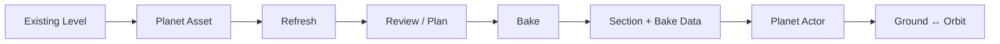

# PlanetX Overview

[Documentation Home](../../PlanetX_User_Guide_EN.md) · [Next: Quick Start](01_Getting_Started.md)

PlanetX converts an existing Unreal Engine Level into a curved planetary representation and supports transitions between Ground and Orbit presentation.

## What it solves

- Reuses existing Landscapes and Static Meshes on a planet
- Generates orbit-scale proxies
- Connects Ground/Orbit coordinates and presentation
- Supports Same World and cross-Level travel
- Bakes large World Partition sources

## Requirements summary

| Item | Current status |
|---|---|
| Dependency | GeometryProcessing |
| Bake | Editor-only |
| Main sources | Static Mesh, Landscape, ISM/HISM, Foliage |
| World Partition | Supported |
| Multiplayer | The game owns travel and replication |
| Engine/Platform | Use combinations built and validated by the current project |
| Demo Map | No bundled user demo |

Continue with [Create Your First Planet Proxy](01_Getting_Started.md).

