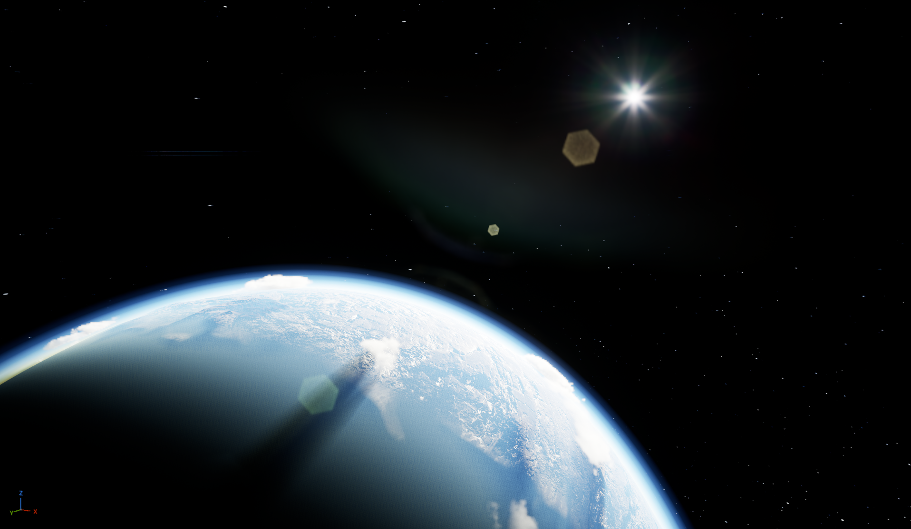

# Welcome to the PlanetX Documentation!

Thank you for downloading PlanetX.

This documentation introduces the complete PlanetX workflow, from installation and planet creation to connecting a Ground Level, baking a Proxy, authoring visuals, and transitioning between Orbit and Ground.

If this is your first time using PlanetX, begin with [Start Here — Same World Quick Start](?lang=en&doc=quick-start-same-world). It is the canonical first-use path.

## What is PlanetX?

PlanetX is an **Unreal Engine plugin that helps you use an existing Unreal Engine Level as part of a planet's surface**.

You can register a Landscape and Level created through your usual workflow as a particular region of a planet. From a distance, that region appears as part of a complete planet; as the player approaches, PlanetX connects it to the actual Ground Level where gameplay takes place.

This lets you create a continuous experience between **a planet viewed from space and gameplay on its surface** without substantially changing how you build Levels.

## What problem does it solve?

Standard Unreal Engine Levels and Landscapes are primarily authored in flat space. A game in which the player views a planet from space and travels all the way to its surface would otherwise need separate implementations for the distant planet, the real Ground Level, coordinate conversion, and the transition between them.

PlanetX lets you keep your existing Ground Level and associate it with a **Section** on the planet. In Orbit, the player sees an efficient Proxy and the planet surface. As the player approaches, that representation can transition naturally into the actual Ground content.

## Basic workflow

1. **Create a Planet Asset**

   Choose the planet's size and initial settings.

2. **Register a Ground Level**

   Register the region of an existing Unreal Engine Level that will become part of the planet surface as a Section.

3. **Bake the Section Proxy**

   Convert the Ground Level into a Proxy suitable for viewing from Orbit.

4. **Author the planet visuals**

   Use **Planet Asset Editor > Preview** to adjust the Section placement, planet surface, materials, and related visuals.

5. **Place the Planet Actor**

   Place the completed Planet Asset in a Level to display the planet.

6. **Verify the Orbit ↔ Ground transition**

   Move the player or camera and test the transition between the Orbit representation and the actual Ground Level.

> **Tip**
> You do not need to understand every PlanetX feature at once.
> Begin with the basic flow: create one Planet Asset and connect one Ground Level to it.

Next, you can [install PlanetX](?lang=en&doc=installation) or proceed directly to [Start Here — Same World Quick Start](?lang=en&doc=quick-start-same-world).
