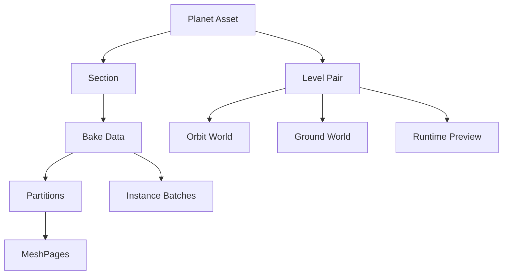

# Core Concepts

[이전: Runtime Integration](03_Runtime_Integration.md) · [문서 홈](../../PlanetX_User_Guide_KO.md) · [다음: Supported Content](05_Supported_Content.md)

| 개념 | 의미 |
|---|---|
| Ground World | 실제 gameplay와 원본 Source가 있는 평면 Level |
| Planet Proxy | Orbit에서 표시하는 곡면 표현 |
| Planet Asset | Planet ID, Radius, Sections, Level Pairs와 설정을 보관 |
| Section | 하나의 Ground 영역과 행성 표면 배치 |
| Level Pair | Ground/Orbit World와 진입 모드 연결 |
| Bake Data | partition, MeshPage, instance와 transition manifest |



## ID와 이름

- Planet ID: 행성의 안정 identity
- Section ID: `{SourceMap}_{FullSourceWorldPath CRC32}`
- Display Name: UI용 이름, Rename 가능
- Planet Binding ID: 같은 Planet ID의 World instance 구분

## Projection과 좌표

현재 projection은 AEQD입니다. Planet Radius가 곡률, Surface Datum이 altitude 0을 결정합니다.

주요 좌표:

- Unreal World
- Planet Local
- Geographic(latitude/longitude/altitude)
- Section tangent frame
- World-independent PlanetX Transform

## Partition과 MeshPage

Partition은 Source 영역을 나누는 계획 단위이고 MeshPage는 revision 아래 생성되는 독립 Static Mesh 결과입니다. 작은 partition은 세밀한 로딩에 유리하지만 Asset과 seam 비용이 늘어납니다.

## Generated Asset

```text
/Game/PlanetX/ProxyBake/{PlanetAsset}/{GroundLevel}/
├─ DA_PXBake_{BakeId}
└─ Revisions/{RevisionId}/
   ├─ Meshes/
   └─ Payloads/
```

경로와 이름은 identity/revision에 사용되므로 임의 이동·Rename을 피하십시오.

