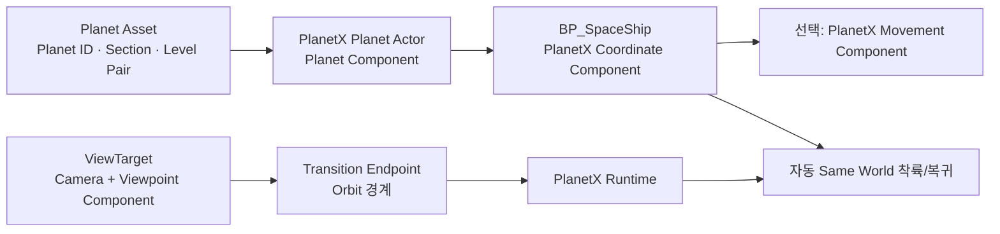
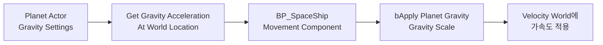

# Runtime Actor 통합 가이드: Blueprint로 우주선과 캐릭터 연결하기

[문서 홈](../../PlanetX_User_Guide_KO.md) · [Runtime Integration 개요](03_Runtime_Integration.md) · [공개 API 전체 목록](11_User_API.md) · [오류 해결](09_Troubleshooting.md)

이 문서는 PlanetX를 처음 사용하는 게임 플레이 프로그래머 또는 레벨 디자이너가 Blueprint Actor를 PlanetX Runtime에 연결하는 방법을 설명합니다. 예시는 `BP_SpaceShip`이 Orbit에서 행성의 Ground로 내려가고 다시 Orbit으로 돌아오는 흐름을 기준으로 하지만, Pawn과 Character에도 같은 원칙을 적용할 수 있습니다.

이 문서를 끝까지 따르면 다음을 할 수 있습니다.

- `BP_SpaceShip`이 어느 Planet을 기준으로 움직이는지 지정한다.
- PlanetX Native Movement로 행성 기준 입력을 처리한다.
- 버튼으로 Same World 착륙/복귀를 실행한다.
- 전환 영역에 진입하면 자동으로 착륙/복귀하도록 설정한다.
- `Add PlanetX Input Vector`가 `false`를 반환하는 이유를 찾는다.

> 이 문서는 이미 Planet Asset과 Section을 만들고 Bake를 완료했다는 전제입니다. 아직 Planet을 만들지 않았다면 먼저 [Quick Start](01_Getting_Started.md)를 완료하십시오.

## 1. 먼저 선택할 Runtime 방식

PlanetX Runtime에는 서로 목적이 다른 세 가지 진입 방식이 있습니다. 처음 검증할 때는 **Same World 수동 착륙**을 권장합니다. 필요한 요소가 가장 적고 오류 위치를 쉽게 확인할 수 있습니다.

| 목표 | 사용할 방식 | 핵심 API/설정 |
|---|---|---|
| 버튼을 눌러 같은 월드에서 착륙 | Same World 수동 | `Query Surface At Planet X Transform` → `Enter Ground Same World` |
| 전환 영역에 들어가면 자동 착륙 | Same World 자동 | Coordinate 정책 + Viewpoint + Transition Endpoint |
| Ground Map으로 실제 Level 이동 | Level Handoff | `Prepare Travel` → 게임의 Travel → `Resume Pending Travel` |
| 행성 기준 이동/중력/표면 정렬 | PlanetX Native Movement | `PlanetXMovementComponent` |
| 기존 Character/Vehicle/Physics 유지 | 기존 이동 구현 + Handoff | `PlanetXMovementInteropLibrary` |

PlanetX는 `Open Level`, Pawn Spawn, Possess, GameMode, 네트워크 복제를 대신하지 않습니다. Level을 바꾸는 경우에는 게임 Blueprint 또는 게임 코드가 그 흐름을 소유해야 합니다.

## 2. Runtime의 핵심 연결 구조



각 요소의 책임을 구분하면 문제를 훨씬 쉽게 해결할 수 있습니다.

| 요소 | 책임 | 하지 않는 일 |
|---|---|---|
| `PlanetX Planet Actor` | Planet Asset 제공, Runtime 등록, 행성 좌표 기준 제공 | 플레이어를 이동시키지 않음 |
| `PlanetXCoordinateComponent` | Actor와 Planet의 참조 연결, 좌표/방향 변환, 자동 진입 참여 | 매 Tick 이동을 만들지 않음 |
| `PlanetXMovementComponent` | 선택적 Native 이동, 중력, 표면 정렬 | CharacterMovement/Physics를 자동 제어하지 않음 |
| `PlanetXViewpointComponent` | 현재 카메라가 전환 상태를 판정할 수 있게 표시 | 우주선을 자동으로 이동시키지 않음 |
| `PlanetXTransitionEndpoint` | Section의 전환 경계를 Runtime에 등록 | 전환 상태 기계를 직접 소유하지 않음 |
| `PlanetXSubsystem` | Surface Query, 착륙/복귀, Travel Ticket의 공개 진입점 | 내부 Runtime Service를 노출하지 않음 |

## 3. 착륙 전에 Planet 쪽을 준비한다

현재 플레이하는 World에 다음 상태가 갖춰져 있어야 합니다.

### 3.1 Planet Actor

1. 레벨에 **PlanetX Planet Actor**를 배치합니다.
2. Actor의 **Planet Component → Planet Asset**에 만든 `Planet Asset`을 지정합니다.
3. `Auto Register Runtime`은 켜 둡니다.
4. 같은 Planet Asset을 여러 Planet Actor가 사용한다면 각 Actor에 고유한 `Planet Binding ID`를 지정합니다.

Planet Actor를 런타임에 Spawn하거나 `Auto Register Runtime`을 끈 경우에는 Planet Component 또는 Planet Actor에서 **Register To PlanetX Runtime**을 호출해야 합니다. 다만 이것은 Runtime Surface Query와 전환을 위한 등록입니다. 아래의 `Missing Planet Reference` 오류는 우선 Actor와 Asset 참조가 유효한지부터 확인해야 합니다.

### 3.2 Section과 Level Pair

Same World 착륙이 가능하려면 목표 Section의 Level Pair가 다음 조건을 충족해야 합니다.

- `Entry Mode = Same World`
- `Can Enter Ground = true`
- `Visual Only = false`
- Ground Sync Mapping과 Ground 표현이 유효함

착륙 전에는 항상 Surface Query 결과의 `bCanEnterGround`를 확인하십시오. 표면에 맞았다고 해서 반드시 해당 위치가 착륙 가능한 Section이라는 뜻은 아닙니다.

### 3.3 시작 전 확인할 점

Planet Asset Editor의 Diagnostics에서 Error가 없는지 확인하고, PIE에서 Planet Actor가 실제로 로드된 상태인지 확인합니다. 문제를 분리할 때는 `PlanetXSubsystem → Validate Planet Asset`과 `Draw Planet Debug`가 유용합니다.

## 4. BP_SpaceShip에 Component를 추가한다

`BP_SpaceShip`을 열고 아래 Component를 추가합니다.

| Component                      |     필요 여부 | 언제 쓰는가                                      |
| ------------------------------ | --------: | ------------------------------------------- |
| `PlanetX Coordinate Component` |        필수 | Planet 참조, 좌표 변환, 착륙/복귀                     |
| `PlanetX Movement Component`   |        선택 | PlanetX가 우주선 이동을 직접 처리할 때                   |
| `PlanetX Viewpoint Component`  | 자동 전환에 필수 | 우주선 또는 카메라가 PlayerController의 ViewTarget일 때 |
| `Camera Component`             | 자동 전환에 필수 | 현재 ViewTarget의 활성 카메라                       |

### 4.1 Coordinate Component 기본 설정

`PlanetXCoordinateComponent`를 선택하고 다음을 설정합니다.

| Details 항목                                        | 권장 값              | 이유                                      |
| ------------------------------------------------- | ----------------- | --------------------------------------- |
| `Auto Register Runtime`                           | `true`            | Actor Runtime Context와 자동 진입 참여에 필요     |
| `Representation Domain`                           | `Orbit`           | 우주선의 기본 표현 영역                           |
| `Runtime Load Policy`                             | `PlanetX Default` | Orbit Actor를 always-loaded 정책으로 다룰 때 사용 |
| `Reference Planet Actor` 또는 `Reference Planet Id` | 아래 5장 참고          | 우주선이 기준으로 삼을 Planet 지정                  |

World Partition을 사용하는 Orbit Actor에는 `PlanetX Default` 정책을 유지하고, 필요한 경우 Details의 **Apply Default Runtime Load Policy To Owner**를 실행합니다. Data Layer와 Streaming Source 정책은 게임 프로젝트가 별도로 관리합니다.

### 4.2 Native Movement를 사용할 때의 Actor 조건

`PlanetXMovementComponent`는 `UpdatedComponent`를 이동시키는 kinematic Movement Component입니다. 기본적으로 Owner의 Root Component를 사용합니다.

- Root Component의 Mobility는 `Movable`이어야 합니다.
- Native Movement 테스트 중 Root Mesh의 `Simulate Physics`는 꺼 둡니다.
- 기존 `CharacterMovement`, Vehicle Movement 또는 자체 Physics 이동을 동시에 켜 두지 않습니다.
- Root가 아닌 Component를 움직여야 한다면 `Updated Component`를 명시적으로 지정합니다.

Physics 기반 우주선을 만들고 싶다면 PlanetX Native Movement를 대신 사용할 것이 아니라 Physics Body Handoff API 또는 프로젝트의 물리 제어 코드를 사용하십시오. PlanetX는 Physics 상태를 자동으로 바꾸지 않습니다.

## 5. Reference Planet을 지정한다

이 단계가 빠지면 `Add PlanetX Input Vector`가 `false`를 반환하면서 `Missing Planet Reference`가 발생합니다.

Coordinate Component는 아래 순서로 기준 Planet을 찾습니다.

```text
Reference Planet Actor
→ 없으면 Reference Planet Id가 같은 Planet Actor를 현재 World에서 탐색
→ 둘 다 없거나 Planet Asset이 없으면 Missing Planet Reference
```

PlanetX가 거리만 보고 가장 가까운 Planet을 자동으로 선택하지는 않습니다. 여러 Planet이 있는 게임에서 잘못된 Planet을 선택하지 않기 위한 의도적인 규칙입니다.

### 5.1 레벨에 미리 배치한 우주선

1. 레벨에서 `BP_SpaceShip` 인스턴스를 선택합니다.
2. Components 패널에서 `PlanetXCoordinateComponent`를 선택합니다.
3. Details의 **Reference Planet Actor** 스포이드로 월드의 PlanetX Planet Actor를 지정합니다.
4. `Current Planet Actor`와 `Current Planet Asset`이 올바르게 표시되는지 확인합니다.

### 5.2 런타임에 Spawn하는 우주선

Blueprint 클래스 기본값에서는 월드에 배치된 Actor를 안전하게 참조할 수 없습니다. `BP_SpaceShip`의 `Event BeginPlay`에서 Actor를 찾아 할당하십시오.

```text
Event BeginPlay
→ Get Actor Of Class (Class = PlanetXPlanetActor)
→ Get PlanetXCoordinateComponent
→ Set Reference Planet Actor
→ Refresh Coordinate Snapshot
```

`Set Reference Planet Actor`는 별도 Subsystem API가 아니라 Coordinate Component의 Blueprint writable 속성입니다. Component 참조 핀에서 드래그하여 노드를 검색할 수 있습니다. 런타임에 참조를 바꾼 직후에는 **Refresh Coordinate Snapshot**을 호출해야 새 Planet Actor와 Asset을 즉시 해석합니다. `Refresh Runtime Context`는 Runtime이 계산한 Context를 읽어 갱신하는 용도이며, 새 Reference를 초기화하는 대체 수단이 아닙니다.

World에 Planet이 여러 개면 `Get Actor Of Class`를 그대로 쓰지 마십시오. Actor Tag, 고유한 Planet Actor Blueprint, Spawn 시 전달한 Actor 참조 등으로 목표 Planet을 명시적으로 선택합니다.

### 5.3 Actor 참조 대신 Planet ID로 찾기

`Reference Planet Actor`를 비워 둔 상태에서 **Reference Planet Id**에 Planet Asset의 `PlanetId`를 넣어도 됩니다. Planet Actor가 하나인 단순한 맵에서는 이 방식이 편합니다.

같은 `PlanetId`를 가진 Planet Actor가 여러 개라면 어떤 World 인스턴스를 뜻하는지 모호해질 수 있습니다. 이 경우에는 `Reference Planet Actor`와 필요 시 `Planet Binding ID`를 명시하십시오.

### 5.4 가장 빠른 참조 검증

BeginPlay 직후 다음처럼 확인합니다.

```text
Get PlanetXCoordinateComponent
→ Get Resolved Planet Component
→ Is Valid?
```

`false`라면 입력, 표면 프레임, 중력, 착륙 모두 실패할 수 있습니다. Planet Actor에 `Planet Asset`이 비어 있지 않은지부터 다시 확인하십시오.

## 6. PlanetX Native Movement로 움직이기

Native Movement는 `Add PlanetX Input Vector`에 들어온 입력을 **다음 Movement Tick에만** 사용합니다. 따라서 Enhanced Input의 `Started` 한 번에서 호출하면 지속 이동하지 않습니다.

### 6.1 처음에는 World Vector로 테스트

참조와 입력 자체를 먼저 검증할 때는 `Vector Space = World`를 사용합니다.

```text
IA_Move (Triggered)
→ Action Value (Vector2D)
→ Make Vector (X, Y, 0)
→ Add PlanetX Input Vector
    Target = PlanetXMovementComponent
    Vector Space = World
```

`Triggered` 또는 기존 Axis 이벤트처럼 매 프레임 실행되는 이벤트에서 호출해야 합니다. `Add PlanetX Input Vector`는 매 Tick 후 입력 누적값을 지우므로, `Started`만 연결하면 키를 누르고 있어도 다음 프레임에는 입력이 없습니다.

### 6.2 표면 기준 이동으로 바꾸기

World Vector 이동이 정상이라면 `Vector Space = Surface Frame`으로 바꿉니다.

```text
IA_Move (Triggered)
→ Make Vector (Forward/Right 입력, 0)
→ Add PlanetX Input Vector
    Vector Space = Surface Frame
    Project To Surface Tangent = true
```

Surface Frame의 축은 다음과 같습니다.

| 값 | 방향 |
|---|---|
| X | Surface East |
| Y | Surface North |
| Z | Surface Up |

표면을 따라 이동하려면 `Project To Surface Tangent = true`를 권장합니다. 자유로운 우주 비행처럼 위/아래 성분도 사용하려면 `World` 또는 `Planet Local` Vector Space를 사용하고 Tangent 투영을 끕니다.

### 6.3 Native Movement 설정 예시

처음에는 다음처럼 단순하게 설정하면 원인을 분리하기 쉽습니다.

| 설정 | 테스트 권장값 |
|---|---|
| `Maximum Speed Cm Per Second` | `1200` 이상 |
| `Acceleration Cm Per Second Squared` | `4096` 이상 |
| `Deceleration Cm Per Second Squared` | `4096` 이상 |
| `Apply Planet Gravity` | 이동 확인 전에는 `false` |
| `Align Up To Surface` | 지상/표면 이동이면 `true` |
| `Sweep In Orbit` | 충돌이 필요할 때만 `true` |

입력 후 `Get PlanetX Velocity` 또는 `Get Movement Runtime State`로 `Velocity World`가 변하는지 확인합니다.

### 6.4 행성 중력 설정

PlanetX의 방사형 중력은 **Planet Actor의 Planet Component**가 계산하고, 이를 실제로 적용할지는 각 Actor의 `PlanetXMovementComponent`가 결정합니다. 따라서 Planet Asset만 설정했다고 우주선에 자동으로 중력이 적용되지는 않습니다.



#### Planet Actor: Gravity Settings

Planet Actor의 **Planet Component → Gravity Settings**에서 다음을 설정합니다.

| 항목 | 의미 | 시작 권장값 |
|---|---|---|
| `Enabled` | 행성 중력 계산 활성화 | `true` |
| `Model = Constant Surface` | 고도와 관계없이 일정한 방사형 중력 | 지상/아케이드 게임 |
| `Model = Inverse Square` | `표면 중력 × (행성 반지름 / 중심까지 거리)²` | 우주 비행 시뮬레이션 |
| `Surface Acceleration` | 표면에서의 가속도, 단위 `cm/s²` | 지구와 비슷하게는 `980` |
| `Maximum Acceleration` | 중심 근처의 과도한 가속도 상한 | 기본값 유지 후 필요 시 조절 |

중력 방향은 언제나 Planet Actor의 중심을 향합니다. Planet Actor를 다른 위치에 배치하면 중력 중심도 함께 바뀝니다.

#### 우주선: 실제 중력 적용 여부

`BP_SpaceShip → PlanetXMovementComponent → Gravity`에서 설정합니다.

| 항목 | 의미 |
|---|---|
| `Apply Planet Gravity` | Orbit/Transition에서 Planet Actor가 계산한 방사형 중력을 Native Movement에 적용 |
| `Apply Planet Gravity In Ground` | Ground에서도 PlanetX 방사형 중력을 적용. 기본값은 `false` |
| `Gravity Scale` | 이 Actor에만 적용하는 중력 배수. `0`은 사실상 무중력 |

자유 비행 우주선의 첫 테스트에서는 `Apply Planet Gravity = false`를 권장합니다. 조종과 착륙 흐름이 확인된 뒤 중력을 켜면, 중력 때문에 입력 실패처럼 보이는 문제를 피할 수 있습니다.

Ground에서 `Apply Planet Gravity In Ground = false`는 **PlanetX Native Movement가** 방사형 중력을 더하지 않는다는 뜻입니다. UE CharacterMovement의 기본 중력, Physics Body의 중력, 또는 프로젝트의 Custom Gravity를 자동으로 켜거나 끄지는 않습니다. 같은 Actor에 두 종류의 중력을 중복 적용하지 않도록 정책을 하나만 선택하십시오.

#### External Level에서의 중력

`Entry Mode = Level Handoff`인 경우 Orbit World와 Ground World의 Planet Actor는 서로 다른 월드 인스턴스입니다. `Gravity Settings`는 Planet Asset이 아니라 **각 World의 Planet Component가 소유하는 설정**이므로, 두 World의 Planet Actor에 원하는 값을 각각 설정해야 합니다.

Travel Ticket은 pose와 전환 상태를 전달하지만 중력 설정을 동기화하는 수단이 아닙니다. Target World에서 `Resume Pending Travel`이 끝난 뒤 우주선 Coordinate Component가 Target Planet Actor를 올바르게 참조하고 있는지 확인하십시오.

#### 중력 디버그

다음 중 하나로 현재 적용값을 확인합니다.

```text
Planet Component → Get Gravity Acceleration At World Location
    World Location = BP_SpaceShip의 현재 위치

또는

PlanetXMovementComponent → Get Movement Runtime State
    → Gravity Acceleration World 출력
```

첫 API는 계산 가능한 방사형 중력 벡터를 반환하고, 두 번째 API는 Native Movement가 이번 Tick에 실제로 적용한 중력 가속도를 보여 줍니다.

### 6.5 입력 노드가 false일 때

`Add PlanetX Input Vector`의 Return Value를 반드시 Branch와 `Print String`에 연결하십시오. `false`이면 바로 이어서 `Get Movement Runtime State`를 호출하고 `Failure Reason`을 출력합니다.

| Failure Reason                 | 원인                                                        | 해결                                                  |
| ------------------------------ | --------------------------------------------------------- | --------------------------------------------------- |
| `Inactive Component`           | Movement Component가 비활성                                   | Component의 Active를 켜고 Activate                      |
| `Missing Owner`                | 정상 Blueprint 사용에서는 드묾                                     | Component를 유효한 Actor에 추가                            |
| `Missing Updated Component`    | Root/Updated Component가 없음                                | Movable Root를 만들거나 Updated Component 지정             |
| `Missing Coordinate Component` | 같은 Actor에 Coordinate Component가 없음                        | Coordinate Component 추가 또는 올바른 Component 참조 지정      |
| `Missing Planet Reference`     | Coordinate Component가 Planet Actor와 Planet Asset을 해석하지 못함 | 5장의 Reference Planet 설정 확인                          |
| `Invalid Coordinate Vector`    | `Surface Frame`/`Section Local` 변환 실패                     | 먼저 `World` Vector Space로 테스트하고 Planet 참조/Section 확인 |

추가로 **Validate Movement Configuration**을 BeginPlay에 한 번 호출해 Error Message를 출력해 두면, PIE에서 설정 실수를 즉시 확인할 수 있습니다.

## 7. 버튼으로 Same World 착륙시키기

이 방법은 전환 영역, Viewpoint, Transition Endpoint 없이도 착륙 명령 자체를 확인할 수 있는 가장 단순한 흐름입니다. Same World는 Ground 콘텐츠가 이미 같은 World에 존재하는 구조이며, PlanetX가 Ground Map을 열거나 스트리밍하는 방식이 아닙니다. Planet Asset의 Section/Level Pair와 Ground Mapping은 유효해야 합니다.

### 7.1 착륙 Blueprint 흐름

예를 들어 `IA_Land`의 `Started`에서 다음 순서를 만듭니다.

```text
Get PlanetXCoordinateComponent
→ Capture Owner Transform To PlanetX
→ Get PlanetX Transform
→ Get Game Instance Subsystem (PlanetXSubsystem)
→ Query Surface At Planet X Transform
→ Break PlanetXSurfaceQueryResult
→ Branch (bCanEnterGround)
→ Enter Ground Same World
    Request Actor = Self
    Surface Query = 위 Query 결과
```

각 `bool` 반환값은 다음 노드로 넘어가기 전에 Branch로 검사하십시오. 특히 `Query Surface At Planet X Transform`이 성공해도 `bCanEnterGround`가 `false`이면 진입하면 안 됩니다.

`Enter Ground Same World`는 현재 Actor의 PlanetX pose를 Capture하고, Surface Query가 가리키는 Ground pose에 적용합니다. 같은 Actor가 유지되므로 Spawn이나 Possess를 추가로 할 필요는 없습니다.

### 7.2 Orbit으로 복귀하기

복귀 입력에는 다음만 호출합니다.

```text
Get Game Instance Subsystem (PlanetXSubsystem)
→ Return To Orbit Same World
    Request Actor = Self
```

수동으로 여러 Actor를 착륙시켰다면 복귀는 진입의 역순으로 처리하십시오. 수동 Same World 복귀는 저장된 Capture 순서를 사용합니다.

### 7.3 착륙 위치만 미리 보고 싶을 때

`Enter Ground Same World` 전에 **Build Landing Transform**을 호출하면 적용될 Ground Transform과 Surface Frame을 확인할 수 있습니다. 디버그 표시, 착륙 UI, 카메라 연출을 만들 때 유용하지만 Transform을 직접 적용한 뒤 Enter API를 또 호출하지는 마십시오.

## 8. 전환 영역에서 자동 착륙시키기

자동 착륙은 플레이어의 현재 관찰 위치가 Transition Cylinder에 들어갔을 때 동작합니다. 각 기능을 하나씩 수동으로 호출하는 대신, Runtime이 전환 상태와 Capture를 처리합니다.

### 8.1 필요한 구성

| 위치 | 필요한 것 | 주요 설정 |
|---|---|---|
| Planet/Orbit World | `PlanetXTransitionEndpoint` | `Endpoint Role = Orbit`, Planet Actor, Section Id, Level Pair Id |
| Player의 ViewTarget | 활성 `Camera Component` | PlayerController가 이 Actor를 ViewTarget으로 사용 |
| Player의 ViewTarget | `PlanetXViewpointComponent` | `Auto Register Runtime = true`, `Can Drive Transition State = true` |
| 자동 이동할 우주선 | `PlanetXCoordinateComponent` | 올바른 Planet 참조, 자동 Entry/Return 활성화 |

전환은 우주선 Actor 자체의 위치만 보는 것이 아니라 **PlayerController의 실제 ViewTarget과 활성 Camera**를 우선 사용합니다. 우주선이 ViewTarget이 아니라면 Camera가 붙은 실제 ViewTarget Actor에 `PlanetXViewpointComponent`를 추가하십시오.

### 8.2 Transition Endpoint 설정

Orbit World에 `PlanetXTransitionEndpoint`를 배치하고 다음을 지정합니다.

1. `Endpoint Role = Orbit`
2. `Planet Actor`에 현재 World의 PlanetX Planet Actor 지정
3. `Section Id`와 `Level Pair Id`에 목표 착륙 Section의 값을 지정
4. `Auto Size Transition Cylinder To Section Bounds`는 처음에는 켜 둠
5. 필요하면 `Outer Radius`, `Inner Radius`, 높이 제한을 조정

Endpoint는 전환 상태를 직접 실행하는 Actor가 아니라, 전환 중심과 Cylinder 규칙을 Runtime에 등록하는 authoring Actor입니다. PlanetX Runtime이 매 프레임 Orbit/Transition/Ground 상태와 Alpha를 계산합니다.

### 8.3 우주선의 자동 진입 정책 설정

`BP_SpaceShip`의 Coordinate Component에서 다음 노드를 BeginPlay에 연결하거나 Details에서 값을 설정합니다.

```text
Set Automatic Same World Entry Enabled(true)
Set Automatic Same World Return Enabled(true)
```

`Spatial Entry Policy → Movement Continuity Policy`는 일반적으로 `Rebase Between Frames`를 사용합니다.

| 정책 | 사용 시점 |
|---|---|
| `Rebase Between Frames` | 일반적인 행성 좌표 전환. Source 속도의 의미를 목표 frame으로 변환 |
| `Preserve World` | World 공간 속도를 그대로 유지하고 싶을 때 |
| `Reset` | 착륙/복귀 순간 속도를 0으로 만들 때 |
| `Do Not Apply` | 이동 구현이 속도를 자체적으로 관리할 때 |

> 자동 진입에 참여한 Actor는 같은 Planet의 활성 전환 결과를 사용합니다. 여러 우주선이 같은 Planet에서 자동 Entry를 켜면 플레이어 카메라의 전환에 함께 반응할 수 있습니다. 플레이어가 조종하는 Actor만 자동 Entry를 켜고, AI/배경 Actor는 수동 API 또는 별도 정책으로 제어하는 편이 안전합니다.

### 8.4 자동 전환이 일어나지 않을 때

아래 순서로 확인합니다.

1. ViewTarget에 활성 Camera와 `PlanetXViewpointComponent`가 모두 있는가?
2. `Can Drive Transition State`가 켜져 있는가?
3. Orbit Endpoint가 PIE에서 Runtime에 등록되었는가?
4. Endpoint의 Planet Actor/Section Id/Level Pair Id가 올바른가?
5. Level Pair가 `Same World`, `Can Enter Ground`, `Visual Only = false` 조건을 만족하는가?
6. 우주선 Coordinate Component에 `Reference Planet Actor` 또는 `Reference Planet Id`가 있는가?
7. 우주선의 `Automatic Same World Entry Enabled`가 켜져 있는가?

PIE에서 `Get Transition Runtime Result`를 호출하거나 PlanetX Mode의 Runtime 팔레트를 사용해 `State`, `Alpha`, `bGroundHandoffReady`를 확인하십시오. 이 API의 `Source Object`는 보통 `BP_SpaceShip`이 아니라 전환 규칙을 등록한 `PlanetXTransitionEndpoint`입니다.

## 9. Ground World가 별도 Level일 때

Ground로 들어갈 때 실제로 다른 World를 열어야 한다면 Same World API가 아니라 Level Handoff를 사용합니다.

```text
Source World
  Surface Query
  → Prepare Travel
  → 게임이 Ticket을 GameInstance 등에 보관
  → 게임이 Open Level / Seamless Travel 실행

Target World
  Planet Actor 등록 완료
  → Target Pawn Spawn / Possess
  → Resume Pending Travel
```

Target Actor에 `PlanetXTravelReceiverComponent`를 추가하면 BeginPlay 후 Pending Travel 복원을 자동 재시도할 수 있습니다. 그래도 Travel, 로딩 화면, Pawn 생성, Possess, 복제 정책은 게임이 직접 구현해야 합니다.

`FPlanetXLevelHandoffTicket`은 일부 필드만 복사하지 말고 구조체 전체를 한 묶음으로 보관하십시오. 성공한 Resume/Complete만 해당 Capture를 소비합니다.

### 9.1 External LAND: Orbit World에서 Travel 시작하기

External 모드에서 `LAND` 입력은 Same World의 `Enter Ground Same World`가 아니라 **Travel Ticket을 준비하는 입력**입니다. Level Pair의 `Entry Mode`가 `Level Handoff`이고 `Ground World`가 지정돼 있어야 합니다.

아래는 `BP_SpaceShip`의 `IA_Land`에 연결할 권장 흐름입니다.

```text
IA_Land (Started)
→ Coordinate: Capture Owner Transform To PlanetX
→ Coordinate: Get PlanetX Transform
→ PlanetXSubsystem: Query Surface At Planet X Transform
→ Branch (Query 성공 AND Surface.bCanEnterGround)
→ PlanetXSubsystem: Get Level Pair For Section
→ Make PlanetXTravelRoute
    World            = LevelPair.GroundWorld
    PlanetId         = Surface.PlanetId
    SectionId        = Surface.SectionId
    PlanetActorIndex = 0
    PlanetBindingId  = Surface.PlanetBindingId
→ PlanetXSubsystem: Prepare Travel
    Source Actor = Self
    Surface Query = Surface
    Target Route = 위 Route
→ Branch (성공)
→ Ticket 전체와 JourneyId를 GameInstance 등의 Travel 후에도 남는 위치에 보관
→ 게임의 Open Level / Seamless Travel
    Target = Ticket.TargetWorld
```

`Prepare Travel`의 `Target Route`는 Surface Query와 같은 `PlanetId`, `SectionId`를 가져야 합니다. `World`, `PlanetId`, `SectionId`, `PlanetActorIndex` 중 하나라도 비어 있으면 Ticket 생성이 실패합니다. Target World에 같은 PlanetId의 Planet Actor가 여러 개면 `PlanetBindingId`를 명시해 대상 인스턴스를 고정하십시오.

`Prepare Travel`이 성공해도 아직 Actor를 이동시키지 않습니다. 반환된 `Ticket.TargetWorld`를 사용해 게임이 Level 이동을 실행해야 합니다. 실패했을 때는 `FPlanetXLevelHandoffResult`의 Error를 출력하고 Travel을 시작하지 마십시오.

### 9.2 External LAND: Ground World에서 도착 Pawn 복원하기

Ground World가 열리면 다음 순서가 중요합니다.

```text
Target World BeginPlay
→ Ground World의 PlanetX Planet Actor가 Runtime 등록 완료
→ Target Pawn Spawn 및 Possess
→ 아래 둘 중 하나 선택
   A. PlanetXSubsystem: Resume Pending Travel (Target Actor = 새 Pawn)
   B. Target Pawn의 PlanetXTravelReceiverComponent가 자동 Resume
```

`PlanetXTravelReceiverComponent`를 쓴다면 `Auto Resume Pending Travel = true`로 두고 `Arrival Retry Timeout Seconds`를 설정합니다. Planet Actor 등록이 약간 늦어져도 설정된 시간 동안 재시도합니다. 이 경우에는 같은 Pawn에서 수동 `Resume Pending Travel`을 동시에 호출하지 마십시오.

도착 Pawn도 이후 이동/복귀에 사용할 `PlanetXCoordinateComponent`를 가져야 합니다. 런타임 Spawn Pawn이라면 Target World의 Planet Actor를 다시 `Reference Planet Actor`에 할당하고 **Refresh Coordinate Snapshot**을 호출하십시오.

### 9.3 Ground에서 Orbit World로 돌아가기

복귀에는 출발 Ticket의 `JourneyId`를 사용합니다.

```text
IA_ReturnOrbit (Started)
→ PlanetXSubsystem: Begin Return Level Handoff
    Journey Id    = 저장한 JourneyId
    Source Actor  = 현재 Ground Pawn
    Resume Alpha  = 0
→ Branch (성공)
→ 게임의 Open Level / Seamless Travel
    Target = Return Ticket.TargetWorld
→ Orbit World의 Target Pawn에서 Resume Pending Travel
   또는 TravelReceiver의 자동 Resume
```

External Level에는 `Return To Orbit Same World`를 사용하지 않습니다. `Automatic Same World Entry/Return`도 이 Travel을 대신 실행하지 않습니다.

### 9.4 External LAND 실패를 진단하는 순서

| 증상 | 먼저 확인할 것 |
|---|---|
| `Prepare Travel`이 false | Surface Query 성공, `bCanEnterGround`, Route의 World/PlanetId/SectionId |
| Target World에서 복원 실패 | Target Planet Actor의 Runtime 등록, PlanetId/BindingId, Target Pawn 생성 시점 |
| Spawn Pawn이 엉뚱한 Planet을 참조 | Target World에서 `Reference Planet Actor` 재할당 후 `Refresh Coordinate Snapshot` |
| Resume가 두 번 실행됨 | TravelReceiver 자동 Resume와 수동 Resume 중 하나만 사용 |
| Return Ticket 생성 실패 | 원본 LAND Ticket의 `JourneyId` 보관 여부와 Ground World 일치 여부 |

## 10. Runtime 상태를 보는 방법

문제가 생겼을 때 Transform을 추측해 수정하기보다 Runtime Snapshot을 읽으십시오.

| 확인하려는 것 | Blueprint API | 핵심 출력 |
|---|---|---|
| 우주선이 어느 Planet/Section에 있는가 | `Get Actor Runtime Context` | PlanetId, SectionId, SpaceState, TransitionAlpha |
| Native Movement가 왜 실패했는가 | `Get Movement Runtime State` | FailureReason, VelocityWorld, GravityAccelerationWorld |
| 표면 착륙이 가능한가 | `Query Surface At Planet X Transform` | bHitPlanetSurface, bCanEnterGround, SectionId |
| 전환이 어떤 상태인가 | `Get Transition Runtime Result` | State, Alpha, bGroundHandoffReady |
| Planet과 Section 위치를 보고 싶다 | `Draw Planet Debug`, `Draw Section Debug` | 월드 디버그 표시 |
| 현재 Actor 상태를 보고 싶다 | `Draw Actor Context Debug` | 월드 디버그 표시 |

특히 다음 두 값을 처음에 출력해 두면 대부분의 구성 문제를 빠르게 찾습니다.

```text
CoordinateComponent → Get Resolved Planet Component → Is Valid
MovementComponent  → Validate Movement Configuration → Error Message
```

## 11. 자주 묻는 문제

### `Add PlanetX Input Vector`가 false다

Return Value만 보지 말고 `Get Movement Runtime State → Failure Reason`을 출력합니다. 가장 흔한 `Missing Planet Reference`는 Coordinate Component가 유효한 Planet Actor와 Planet Asset을 찾지 못했다는 뜻입니다. 5장을 다시 확인하고, 처음에는 `Vector Space = World`로 테스트합니다.

### 입력을 연결했는데 한 번만 움직인다

`Started`가 아니라 `Triggered` 또는 Axis 이벤트에서 `Add PlanetX Input Vector`를 호출합니다. 이 함수의 입력은 매 Movement Tick 후 초기화됩니다.

### `Reference Planet Actor`가 자동으로 채워지지 않는다

PlanetX는 가장 가까운 Planet을 자동 선택하지 않습니다. `Reference Planet Actor`를 명시하거나, `Reference Planet Id`를 설정해야 합니다. Spawn Actor라면 BeginPlay에서 Actor 참조를 할당한 뒤 `Refresh Coordinate Snapshot`을 호출합니다.

### Planet Actor는 있는데 Reference가 없다고 나온다

Planet Actor의 `Planet Component → Planet Asset`이 비어 있으면 유효한 Reference로 취급되지 않습니다. Planet Asset을 지정한 뒤 PIE를 다시 시작하고, 우주선의 `Current Planet Actor`/`Current Planet Asset`을 확인합니다.

### 자동 전환은 되는데 우주선이 움직이지 않는다

Coordinate Component는 좌표/전환 참여용이지 이동 Component가 아닙니다. 직접 조종하려면 Native Movement 또는 기존 이동 구현을 별도로 사용해야 합니다.

### Native Movement와 Physics를 같이 켜도 되는가

권장하지 않습니다. `PlanetXMovementComponent`는 kinematic 이동이고, Physics Body는 별도의 제어 경로입니다. 전환 시에는 Movement Handoff API를 사용하거나 게임의 Physics 정책을 명시적으로 처리하십시오.

## 12. 배포 전 체크리스트

- [ ] PlanetX Planet Actor에 Planet Asset이 지정되어 있다.
- [ ] Planet Actor가 Runtime에 등록되어 있다.
- [ ] 우주선에 PlanetX Coordinate Component가 있다.
- [ ] 우주선의 Reference Planet Actor 또는 Reference Planet Id가 유효하다.
- [ ] Native Movement 사용 시 Movable Root, 비물리 Root, Movement Component 설정을 확인했다.
- [ ] PlanetX 방사형 중력을 사용할 경우 Planet Actor와 Movement Component의 중력 설정을 모두 확인했다.
- [ ] External Level이면 Orbit/Ground World의 Planet Actor 중력 설정을 각각 확인했다.
- [ ] 입력은 `Triggered`/Axis 이벤트에서 매 프레임 전달한다.
- [ ] 수동 착륙 전 Surface Query와 `bCanEnterGround`를 확인한다.
- [ ] 자동 전환 사용 시 ViewTarget에 Camera + Viewpoint Component가 있다.
- [ ] 자동 전환 사용 시 Orbit Transition Endpoint와 Same World Level Pair가 유효하다.
- [ ] `bool` 반환값이 false일 때 Result 구조체 또는 Failure Reason을 로그로 남긴다.

## 다음 문서

- 각 함수의 전체 입력/출력과 C++ 사용법: [사용자 제공 API](11_User_API.md)
- Bake, Planet Asset, Section을 처음 구성하는 방법: [Quick Start](01_Getting_Started.md)
- World Partition 및 Large World 고려사항: [Large World와 World Partition](06_Large_World_and_World_Partition.md)
- 일반적인 Bake/Runtime 문제 해결: [Troubleshooting](09_Troubleshooting.md)
