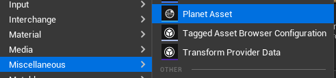
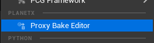
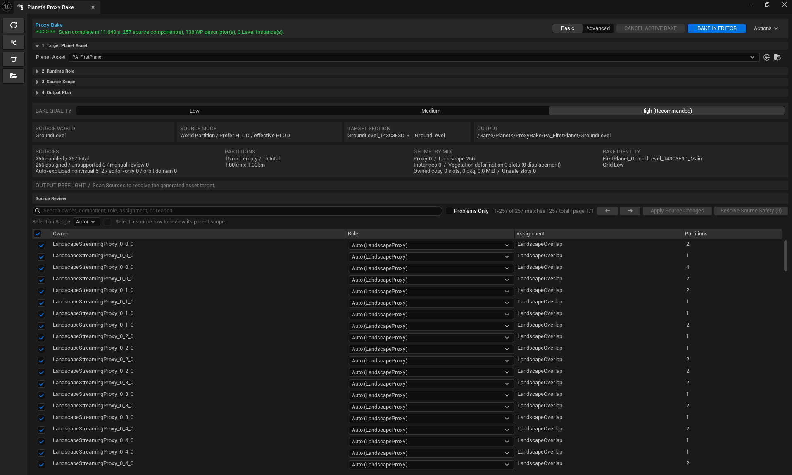
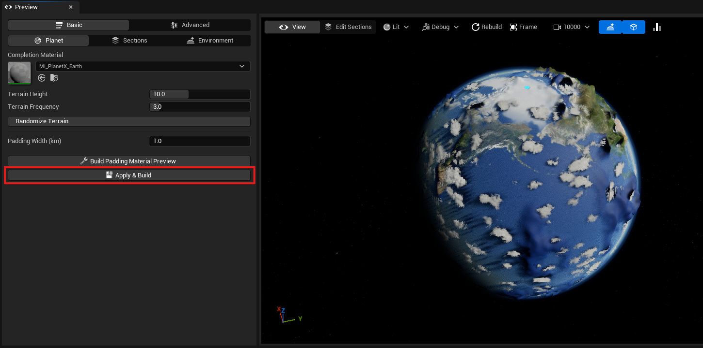
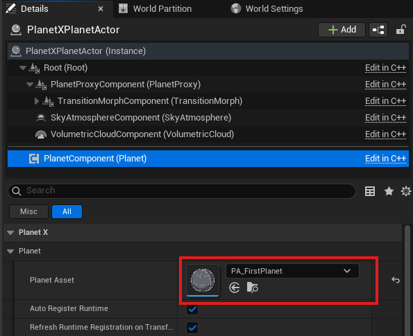
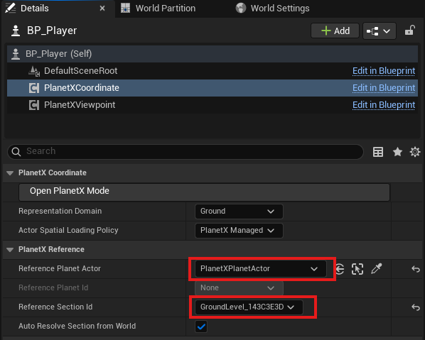
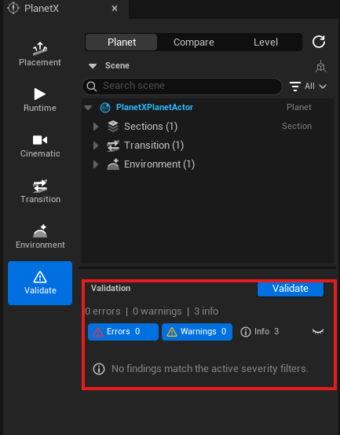
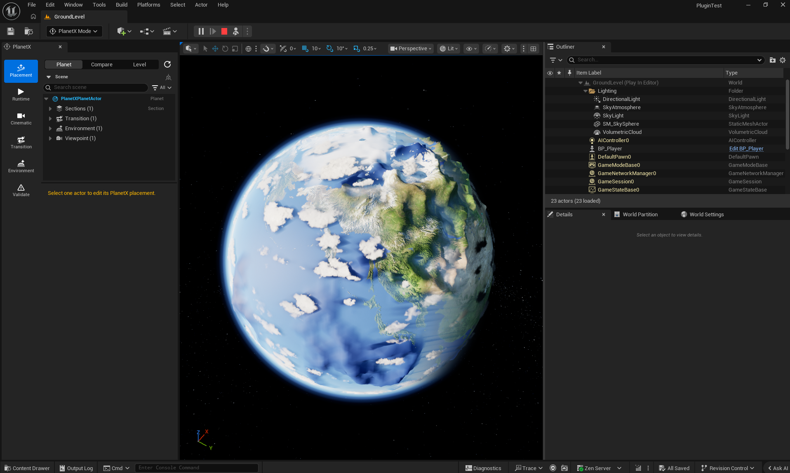

# 여기서 시작 — Same World 빠른 시작

이 문서는 공식 첫 사용 및 제품 검토 경로입니다. Unreal Engine의 기본 **Open World** Level 템플릿으로 시작해 Level을 `GroundLevel`로 저장하고, 이를 PlanetX의 **Same World Section**으로 연결한 뒤 실제 Ground 콘텐츠와의 런타임 전환을 확인합니다.

완료하면 다음과 같은 구성이 만들어집니다.

- Planet Asset 1개
- `GroundLevel`과 연결된 Same World Section 1개
- Bake된 Section Proxy
- Runtime용 행성 비주얼
- PlanetX Planet Actor
- Environment Manager
- Transition Endpoint
- Orbit ↔ Ground 전환에 참여하는 Player Actor

> 이 문서에서는 **Same World** 구성만 다룹니다.
> Orbit과 Ground를 서로 다른 Level로 구성하는 **External Level** 방식은 이 흐름을 성공한 뒤 [고급 가이드 — Multi-Level Handoff](?lang=ko&doc=quick-start-level-handoff)를 참고하세요.

## 시작하기 전에

다음 항목을 준비해 주세요.

- PlanetX가 설치되고 활성화된 Unreal Engine 5.8 프로젝트

미리 준비한 Ground Level은 필요하지 않습니다. 2단계에서 Unreal Engine의 기본 **Open World** 템플릿으로 새 Level을 만들고 `GroundLevel`로 저장합니다. 이 템플릿의 Landscape를 재현 가능한 Source로 사용하며, 런타임 전환 테스트에 필요한 Player Actor는 11단계에서 준비합니다.

동일한 결과를 재현하려면 다음 값을 그대로 사용하세요.

| 설정 | 값 |
| --- | --- |
| Ground Level | **Open World** 템플릿으로 만든 `GroundLevel` |
| Planet ID | `FirstPlanet` |
| Planet Radius | `100 km` |
| Planet Asset | `PA_FirstPlanet` |

2단계에서 `GroundLevel`을 만들고 저장하기 전에는 Proxy Bake를 열지 마세요. Proxy Bake에는 `Untitled` 또는 `/Temp` Level이 아닌 저장된 Level을 사용해야 합니다.

또한 PIE 또는 Simulate가 실행 중이라면 먼저 종료하세요. Proxy Bake는 Editor의 Ground Source를 기준으로 작업하므로 PIE 중에는 실행하지 않습니다.

---

## 1. Planet Asset 준비

**Content Browser > Add > Miscellaneous > Planet Asset**을 선택합니다. 이 문서에서는 Planet ID `FirstPlanet`, Planet Radius `100 km`, 기본 Coordinate Convention을 사용하고 Asset을 `PA_FirstPlanet`으로 저장합니다. 각 설정의 개념 설명이 필요한 경우에만 [첫 Planet Asset 만들기](?lang=ko&doc=create-first-planet)를 참고하세요.



**Section은 아직 직접 만들 필요가 없습니다.**

처음 Proxy Bake를 실행하면 현재 Ground Level을 기준으로 필요한 Section과 Level Pair가 자동으로 생성됩니다.

---

## 2. GroundLevel을 만들고 Proxy Bake 열기

**File > New Level**을 선택하고 Unreal Engine의 기본 **Open World** 템플릿을 연 뒤 즉시 `GroundLevel`로 저장합니다.

Open World 템플릿에는 World Partition Landscape가 포함되어 있으며, 이 빠른 시작에서는 동일한 결과를 재현하기 위한 Ground Source로 사용합니다. 이 흐름을 성공한 뒤에는 프로젝트의 실제 Gameplay Level에서도 같은 과정을 반복할 수 있습니다.

Proxy Bake를 열기 전에 Level 탭이 `Untitled`가 아니라 `GroundLevel`인지 확인하고 한 번 더 저장하세요.

첫 Bake에서는 Unreal Editor의 **Tools** 메뉴에서 **PlanetX** 영역을 찾고 **Proxy Bake Editor**를 선택합니다. 이 경로가 공식 첫 사용 경로입니다.



Planet Asset Editor > Sections에서 Proxy Bake를 여는 방식은 기존 Section 작업 경로이며 Section이 이미 생성된 뒤에만 사용합니다.

Proxy Bake Editor가 열리면 먼저 상단의 **Basic** 모드를 사용하면 됩니다. 빠른 시작에서는 Advanced 설정을 변경할 필요가 없습니다.

### Target Planet Asset 지정

**1 Target Planet Asset** 영역에서 앞 단계에서 만든 Planet Asset을 선택합니다.

이미 Planet Asset Editor에서 Proxy Bake를 열었다면 자동으로 지정되어 있을 수 있습니다.

Planet Asset이 올바르게 지정되었는지 확인하세요.

### Runtime Role을 Same World로 설정

**2 Runtime Role**을 펼칩니다.

**Presentation**에서 다음 값을 선택합니다.

```text
Same World
```

Same World는 Planet과 실제 Ground 콘텐츠가 같은 World 안에 존재하는 구성입니다.

이 모드에서는 현재 열려 있는 Ground Level이 자동으로 **Ground World**가 됩니다.

따라서 별도의 Planet World를 지정할 필요가 없습니다.

**Ground World**에 현재 작업 중인 Level이 표시되는지 확인하세요.

### Source Scope 선택

**3 Source Scope**에서 Proxy Bake가 어떤 Actor를 검색할지 선택합니다.

처음 사용하는 경우 일반적인 단일 Level이라면 다음 설정을 권장합니다.

```text
Source Scope
└─ Current Level
```

각 옵션은 다음과 같이 사용할 수 있습니다.

- **Selected Actors**  
  현재 선택한 Actor만 Bake하고 싶을 때 사용합니다.

- **Current Level**  
  현재 Persistent Level의 Actor를 대상으로 합니다. 일반적인 첫 테스트에 적합합니다.

- **Loaded Levels**  
  현재 Level과 함께 로드된 Streaming Level 및 Level Instance까지 포함할 때 사용합니다.

- **Reviewed Set**  
  이전에 검토한 Source 목록을 그대로 다시 사용합니다. 반복적인 제작 작업을 위한 옵션이므로 처음에는 사용하지 않아도 됩니다.

그 아래의 **Source Representation**은 특별한 이유가 없다면 기본 설정을 유지해도 됩니다.

World Partition HLOD가 준비되어 있다면 **Prefer HLOD**가 유효한 HLOD를 우선 사용하고, 필요한 경우 원본 Actor를 사용합니다.

### Bake Quality 선택

Proxy Bake Editor 상단의 **BAKE QUALITY**에서 다음 값을 권장합니다.

```text
High (Recommended)
```

빠른 테스트 시간을 줄이고 싶다면 Medium이나 Low를 사용할 수 있지만, 최종 결과를 확인할 때는 High 사용을 권장합니다.

---

## 3. Ground Source 검색하기

설정이 끝났다면 **Scan Sources**를 클릭합니다.

단축키는 `F5`입니다.

```text
Scan Sources
```

Scan은 현재 설정에 따라 Ground Level을 검색하고 Proxy Bake에 사용할 Source 목록과 Bake Plan을 구성합니다.

> PlanetX Mode를 사용하고 있다면 Scan 전에 Preview View를 반드시 **Level**로 변경하세요.
>
> **Planet**과 **Compare**는 행성 표현을 확인하기 위한 Preview 상태이므로 Ground Proxy Bake의 Source를 선택하는 기준으로 사용할 수 없습니다.

Scan이 완료되면 **Source Review**에서 발견된 Source를 확인합니다.

일반적인 Static Mesh, Landscape, ISM/HISM, Foliage 등의 지원 대상은 자동으로 적절한 역할이 지정됩니다.

### Source Review에서 확인할 것

처음에는 목록 전체를 하나씩 수정할 필요는 없습니다.

다음과 같은 문제가 표시되는지만 확인하세요.

- 사용하려던 Actor가 목록에 나타나지 않음
- `Manual Review`가 필요한 Source가 있음
- `Unsupported` Source가 있음
- Bake에 사용되는 Source가 하나도 없음

상태 줄이 녹색 `SUCCESS`이고, 의도한 Source가 하나 이상 활성화되어 있으며, `Unsupported`와 `Manual Review`가 모두 `0`이고 **BAKE IN EDITOR**가 활성화된 상태에서 진행합니다.



생성되는 Section ID에는 고유한 접미사가 붙습니다. 예시 화면은 `GroundLevel_143C3E3D`를 사용하지만 사용자의 접미사는 달라도 정상입니다.

지원하지 않는 Source가 있다면 해당 항목을 제외하거나 문제를 수정한 뒤 다시 Scan할 수 있습니다.

Source Review에서 **Use** 또는 **Role** 값을 직접 변경했다면 반드시 다음 버튼을 한 번 클릭하세요.

```text
Apply Source Changes
```

Source 변경 사항을 적용하지 않으면 Bake 버튼이 활성화되지 않습니다.

아무 Source도 수정하지 않았다면 별도로 누를 필요는 없습니다.

### World Partition을 사용하는 경우

World Partition Level에서는 Output Plan에 자동 크기 설정이 표시될 수 있습니다.

처음에는 **Automatic World Partition Output Sizing**을 활성화한 상태로 사용하는 것을 권장합니다.

Scan 결과를 기준으로 PlanetX가 필요한 출력 Partition 구성을 계산합니다.

---

## 4. Section Proxy Bake 실행하기

Source 검토가 끝났다면 **BAKE IN EDITOR**를 클릭합니다.

단축키는 `Ctrl+B`입니다.

```text
BAKE IN EDITOR
```

Bake가 진행되는 동안 Ground의 Geometry를 수집하고, Orbit에서 사용할 Section Proxy와 필요한 Runtime 데이터를 생성합니다.

처음 Bake하는 Planet Asset이라면 이 과정에서 **현재 Ground Level에 대응하는 Section이 자동으로 생성되고 Planet Asset에 연결됩니다.**

Bake가 끝날 때까지 기다리세요.

### Bake 결과 확인

정상적으로 완료되었다면 결과가 성공 상태로 표시됩니다.

일부 Source가 제외되었다면 Bake 자체는 성공하면서 경고가 함께 표시될 수 있습니다.

이 경우 결과의 Warning과 Omission을 확인하여 의도한 Ground 콘텐츠가 빠지지 않았는지 확인하세요.

필요하다면 **Open Results**를 클릭하거나 `Ctrl+Shift+O`를 눌러 생성된 Bake 결과를 Content Browser에서 확인할 수 있습니다.

> 이미 최신 Bake 결과가 존재한다면 버튼 이름이 **REBUILD IN EDITOR**로 표시될 수 있습니다.  
> 이는 현재 결과를 강제로 다시 생성하는 동작입니다.

---

## 5. 생성된 Section 확인하기

Planet Asset Editor로 돌아가 **Sections**를 엽니다.

첫 Proxy Bake가 성공했다면 Section 목록에 새로운 항목이 하나 표시됩니다.

빠른 시작에서는 다음 상태를 확인하면 됩니다.

| 항목 | 예상 상태 |
| --- | --- |
| Runtime Role | `Same World` |
| Ground World | `GroundLevel` |
| Bake | `Linked` |
| Transition | `Ready` |

Section을 선택하면 오른쪽에서 연결된 Ground World와 Generated Resource 상태를 추가로 확인할 수 있습니다.

Same World Section은 Ground Level과 행성의 기준점을 연결하는 **고정 Anchor**로 사용됩니다.

따라서 기본 Same World Section의 Latitude, Longitude, Surface Yaw와 Scale은 직접 변경할 필요가 없습니다.

필요한 경우 **Altitude**만 조정하여 Ground와 행성 표면 사이의 높이 차이를 보정할 수 있습니다.

---

## 6. 행성 비주얼 만들기

이제 Planet Asset Editor에서 **Preview**를 엽니다.

처음에는 **Basic** 모드를 사용하면 됩니다.

여기에서는 Bake된 Section Proxy와 나머지 행성 표면을 함께 확인할 수 있습니다.

### Completion Material 지정

행성에서 Section이 존재하지 않는 나머지 영역을 표시하려면 **Completion Material**을 지정합니다.

```text
Preview
└─ Basic
   └─ Planet
      └─ Completion Material
```

이 튜토리얼에서는 **Show Plugin Content**를 활성화하고 포함된 `MI_PlanetX_Earth` Material Instance를 선택합니다.

```text
/PlanetX/PlanetX/Materials/Samples/PlanetSurface/MI_PlanetX_Earth
```

처음에는 Terrain Height, Terrain Frequency, Padding Width 등의 값은 기본값으로 두어도 됩니다.

Preview에서 다음 사항만 확인합니다.

- 행성 전체가 정상적으로 표시되는지
- Bake한 Section Proxy가 행성 표면에 나타나는지
- Proxy 주변에 심각한 빈 공간이나 뒤집힌 Geometry가 없는지



Preview 상단의 `10000`은 Viewport 카메라 속도이며 Planet Radius가 아닙니다.

### Runtime Visual 생성

Preview 결과에 문제가 없다면 **Planet Visual Build** 영역에서 다음 버튼을 클릭합니다.

```text
Apply & Build
```

`Apply & Build`는 현재 Preview 설정을 Planet Asset에 적용하고, 필요한 Padding Material과 Runtime용 행성 Visual Asset을 생성합니다.

작업이 완료될 때까지 기다리세요. 성공하면 다음 메시지가 표시됩니다.

```text
Planet Visual Build completed successfully.
```

> **Apply & Build가 비활성화되어 있다면**
>
> 먼저 Preview에 표시된 오류를 확인하세요.
>
> 특히 Proxy Bake 결과가 오래되었거나 Padding 생성에 실패한 경우 Build가 차단될 수 있습니다. Ground Geometry가 변경되었다면 Proxy Bake를 다시 실행한 뒤 Preview를 Refresh하고 다시 시도하세요.

작업이 끝나면 Planet Asset을 저장합니다.

---

## 7. Ground Level에 PlanetX Planet 배치하기

다시 Ground Level로 돌아옵니다.

Place Actors에서 다음 Actor를 검색합니다.

```text
PlanetX Planet
```

Level에 **PlanetX Planet** Actor를 하나 배치합니다.

Actor를 선택하고 Details에서 **Planet Component**를 찾은 뒤 **Planet Asset**에 앞에서 만든 Planet Asset을 지정합니다.



다음 기본 설정은 그대로 유지합니다.

```text
Auto Register Runtime
    Enabled
```

하나의 Planet Actor만 사용하는 빠른 시작에서는 별도의 Planet Binding ID를 설정할 필요가 없습니다.

---

## 8. Planet Actor를 Ground Level에 정렬하기

Level Editor 왼쪽 위의 Modes 선택기에서 **PlanetX Mode**를 선택합니다.

PlanetX Mode 상단에는 다음 세 가지 Preview View가 있습니다.

- **Planet**
- **Compare**
- **Level**

먼저 **Level**을 선택합니다.

```text
Preview View
└─ Level
```

Level View에서는 Planet Proxy를 숨기고 원본 Ground Level을 표시합니다.

### 활성 Planet 확인

PlanetX Mode의 **Scene** 영역에서 방금 배치한 Planet Actor가 활성 Planet으로 선택되어 있는지 확인합니다.

Planet이 여러 개 있다면 방금 만든 Planet을 명시적으로 선택하세요.

### Same World Align 실행

Scene 영역의 오른쪽에 있는 **Transform 모양의 Align 아이콘**을 클릭합니다.

이 버튼은 Planet Actor를 현재 Same World Ground Level의 기준 위치에 맞춥니다.

Same World에서는 Ground Level을 행성의 North Pole 기준 Section으로 사용하므로 사용자가 Planet Actor의 위치를 직접 계산할 필요가 없습니다.

Align은 Planet Actor의 회전이나 Scale을 임의로 변경하지 않고, Ground와 행성 표면이 맞닿도록 위치를 조정합니다.

### Compare로 정렬 확인

정렬이 끝나면 상단 Preview View를 **Compare**로 변경합니다.

```text
Compare
```

Compare에서는 다음 두 표현을 동시에 확인할 수 있습니다.

- 실제 Ground Level
- Bake된 Planet Section Proxy

두 표현이 같은 위치에 겹쳐 보이는지 확인하세요.

큰 위치 오차가 보인다면 다음 단계로 진행하기 전에 다음 항목을 다시 확인하는 것이 좋습니다.

- 올바른 Planet Asset이 Planet Actor에 지정되어 있는지
- Proxy Bake가 현재 Ground Level을 대상으로 만들어졌는지
- Same World Section의 Bake 상태가 `Linked`인지
- Section Altitude가 의도하지 않은 값으로 변경되지 않았는지

확인이 끝나면 **Planet** View로 전환하여 Orbit에서 보이는 행성 표현도 확인할 수 있습니다.

---

## 9. Environment Manager 추가하기

PlanetX는 각 Planet에 하나의 **Environment Manager**를 사용합니다.

Environment Manager를 추가하고 연결하기 전에는 PlanetX가 이 Level에 대기, 구름과 우주 배경 환경을 아직 적용하지 않았기 때문에 행성이 어둡게 보일 수 있습니다. 이 상태를 Material 오류로 판단하지 말고 Environment Manager 설정을 먼저 완료하세요.

PlanetX Mode에서 **Environment** Palette를 엽니다.

단축키는 `Alt+5`입니다.

Environment Manager가 아직 없다면 다음 메시지가 표시됩니다.

```text
Environment Manager is not assigned to this Planet.
```

**Add Manager**를 클릭합니다.

```text
Add Manager
```

PlanetX가 현재 활성 Planet에 연결된 `PlanetXEnvironmentManager`를 Level에 생성합니다.

처음에는 별도의 Level Override를 설정하지 않아도 됩니다. Planet Asset에서 작성한 Environment 설정이 기본값으로 사용됩니다.

Manager를 추가한 직후 `GroundLevel`을 저장합니다. 대기나 구름이 이상하게 보인다면 먼저 Level을 저장한 뒤 Planet View를 다시 확인하세요. 저장하면 Environment가 다시 평가되기 전에 Manager와 Level Binding이 유지됩니다.

Manager가 생성되었다면 **Validate**를 눌러 현재 Planet과 올바르게 연결되었는지 확인합니다.

> PlanetX는 Environment 기능을 일부 사용하지 않는 경우에도 Planet마다 하나의 Environment Manager를 Runtime infrastructure로 사용합니다. 빠른 시작에서도 생성하는 것을 권장합니다.

---

## 10. Transition Endpoint 추가하기

PlanetX Mode에서 **Transition** Palette를 엽니다.

단축키는 `Alt+4`입니다.

현재 Level에 Endpoint가 없다면 다음 메시지가 표시됩니다.

```text
No Transition Endpoint for this Level.
```

**Add Endpoint**를 클릭합니다.

```text
Add Endpoint
```

PlanetX가 현재 활성 Planet과 Same World Section에 맞는 Transition Endpoint를 자동으로 생성합니다.

Endpoint에는 다음 정보가 자동으로 연결됩니다.

- 현재 Planet
- 현재 Section
- 현재 Level Pair
- 앞 단계에서 만든 Environment Manager

따라서 빠른 시작에서는 ID를 직접 입력할 필요가 없습니다.

### Transition 범위 확인

생성된 Endpoint는 Section의 크기를 기준으로 Transition Cylinder를 자동 설정합니다.

기본 설정인 다음 옵션은 그대로 유지하세요.

```text
Auto Size Transition Cylinder to Section Bounds
    Enabled
```

Viewport에는 Transition 영역을 확인하기 위한 Debug Cylinder가 표시됩니다.

이 영역은 플레이어가 Orbit, Transition, Ground 중 어느 상태에 있는지 판단하는 기준으로 사용됩니다.

Endpoint의 위치나 크기를 처음부터 수동으로 조정할 필요는 없습니다.

Level을 저장합니다.

---

## 11. Player Actor를 PlanetX에 연결하기

이제 실제로 움직일 Pawn 또는 Character를 설정합니다.

여기서는 **현재 PlayerController가 View Target으로 사용하는 Actor**를 수정해야 합니다. 이 튜토리얼에서는 Ground Level에 배치하고 **Auto Possess Player 0**으로 설정한 Pawn 또는 Character Instance를 사용합니다.

`GroundLevel`에 해당 Actor가 없다면 지금 Pawn 또는 Character를 배치하고 **Auto Possess Player**를 **Player 0**으로 설정한 뒤, 활성 Camera Component가 PlayerController의 View Target을 제공하는지 확인합니다.

해당 Actor의 Blueprint를 엽니다.

### Coordinate Component 추가

Components 패널에서 **PlanetX Coordinate Component**를 추가합니다.

Component를 추가한 뒤 Blueprint를 Compile하고 Ground Level로 돌아갑니다. Level에 **배치한 Player Actor Instance**를 선택하고 해당 Instance의 Component Details에서 **PlanetX Reference**를 다음과 같이 설정합니다.

**Reference Planet Actor**에는 이 Level에 배치한 **PlanetX Planet Instance**를 지정합니다.

그 다음 **Reference Section Id**에서 앞의 Proxy Bake가 생성한 Same World Section을 선택합니다.

처음 테스트에서는 Section을 자동 검색하게 두기보다 명시적으로 지정하는 것을 권장합니다.



PIE가 시작되면 실제로 Possess된 Pawn이 여기서 설정한 Actor와 같은지 확인하세요. World Outliner에 별도의 `DefaultPawn0`가 생성되고 그 Pawn이 Possess된다면, 배치된 `BP_Player`가 조작된다고 가정하지 말고 실제 Pawn을 설정하거나 GameMode의 Default Pawn Class를 변경해야 합니다.

> Blueprint Class Default에서 특정 Level Actor를 지정하려고 하지 마세요. Blueprint Class는 특정 Level에 존재하는 Actor Instance 참조를 저장할 수 없습니다. GameMode를 통해 Pawn을 Spawn하는 프로젝트에서는 Spawn 이후 Planet 참조를 Resolve하고 지정해야 합니다. 자세한 내용은 [런타임 통합](?lang=ko&doc=runtime-integration)을 참고하세요.

최종적으로 다음 관계가 되어야 합니다.

```text
Player Actor
└─ PlanetX Coordinate Component
   ├─ Reference Planet Actor → 배치한 PlanetX Planet
   └─ Reference Section Id   → Bake로 생성된 Same World Section
```

`Reference Planet Actor`가 설정되어 있다면 Planet ID는 해당 Actor의 Planet Asset에서 자동으로 결정됩니다.

### Viewpoint Component 추가

같은 Actor에 **PlanetX Viewpoint Component**를 추가합니다.

다음 기본 설정은 그대로 유지합니다.

```text
Auto Register Runtime
    Enabled

Can Drive Transition State
    Enabled
```

그리고 해당 Actor에 **활성 Camera Component가 하나 이상 존재하는지 반드시 확인하세요.**

PlanetX는 PIE에서 실제 PlayerController의 View Target과 활성 Camera를 기준으로 Orbit / Transition / Ground 상태를 계산합니다.

따라서 PlayerController가 다른 Actor를 View Target으로 사용하고 있다면 PlanetX Viewpoint Component도 실제 View Target Actor에 추가해야 합니다.

> **중요**
>
> Coordinate Component만 추가하고 Viewpoint Component를 추가하지 않으면 플레이어 카메라를 기준으로 Transition 상태를 계산할 수 없습니다.

### Movement Component는 필요한 경우에만 추가

기존 Character Movement나 프로젝트 고유 이동 시스템을 사용하고 있다면 **PlanetX Movement Component를 반드시 추가할 필요는 없습니다.**

PlanetX Movement Component는 다음과 같은 기능이 필요한 경우에 추가하세요.

- 행성 중심 방향의 중력
- Surface Frame 기반 이동 입력
- 행성 표면 Up 방향 정렬
- PlanetX Movement Handoff

빠른 시작에서 단순히 Orbit ↔ Ground 전환을 확인하는 목적이라면 기존 이동 Component를 그대로 사용할 수 있습니다.

---

## 12. 자동 Same World Entry 활성화하기

Same World에서 플레이어가 Transition 영역을 통과할 때 자동으로 Ground와 Orbit 좌표 사이를 이동하도록 설정합니다.

현재 PlanetX에서는 이 설정을 Blueprint에서 활성화할 수 있습니다.

Player Actor Blueprint의 **Event BeginPlay**에서 앞에서 추가한 PlanetX Coordinate Component를 사용하여 다음 두 함수를 호출합니다.

```text
Event BeginPlay
    │
    ├─ Set Automatic Same World Entry Enabled
    │      Enabled = true
    │
    └─ Set Automatic Same World Return Enabled
           Enabled = true
```

두 함수 모두 **PlanetX Coordinate Component**의 함수입니다.

첫 번째 옵션은 플레이어가 Ground 영역으로 들어왔을 때 Orbit 좌표에서 실제 Ground 좌표로 이동하도록 합니다.

두 번째 옵션은 다시 Orbit 영역으로 나갈 때 Ground에서 Orbit 좌표로 복귀하도록 합니다.

빠른 시작에서는 Return Pose와 Movement Continuity의 기본 정책을 그대로 사용하면 됩니다.

기본적으로 Ground에서 이동한 결과를 유지하면서 Orbit 좌표로 이어지고, 필요한 경우 두 좌표 Frame 사이에서 이동 상태가 변환됩니다.

Blueprint를 Compile하고 저장합니다.

---

## 13. 테스트 시작 위치 확인하기

Orbit → Ground 전환을 확인하려면 플레이어가 처음부터 Ground 영역 안에 있어서는 안 됩니다.

Transition Endpoint의 Debug Cylinder를 확인하고, 플레이어의 시작 위치를 **Ground Transition 영역 바깥쪽**에 배치하세요.

정확한 거리는 Section의 크기에 따라 달라지므로 고정된 숫자로 맞출 필요는 없습니다.

중요한 것은 플레이어 또는 카메라가 다음 순서로 이동할 수 있어야 한다는 점입니다.

```text
Orbit
  ↓
Transition
  ↓
Ground
```

그리고 반대로 이동하면 다음 순서가 됩니다.

```text
Ground
  ↓
Transition
  ↓
Orbit
```

기존 Character가 지상 이동만 가능해 Orbit 영역에서 Ground 쪽으로 이동할 수 없다면, 테스트용 Pawn이나 비행 가능한 이동 방식을 사용하세요.

PlanetX는 프로젝트의 Pawn 이동 방식을 대신 제공하지 않습니다.

---

## 14. 실행 전 검증하기

모든 설정이 끝났다면 **Save All**을 실행합니다.

Planet Asset을 열고 **Diagnostics**에서 다음을 실행합니다.

```text
Full Validate
```

또는 PlanetX Mode의 **Validate** Palette에서도 현재 World 구성을 확인할 수 있습니다.

단축키는 `Alt+6`입니다.

빠른 시작에서는 최소한 다음 항목에 Error가 없어야 합니다.

- Planet Actor가 존재하고 Planet Asset이 연결되어 있음
- Same World Section과 Level Pair가 유효함
- Proxy BakeData가 연결되어 있음
- Runtime에서 표시할 Proxy가 존재함
- Transition Endpoint가 정확히 하나 존재함
- Environment Manager가 정확히 하나 존재함
- Planet과 Ground의 Same World Align이 올바름



Info 항목은 남아 있을 수 있습니다. 첫 검증 통과 기준은 `Errors 0`, `Warnings 0`입니다.

Validation Error가 있다면 PIE로 넘어가기 전에 먼저 해결하세요.

일부 중요한 설정 오류는 PlanetX가 PIE 시작을 차단할 수 있습니다.

---

## 15. PIE에서 Orbit ↔ Ground 전환 확인하기

이제 **Play**를 눌러 PIE를 시작합니다.

PlanetX Mode의 **Runtime** Palette를 엽니다.

단축키는 `Alt+2`입니다.

Runtime Palette에서는 현재 Planet 등록 상태와 Transition 상태를 확인할 수 있습니다.

플레이어를 Ground 방향으로 이동시키면서 Transition 상태를 확인하세요.

정상적인 경우 상태가 다음과 같이 변합니다.

```text
Orbit
→ Transition
→ Ground
```

Ground 상태에 도달하면 PlanetX가 Same World Section의 실제 Ground 위치로 플레이어 상태를 연결합니다.

다시 Ground에서 멀어지면 다음 순서로 복귀합니다.

```text
Ground
→ Transition
→ Orbit
```

전환 과정에서 다음 항목을 확인하세요.

- Section Proxy와 실제 Ground가 크게 어긋나지 않는지
- 플레이어 위치가 갑자기 엉뚱한 장소로 이동하지 않는지
- 카메라 방향이 정상적으로 유지되는지
- Ground 진입 후 기존 Gameplay가 정상적으로 동작하는지
- Orbit으로 돌아갈 때 이동 흐름이 자연스럽게 이어지는지

아래 예시는 완성된 행성 비주얼이 표시된 상태로 `GroundLevel`이 실제 PIE에서 실행 중인 화면입니다. 이 이미지는 PIE 렌더링 결과를 확인하는 용도이며, 실제 Orbit, Transition, Ground 상태 순서는 앞에서 설명한 **Runtime** Palette에서 별도로 확인하세요.



예시 화면의 노란색 Placement 안내는 배치 편집 대상으로 선택된 Actor가 없다는 뜻이며 Validation Error가 아닙니다.

---

## 전환이 동작하지 않는다면

자동 전환이 발생하지 않는 경우 다음 항목을 순서대로 확인하세요.

1. **PlanetX Planet에 올바른 Planet Asset이 지정되어 있는지 확인합니다.**
2. PlanetX Mode의 Align을 실행했는지 확인합니다.
3. **Environment Manager가 하나 존재하는지 확인합니다.**
4. **Transition Endpoint가 하나 존재하는지 확인합니다.**
5. Player Actor의 Coordinate Component에 올바른 **Reference Planet Actor**와 **Reference Section Id**가 지정되어 있는지 확인합니다.
6. 실제 PlayerController의 View Target에 **PlanetX Viewpoint Component**가 있는지 확인합니다.
7. View Target에 활성 **Camera Component**가 있는지 확인합니다.
8. Blueprint에서 **Automatic Same World Entry**와 **Automatic Same World Return**을 활성화했는지 확인합니다.
9. Proxy Bake 결과가 오래된 상태라면 다시 **Scan Sources → Bake**를 실행합니다.
10. 비주얼이 오래된 상태라면 **Planet Asset Editor > Preview**에서 다시 **Apply & Build**를 실행합니다.
11. 마지막으로 **Full Validate**에서 남아 있는 Error를 확인합니다.

문제가 계속된다면 [진단 도구](?lang=ko&doc=diagnostic-tools)와 [Runtime 이동 문제 해결](?lang=ko&doc=runtime-travel-troubleshooting)을 참고하세요.

---

## 완료

여기까지 정상적으로 동작했다면 PlanetX의 가장 기본적인 제작 흐름을 한 번 완료한 것입니다.

```text
Planet Asset
    ↓
Ground Level
    ↓
Proxy Bake
    ↓
Same World Section
    ↓
Planet Visual Build
    ↓
PlanetX Planet + Align
    ↓
Environment Manager
    ↓
Transition Endpoint
    ↓
Player Coordinate + Viewpoint
    ↓
Orbit ↔ Ground
```

다음 단계에서는 필요에 따라 **Planet Asset Editor > Preview**에서 행성의 표면과 환경을 더 세밀하게 편집하거나, 여러 Section을 추가하거나, 서로 다른 Level을 연결하는 External Level 방식을 구성할 수 있습니다.
