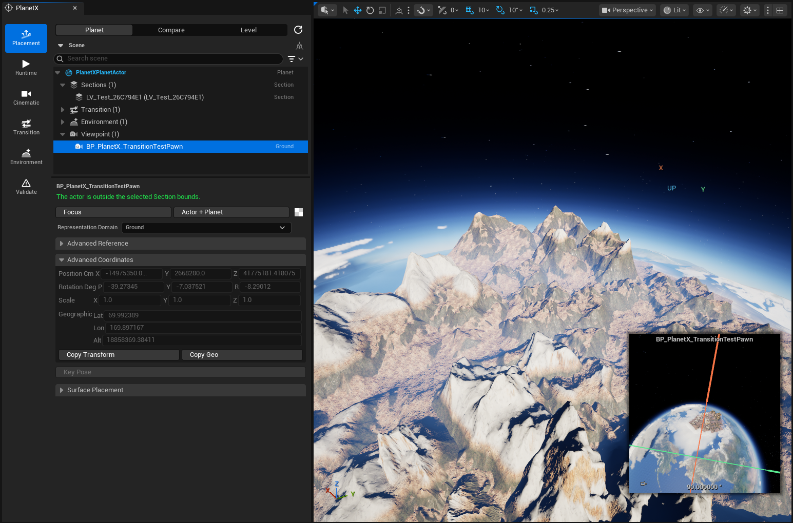
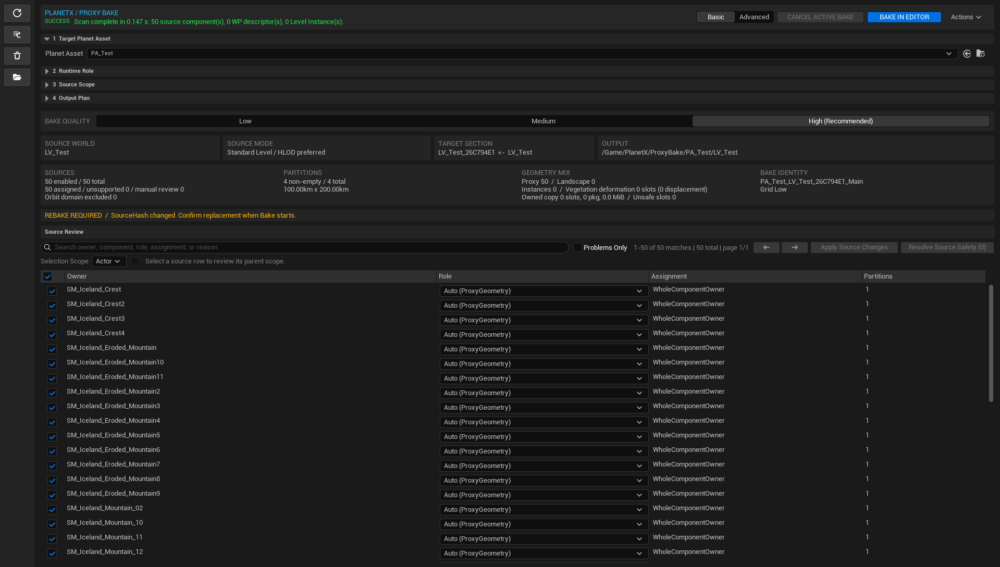
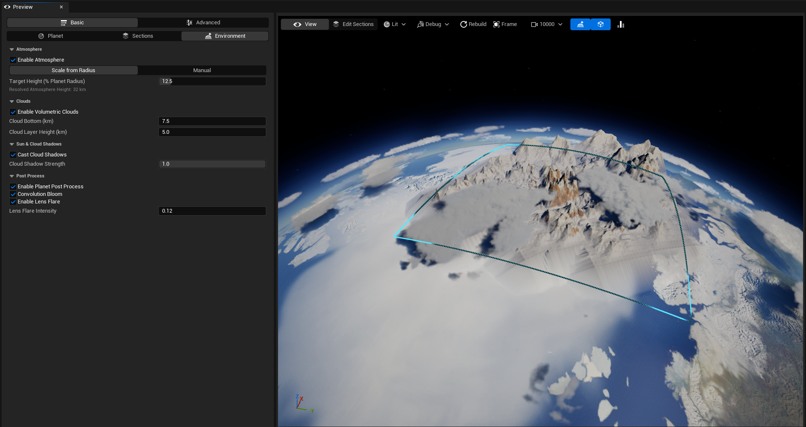
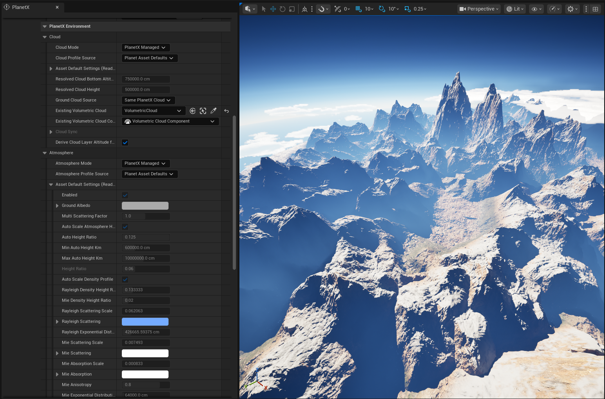
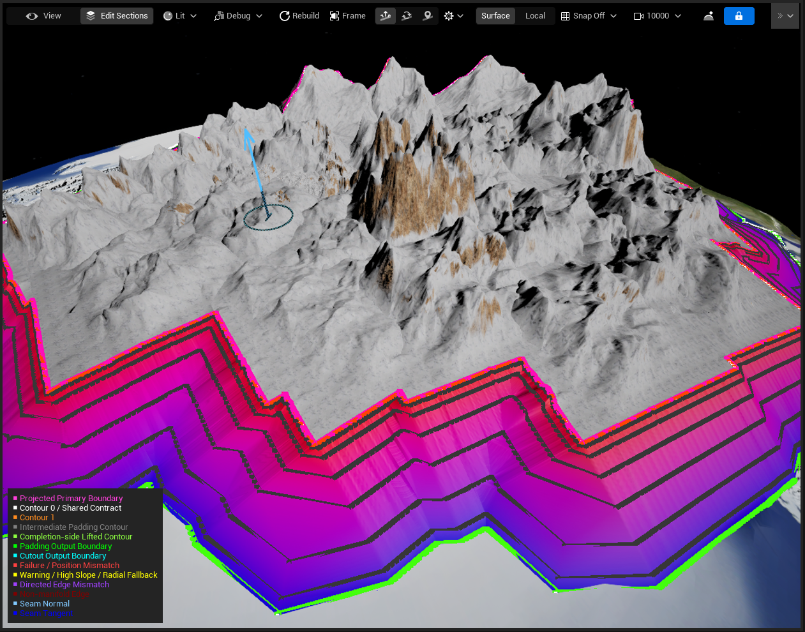

# 주요 기능

PlanetX는 기존 Unreal Engine Level을 행성의 일부로 연결하고, Orbit에서 바라보는 행성 표현부터 실제 Ground 플레이까지 하나의 흐름으로 구성할 수 있도록 다양한 제작 및 런타임 기능을 제공합니다.

## 행성 좌표와 표면 기준

PlanetX는 행성의 중심과 표면을 기준으로 위치와 방향을 계산할 수 있는 좌표 체계를 제공합니다.

이를 통해 행성 어디에 있더라도 표면의 위쪽 방향과 이동 방향을 일관되게 계산할 수 있으며, 기존 Unreal Engine의 World 좌표와 행성 좌표 사이를 변환할 수 있습니다.

이 좌표 체계는 Section 배치, Ground 연결, 플레이어 이동과 Orbit ↔ Ground 전환의 공통 기준으로 사용됩니다.

## Section과 Ground 연결

**Section**은 기존 Ground 콘텐츠를 행성 표면의 특정 지역과 연결하기 위한 단위입니다.

하나의 행성에 여러 Section을 배치할 수 있으며, 각 Section에는 실제 플레이에 사용할 Ground Level을 연결할 수 있습니다.

PlanetX는 프로젝트 구성에 따라 두 가지 방식의 전환을 지원합니다.

- **Same World**  
  Orbit과 Ground 콘텐츠를 하나의 World 안에서 사용하며, 플레이어가 이동하는 동안 표현을 전환합니다.

- **Level Handoff**  
  Orbit과 Ground를 서로 다른 Level로 구성하고, 전환 시 플레이어의 위치와 이동 상태를 이어받아 다른 Level로 이동합니다.

## Section Proxy Bake

PlanetX는 기존 Ground Level의 모습을 Orbit에서도 확인할 수 있도록 **Section Proxy**를 생성할 수 있습니다.

Landscape, Static Mesh, Foliage 등 Ground를 구성하는 주요 요소를 분석하여 원거리에서 사용하기 적합한 형태로 Bake하고, 이를 행성 표면의 Section과 연결합니다.

이를 통해 실제 Ground Level 전체를 항상 표시하지 않고도 Orbit에서는 해당 지역의 모습을 행성 표면에서 확인할 수 있습니다.

## Orbit ↔ Ground 전환

PlanetX는 플레이어 또는 카메라가 행성에 접근하거나 지표면에서 다시 멀어지는 과정에서 **Orbit 표현과 실제 Ground 콘텐츠 사이를 전환**할 수 있습니다.

전환 과정에서는 행성 표면의 위치와 방향을 기준으로 플레이어의 위치, 회전과 이동 상태를 이어갈 수 있도록 처리합니다.

이를 통해 별도의 착륙 화면이나 완전히 분리된 이동 방식 없이, Orbit과 Ground를 하나의 이동 흐름으로 구성할 수 있습니다.

## 행성 비주얼 제작

PlanetX는 Section Proxy가 없는 영역까지 하나의 완성된 행성처럼 보이도록 행성 표면을 제작할 수 있는 기능을 제공합니다.

Planet Asset Editor의 **Preview** 탭에서 다음 요소를 편집하고 미리 확인할 수 있습니다.

- 행성의 기본 표면
- Section과 행성 표면 사이의 연결 영역
- Surface Material
- 대기와 구름
- 태양과 조명
- 우주 배경과 후처리 효과

편집한 결과는 최종 Runtime용 행성 비주얼로 생성하여 사용할 수 있습니다.

## 환경 전환

Orbit과 Ground에서는 필요한 환경 표현이 서로 다를 수 있습니다.

PlanetX는 행성의 대기, 구름, 조명과 기타 환경 효과를 관리하고, 플레이어가 Orbit과 Ground 사이를 이동할 때 현재 상태에 맞는 환경 표현을 적용할 수 있도록 지원합니다.

## 검증과 디버깅

PlanetX는 행성을 제작하는 과정에서 잘못된 설정이나 누락된 데이터를 쉽게 확인할 수 있도록 여러 검증 및 디버깅 기능을 제공합니다.

Planet Asset 설정, Section과 Ground 연결, Proxy Bake 결과, 행성 비주얼과 Runtime 전환 상태 등을 확인할 수 있으며, 문제가 발생했을 때 어느 단계에서 수정이 필요한지 파악할 수 있도록 도와줍니다.
